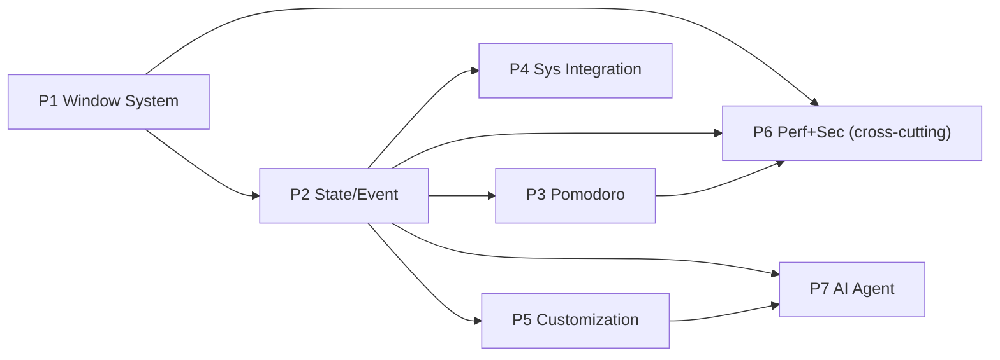

# Island Dynamic — Phase Map (Sumber Kebenaran Tahapan)

> contracting doc. Semua generate code WAJIB ikut urutan phase ini. Tidak boleh loncat.

| Phase | Nama (exact) | Sumber riset | Status |
|---|---|---|---|
| 1 | Windows Overlay + Window System | `docs/window-overlay.md`, `research/2026-09-17-dynamic-island-windows.md` | Spec ready |
| 2 | State/Event Architecture | `research/2026-09-17-dynamic-island-state-system.md`, `research/2026-09-17-dynamic-island-ios-macos-mekanisme.md` | Spec ready |
| 3 | Pomodoro Engine | `research/2026-09-17-pomodoro-timer-engine.md` | Spec ready |
| 4 | Windows System Integration | `research/2026-09-17-max-island-system-application-integration.md` | Spec ready |
| 5 | Customization | `research/2026-09-17-customization-system.md` | Spec ready |
| 6 | Performance + Security | Sintesis risiko semua riset (throttle, atomic write, validation, native helper) | Spec di `docs/phase-6-performance-security.md` |
| 7 | AI / Agent Layer | Flag `modules.ai` di customization + slot `MAX` di `images/` | Spec di `docs/phase-7-ai-agent.md` |

## Aturan urutan (gate)

1. Kerjakan strictly berurutan: P1 → P2 → … → P7.
2. Setiap phase punya Definition of Done (DoD) di file `docs/phase-N-*.md` masing-masing.
3. Dilarang mulai Pn+1 jika DoD Pn belum hijau (build + test + checklist manual).
4. Kontrak antar-phase tidak boleh diubah sepihak. Perubahan kontrak = update doc phase terkait + catat di `docs/README.md` changelog.
5. Lihat `AGENTS.md` di root untuk kontrak generate (clean code FAANG, struktur folder, quality gates).

## Peta dependensi

- P1 tidak boleh import P2–P7. P2 murni (tanpa Electron/React). P3/P4 hanya emit event ke P2, tidak render langsung. P5 hanya config + CSS vars + window API. P6 cross-cutting (diterapkan di semua phase, diverifikasi di akhir). P7 hanya consumer event P2 + config P5.

## Peta dokumentasi (di luar phase map)

> Prinsip: **every important decision should have a reason, every requirement should be testable, and every component should have a clear boundary.**

| Area | Dokumen |
|---|---|
| Product | `product/prd.md`, `product/user-stories.md`, `product/success-metrics.md` (indeks: `00-product/`) |
| Requirements | `requirements.md` (ID stabil) + `requirements/01–13` (rinci + testing + traceability) (indeks: `02-requirements/`) |
| Architecture | `architecture.md` + `architecture/threat-model.md` + `state-machine.md` + `window-overlay.md` (indeks: `03-architecture/`) |
| Decisions | `adr/000-template.md` … `adr/007-fault-isolation.md` (indeks: `05-adr/`) |
| API | `api/contracts.md` |
| Testing | `testing/strategy.md`, `testing/test-plan.md` (indeks: `07-testing/`) |
| Operations | `operations/observability.md`, `operations/runbook.md`, `operations/cicd.md` (indeks: `09-operations/`) |
| Releases | `releases/roadmap.md`, `releases/changelog.md`, `releases/release-engineering.md`, `releases/post-release-review.md` (indeks: `10-releases/`) |
| Research | `research/` (9 decision docs + `README.md` indeks) (indeks: `01-research/`) |

Aturan anti-duplikasi: angka/kontrak hidup di SATU tempat (persyaratan di `requirements.md`, kontrak di `api/contracts.md`, TC di `12-testing.md`, matriks di `13-traceability.md`). Dok lain hanya merujuk + menambah sudut pandang baru.

## Changelog

- 2026-09-17: initial 7-phase map dari 6 research + 1 window-overlay doc + 1 design image.
- 2026-09-17: dokumen pelengkap yang tetap berlaku — `requirements.md` (ID FR/NFR stabil), `architecture.md` (peta implementasi), `state-machine.md` (kontrak visibility+content), `adr/` (keputusan kunci). Jika bertentangan dengan `phase-N-*.md`, phase doc menang untuk urutan kerja, requirement ID menang untuk acceptance.
- 2026-09-17: struktur komprehensif — `product/`, `testing/`, `operations/`, `releases/`, `api/contracts.md`, `architecture/threat-model.md` + peta dokumentasi & prinsip di atas.
