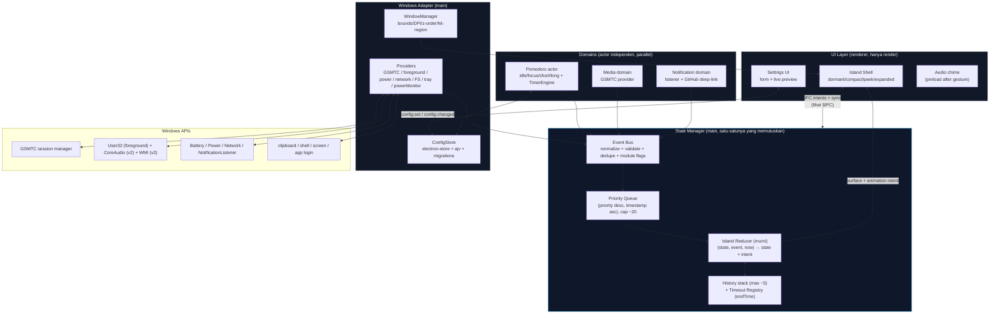
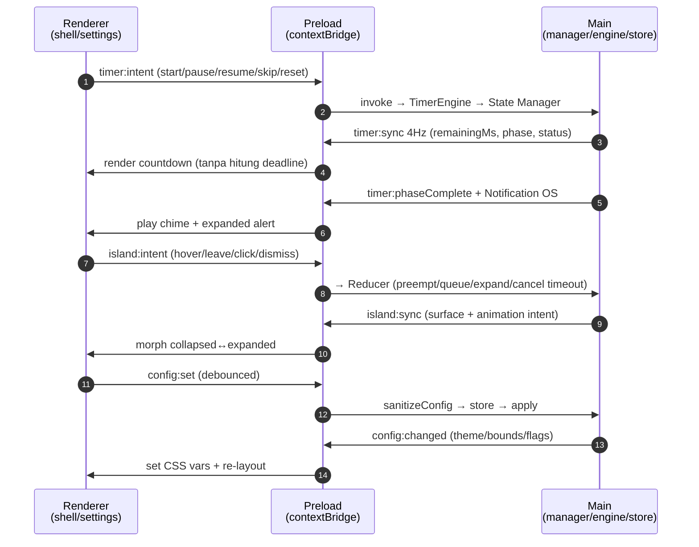
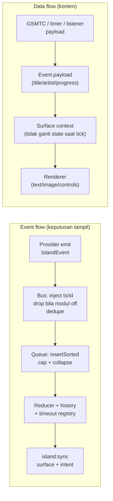
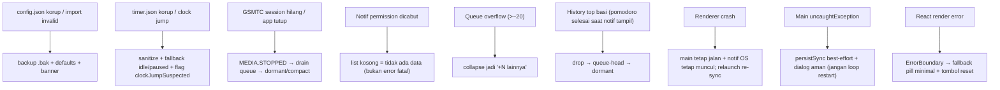

# Architecture — MAX Island (v1, Electron Windows)

> Implementasi dari `docs/requirements.md` dan riset di `research/`.
> Status: Proposed v1. Diagram mermaid = spesifikasi, bukan hasil generate kode.

## System overview (peta dari usulan user, diperjelas)



Hubungan dengan diagram user: `UI Layer` = renderer; `State Manager` = satu decision point di main; `Pomodoro/Media/Notification` = domain actors; `Windows Adapter` = satu lapisan tipis ke `Windows APIs` (GSMTC generik + foreground allowlist + power/network/FS + notification listener — bukan adapter per-app).

## Component boundaries (siapa boleh tahu apa)

| Komponen | Proses | Boleh | Dilarang |
|---|---|---|---|
| `src/shared/*` (types, `IslandEvent`, `IslandSurfaceState`, `config.ts`, `sanitizeConfig`, `migrateConfig`) | shared | Pure, tanpa Electron/React; dipakai main + renderer | I/O, `Date.now()` di dalam reducer, `Math.random` |
| `core/events` (bus, queue, reducer, history, timeout-registry) | main (instance), pure logic | `(state, event, now) → state`; waktu di-inject; test Node saja | Import electron/react; `setTimeout` mentah sebagai kebenaran (hanya untuk jadwal reconcile, deadline = `endTime`) |
| `main/timerEngine` (Pomodoro actor + deadline + reconcile + history writer) | main | Satu-satunya yang menghitung deadline; owns `PersistedTimer` | Menghitung deadline di renderer; tulis store tiap tick render |
| `main/providers` (gsmtc, foreground, power, network, fs-watcher, notif-listener, clipboard, screen) | main | Emit `IslandEvent` ternormalisasi; polling lambat + event; label confidence untuk heuristik (mic) | Render UI; preempt langsung; polling cepat permanen |
| `main/configStore` (electron-store + schema + migrations + backup) | main | Satu jalur tulis `setConfig` tervalidasi; broadcast `config:changed` | Tulis tiap tick; dua desain profil sekaligus |
| `main/windowManager` (bounds, DPI, z-order, hit-region, fullscreen, tray, startup) | main | `setSize` fixed collapsed/expanded, posisi `workArea` DIP, `pop-up-menu`, `setIgnoreMouseEvents` hit-region | Resize bebas; `focus()` agresif; janji tembus exclusive-fullscreen / ikut virtual desktop |
| `renderer/islandShell` | renderer | Render `IslandSurfaceState` + animation intent (`transform/opacity` ≤300 ms); kirim intent user | Memutuskan priority/queue/history; menyimpan kebenaran timer |
| `renderer/settings` | renderer | Form + preview lokal (debounce 100–200 ms) + panggil `config:set` | Tulis disk langsung; validasi sendiri tanpa `shared` |
| `preload` | boundary | `contextBridge` minimal: `timer:intent`, `island:intent`, `config:set/get`, subscribe `timer:sync`, `island:sync`, `config:changed`, `phase:complete` | `nodeIntegration:true`, expose `require`/fs mentah |

Aturan modul (kontrak antar-doc): `modules.*=false` → actor tidak di-spawn + event kategorinya di-drop di bus (mencegah bug #4738).

## IPC contract



| Channel | Arah | Payload | Frekuensi |
|---|---|---|---|
| `timer:intent` | R→M | `{action, phase?, durationMs?}` | on user action |
| `timer:sync` | M→R | `{remainingMs, phase, status, cycleCount}` | 4 Hz saat running + segera saat transisi |
| `timer:phaseComplete` | M→R | `{phase, outcome, flags}` | on deadline |
| `island:intent` | R→M | `USER.HOVER/LEAVE/CLICK/DISMISS` | on interaction |
| `island:sync` | M→R | `{surface, animationIntent}` | on decision change (debounce 100–200 ms saat burst) |
| `config:set` / `config:get` | R↔M | partial config tervalidasi | on settings change (debounce slider) |
| `config:changed` | M→R | full active config | on store write / migrasi |
| `set-ignore-mouse-events` | R→M | `{ignore, forward}` | on hit-region change (bukan timer) |

## Data flow vs event flow



- Event flow menentukan **apa yang tampil + kapan hilang** (priority, preemption, timeout, restore). Tick (`POMODORO.TICK`/`MEDIA.PROGRESS`) hanya masuk data flow — update payload, tidak ganti surface (throttle 1 s).
- Data flow tidak pernah mem-bypass State Manager: tidak ada provider yang langsung memanggil renderer.

## State ownership

| State | Owner | Mirror | Catatan |
|---|---|---|---|
| `IslandSurface` + queue + history + timeout deadlines | State Manager (main) | Renderer mirror read-only via `island:sync` | Satu-satunya penulis keputusan tampil |
| `PersistedTimer` (`phase/status/targetEnd/remainingOnPause/cycleCount/configSnapshot/lastTick`) | TimerEngine (main) | Renderer via `timer:sync` | Deadline hanya dihitung di main |
| Session history (append-only) | TimerEngine → `history.jsonl` | Statistik dihitung dari file, bukan counter aktif | Tulis sekali per fase, idempotent `phaseRunId` |
| `IslandConfig` aktif + profiles | ConfigStore (main) | Renderer via `config:changed` | Satu jalur tulis tervalidasi |
| Window bounds/level/hit-region | WindowManager (main) | — | Dari `workArea` DIP + config |
| Animasi berjalan (`rAF`/transition) | Renderer (ephemeral) | — | Intent dari main, eksekusi di renderer, stop saat idle |

## Storage

| File (di `app.getPath('userData')` ≈ `%APPDATA%\<App>`) | Isi | Pola tulis |
|---|---|---|
| `config.json` (electron-store, atomik temp+rename) | `IslandConfig` + `profiles` + `activeProfileId` | Hanya saat user ubah (debounce), ganti profil, import, migrasi boot. Backup `config.bak-<ts>.json` (max 5, rotate) sebelum overwrite/migrasi |
| `timer.json` (atomik) | `PersistedTimer` + `appVersion` | Tiap transisi + `hidden`/`blur` + `suspend`/`lock-screen` (best-effort) + throttle 5 detik (`lastTick` saja). Validasi + fallback defaults bila korup |
| `history.jsonl` (append) | `SessionRecord[]` (satu baris per fase, UTC ISO) | Sekali per fase berakhir; rotate per bulan (atau SQLite v2) |
| `.bak` files | Backup config/timer korup | `rename` sebelum fallback, jangan hapus diam-diam |

Pemisahan ini disengaja: settings jarang ditulis, runtime timer terpisah, history tidak pernah dioverwrite timer.

## Threading & scheduling (Electron single-threaded per proses)

- **Main:** event loop Node, non-blocking. TimerEngine `setInterval` 250 ms hanya saat running (reconcile deadline, bukan decrement). Media poll 500–1000 ms + event `CurrentSessionChanged`. Sysinfo opt-in ≥2000 ms. `suspend`/`lock-screen` handler = `persistSync()` cepat (<10 ms), kebenaran dipulihkan di `resume`/`unlock`/`visible`/`focus`.
- **Renderer:** UI thread Chromium. `backgroundThrottling: false` + `disable-background-timer-throttling` sebagai optimasi saja — kebenaran tetap deadline. Animasi `transform/opacity` compositor-only; hentikan `rAF`/timer saat collapsed/statis (`event → render → return idle`).
- **Tidak ada worker/thread pool di v1.** Jika butuh (parsing berat, artwork), tambah Web Worker nanti — bukan shared memory.
- Render burst di-debounce 100–200 ms di main sebelum `island:sync` agar tidak flicker.

## Error boundaries & failure modes



| Failure | Deteksi | Respons | Uji |
|---|---|---|---|
| Config korup | parse/ajv gagal | backup + defaults + banner (FR-31) | edit manual JSON |
| Import v-masa-depan | `configVersion` > app | tolak jelas / strip minor + warning | import file v2 ke v1 |
| Clock jump >threshold | `\|wall−mono\|` besar | hormati wall-clock + flag + log history | maju/mundur 10 menit |
| Sleep saat running | gap `now−lastTick` besar | reconcile + `completedWhileSuspended` | sleep 2 menit |
| Crash saat running/paused | boot `status` | lanjutkan/selesaikan tertunda; paused tetap paused | kill proses |
| Double-complete | `phaseRunId` sudah tercatat | tulis history sekali | tick + resume bersamaan |
| Modul off tapi event datang | bus check flags | drop di bus | matikan music, ganti track |
| Fullscreen exclusive | `fullscreen` event / uji manual | default `hide`, jangan paksa fokus | game exclusive vs borderless |
| Monitor dicabut | `display-removed` | clamp ke primary + fallback top-center | cabut-colok monitor |

## Startup sequence

```mermaid
sequenceDiagram
    autonumber
    participant A as app.ready
    participant C as ConfigStore
    participant T as TimerEngine
    participant S as State Manager
    participant W as WindowManager
    participant R as Renderer

    A->>C: load + ajv + migrations + backup bila perlu
    C->>T: configSnapshot (durasi, auto-start, pauseOnLock)
    A->>T: load timer.json → boot reconcile (lanjut/selesai/idle)
    A->>S: init dormant + restore queue/history/deadlines (validasi basi)
    A->>W: create window (show:false) → bounds DIP + pop-up-menu + hit-region
    W->>R: load shell → ready-to-show → showInactive
    R->>A: subscribe sync channels; preload gesture unlock audio
```

## Conformance (arsitektur ↔ requirements)

| Requirements | Dipenuhi oleh |
|---|---|
| FR-01–07 (shell, posisi, tray, fullscreen) | WindowManager + IPC + `pop-up-menu` + `workArea` DIP + tray ICO |
| FR-10–16 (pomodoro) | TimerEngine deadline + reconcile + history + notif/suara |
| FR-20–27 (signals) | 3 provider generik (GSMTC / foreground+URI / power-network-FS-notif) + matriks v1 vs tunda |
| FR-30–34 (config) | ConfigStore + `shared/config.ts` + CSS vars + profiles |
| FR-40–43 (state) | Bus + queue + reducer + history + timeout registry di main |
| UI-001–003 (collapsed/expanded/morph) | WindowManager (fixed sizes) + islandShell (`transform`/`opacity` intent) |
| SYS-001–004 (notif/media/mic/display) | Providers: notif-listener (consent) / GSMTC / mic-heuristic (confidence) / screen-display |
| EXT-001–004 (spotify/github/browser/ai) | GSMTC generik (EXT-001/003) + URI launcher + REST-opsional (EXT-002) + P7 AI actor (EXT-004) |
| STATE-001–003 (single-owner/preempt/restore) | Bus + queue + reducer + history + timeout registry di main (sama FR-40–42) |
| NFR-01–03, 08 (perf) | `event → render → idle`, interval lambat, compositor-only, HW accel ON |
| NFR-04 (display) | Cursor-based target + display events + DIP |
| NFR-05–06, 10 | Error table + minimal privileges + logging flags |

## Open decisions / spikes sebelum build

1. Pin versi Electron/Node/`windows-media-sessions`/`electron-store` dari docs primer.
2. Spike GSMTC play/pause Spotify + YouTube Chromium; spike foreground VSCode/Chrome; spike notif-listener izin-ditolak vs diizinkan.
3. Spike `core/events` murni + 5 unit test state-system; spike `shared/config.ts` + 5 unit test schema.
4. Spike ukur idle 60 detik (`getCPUUsage` + Task Manager/GPU) sebelum budget jadi SLA.
5. Uji matriks overlay: Win10/11, 100–200%+, 2 monitor, taskbar posisi, game exclusive, RDP/VM, virtual desktop (ekspektasi: tidak ikut).

(End of file)
