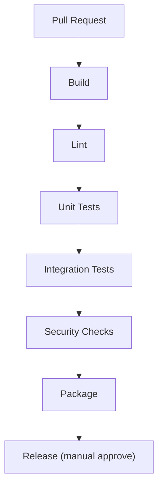

# CI/CD Pipeline

> Status repo saat dokumen ditulis: **bukan git repo** — pipeline di bawah berlaku segera setelah `git init` + push ke GitHub. Sampai saat itu, jalankan tahap yang sama secara manual sebelum klaim DoD hijau.

## Pipeline



| Tahap | Isi | Gagal = |
|---|---|---|
| Build | `npm ci` + build main + renderer (satu workflow, Node versi di-pin) | PR merah |
| Lint | ESLint + cek aturan repo: `shared/` tanpa electron/react, tanpa `any` liar, import boundaries | PR merah |
| Unit Tests | `node:test` — 5 contract P2 + 5 config P5 + engine cases | PR merah |
| Integration Tests | IPC, GSMTC (boleh mock + tercatat), config apply | PR merah bila yang headless gagal |
| Security Checks | TC-SEC-001 + grep audit (`nodeIntegration`, `require(userPath)`, `openExternal` non-allowlist, secret di diff, tulis-di-tick) | PR merah |
| Package | electron-builder → installer + cek ICO tray + versi = tag | Artefak tidak terbit |
| Release | Manual approve → GitHub Release + upload installer + notes dari changelog | Tidak auto-publish |

Minimal workflow awal (sengaja 1 file — tambah matriks OS setelah hijau):

```yaml
# .github/workflows/pr.yml (sketsa — pin versi saat git init)
name: pr
on: [pull_request]
jobs:
  verify:
    runs-on: windows-latest
    steps:
      - uses: actions/checkout@v4
      - uses: actions/setup-node@v4
        with: { node-version-file: '.nvmrc' }
      - run: npm ci
      - run: npm run lint
      - run: npm test
      - run: npm run audit:security
```

## Branch protection (`main`)

- Require pull request (tanpa push langsung), minimal 1 review.
- Require status checks: build + lint + unit + security — semua hijau sebelum merge.
- Require conversation resolution; dismiss stale approvals saat push baru.
- Linear history (squash merge) agar changelog per versi bersih.
- Tag `v*` hanya dari `main` yang hijau; release manual approve.
