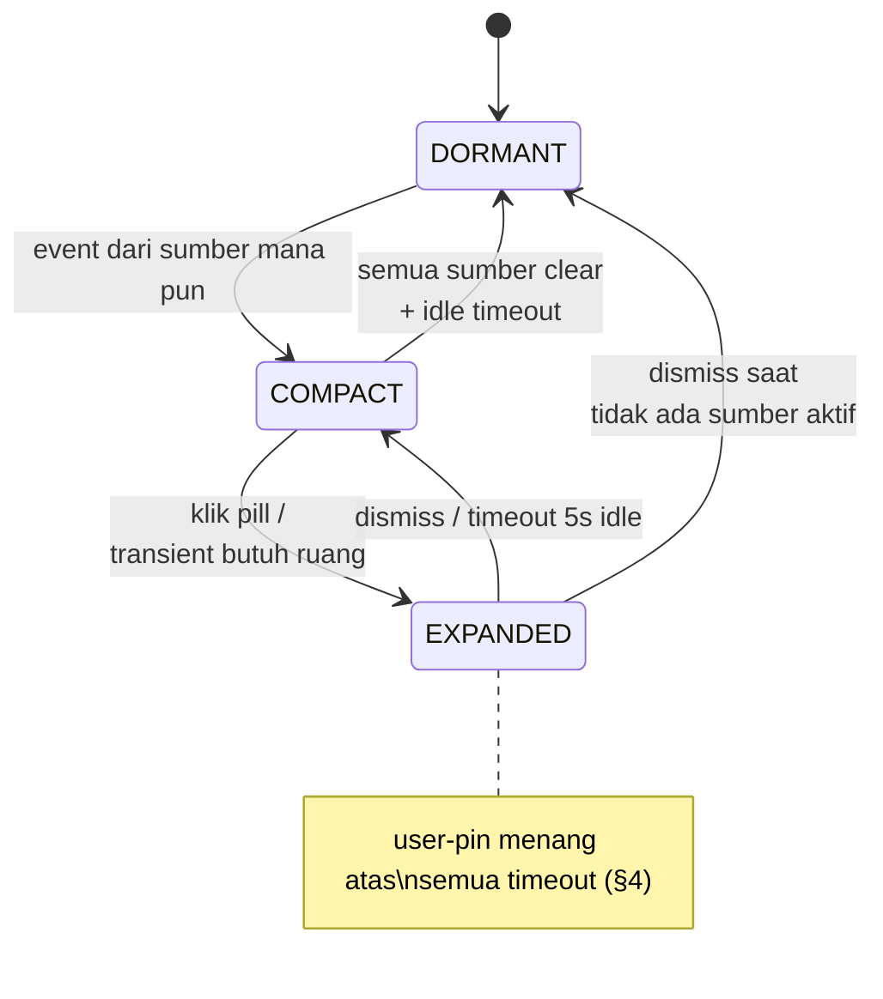
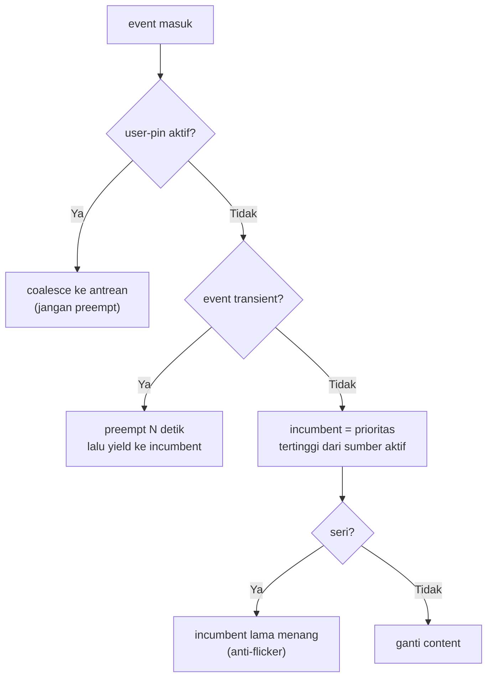

# State Machine — MAX Island

> Satu island, banyak event. Tanpa state machine + prioritas, UI jadi kacau saat Pomodoro, musik, dan notifikasi masuk bersamaan. Dokumen ini adalah kontrak perilaku island — semua implementasi UI wajib ikut.

## 1. Dua konsep ortogonal

Jangan campur **visibility** (seberapa besar island) dengan **content** (sumber apa yang ditampilkan). Keduanya berubah karena alasan berbeda:

- **Visibility:** `DORMANT` → `COMPACT` → `EXPANDED` (dipicu event / klik user / timeout).
- **Content:** `CLOCK` / `POMODORO` / `MEDIA` / `NOTIFICATION` / `SYSTEM` (dipilih resolver prioritas).

## 2. Diagram visibility



Aturan timeout (pelajaran dari Windhawk issue #4738 — media tidak boleh menahan island tetap terbuka):

- `EXPANDED → COMPACT` otomatis setelah **5 detik idle** (tanpa pointer/keyboard), **kecuali** user-pin aktif.
- Media play/track-change **tidak** auto-expand — cukup update slot `COMPACT`.
- Yang boleh auto-expand: transient selesai (agar user sadar konteks kembali) dan Pomodoro selesai.

## 3. Resolver prioritas content



### Tabel prioritas

| Rank | Sumber | Sifat | Perilaku |
|------|--------|-------|----------|
| 0 | User expand (pin) | manual | Menang atas semua sampai dismiss/timeout |
| 1 | `NOTIFICATION` | transient, 4 dtk | Preempt, lalu **yield** ke incumbent |
| 2 | `POMODORO` running | persistent | Pemilik default slot compact |
| 3 | `MEDIA` playing | persistent | Di bawah Pomodoro |
| 4 | `SYSTEM` (mic/batt/jaringan) | persistent-low | Hanya bila rank 1–3 kosong |
| 5 | `CLOCK` | fallback | Selalu ada, tidak pernah kosong |

### Aturan anti-kacau

1. **Incumbent wins ties** — prioritas seri = jangan ganti (mencegah flicker saat dua event datang berurutan).
2. **Transient tidak mengantre** — maksimal 1 notifikasi tampil; yang baru datang **latest-wins + coalesce** (gabung teks bila se-jenis), bukan antrean memanjang.
3. **Preempt selalu yield** — transient tidak boleh mengubah incumbent; setelah N detik, content kembali persis ke sebelumnya.
4. **Persistent tidak saling preempt paksa** — Pomodoro vs musik diselesaikan sekali oleh tabel, bukan rebutan tiap tick. Tick timeline media **bukan** event resolver (hanya update progress bar).
5. **Semua transisi tercatat** — tiap perubahan state log `{from, to, reason, at}` (ring buffer 50) untuk debug "kok island-nya begini?".

## 4. Contoh alur (kasus user)

```
Pomodoro jalan (COMPACT:POMODORO "24:59")
    ↓  GitHub notification masuk
COMPACT:NOTIFICATION "CI failed di main"  (preempt, timer 4 dtk)
    ↓  4 detik, tanpa interaksi
COMPACT:POMODORO "24:55"                  (yield — Pomodoro kembali)
```

Varian: user klik pill saat notifikasi tampil → `EXPANDED` + **pin** → timeout 4 dtk dibatalkan, notifikasi tetap sampai user dismiss (max 30 dtk, lalu paksa yield agar tidak nyangkut).

## 5. Event router (pseudocode kontrak)

```
on(event):
  log(event)
  if state.visibility == EXPANDED and userPinned:
    coalesce(event)          # jangan ganggu user
    return
  if event.kind == TRANSIENT:
    incumbent = currentContent
    show(event, timeout=4s)
    onTimeout: show(incumbent)   # yield, bukan ke IDLE
  else:
    updateActiveSources(event)
    winner = highestPriority(activeSources)  # tie → incumbent
    if winner != currentContent:
      show(winner)
  updateVisibility()  # DORMANT bila tidak ada sumber aktif
```

## 6. Yang eksplisit TIDAK dilakukan

- Tidak ada animasi antrean / stacking card — satu slot, satu content.
- Tidak ada suara untuk transient (kecuali Pomodoro selesai) — island itu glanceable, bukan interupsi.
- Tidak ada preempt oleh `CLOCK` — jam tidak pernah merebut slot.

## Referensi

- ADR-003 (state management) — `adr/003-state-management.md`
- Pelajaran auto-hide — `research/2026-09-17-dynamic-island-windows.md` §5
- Provider generik (sumber event) — `research/2026-09-17-max-island-system-application-integration.md`
