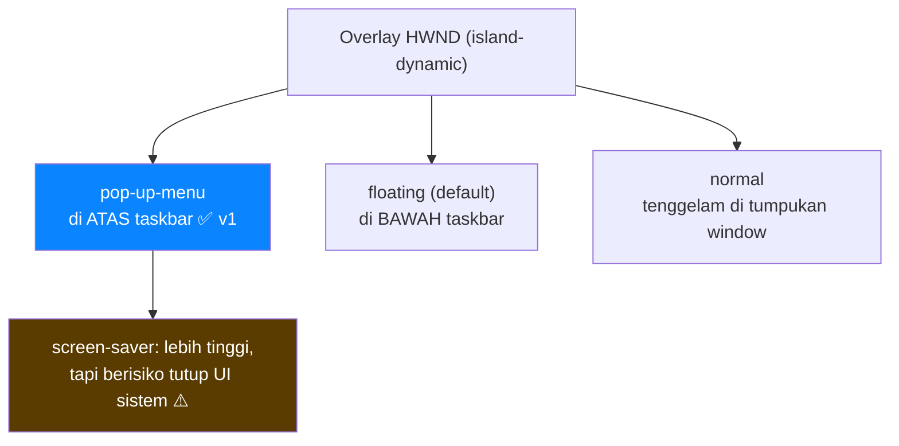
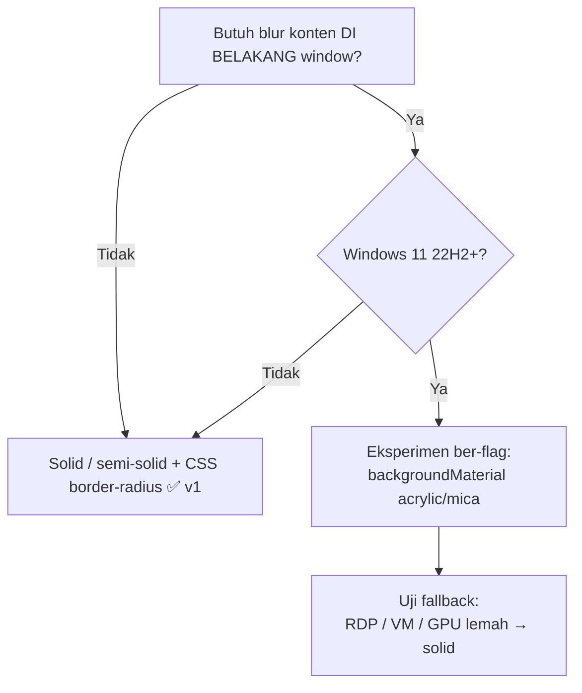
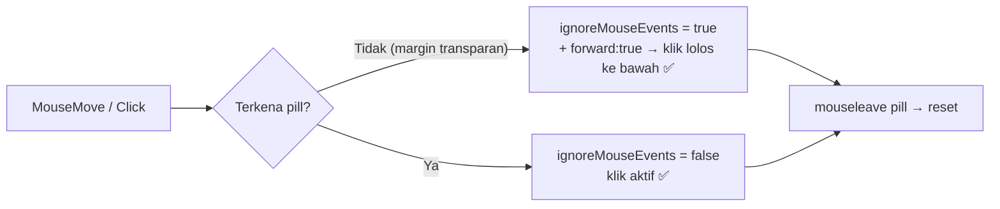
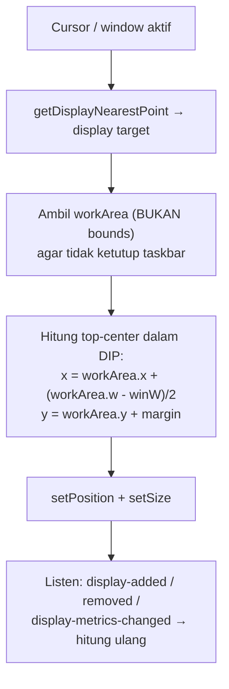

# Window Overlay — Membuat Floating UI yang Terasa Bagian dari Windows

> Pertanyaan utama: **"Bagaimana membuat satu floating UI yang terasa seperti bagian dari Windows, tetapi sebenarnya adalah aplikasi terpisah?"**
>
> Jawaban singkat: satu `BrowserWindow` Electron yang **borderless + transparan + alwaysOnTop level `pop-up-menu`**, pill digambar pakai **CSS** (bukan material sistem), klik diatur lewat **hit-region** (`setIgnoreMouseEvents` hanya untuk margin transparan), posisi dihitung dari **`workArea` dalam DIP**, tanpa janji tembus fullscreen-exclusive atau ikut pindah virtual desktop.
>
> Status: living doc (diperbarui saat implementasi). Keputusan awal: lihat `research/2026-09-17-dynamic-island-windows.md`.

## 1. Peta z-order (di mana island berdiri)



**[Fakta]** `alwaysOnTop` punya level: `normal, floating, torn-off-menu, modal-panel, main-menu, status, pop-up-menu, screen-saver`. Default `true` = `floating`; `false` reset ke `normal`. Level `floating`–`status` duduk **di bawah** taskbar Windows; `pop-up-menu` ke atas tampil **di atas** taskbar. ([Electron BrowserWindow](https://www.electronjs.org/docs/latest/api/browser-window))

**Keputusan v1:** `level: 'pop-up-menu'`. Alasan: di atas taskbar (island top-center tidak ketutup), belum se-ekstrem `screen-saver` yang berisiko menutupi UI sistem dan butuh uji fokus/aksesibilitas dulu.

## 2. Borderless window (`frame: false`)

**[Fakta]** Pola resmi: `new BrowserWindow({ width, height, frame: false })`. Area drag kustom memicu event `system-context-menu` saat diklik kanan — panggil `event.preventDefault()` untuk mencegahnya. ([Custom Window Styles](https://www.electronjs.org/docs/latest/tutorial/custom-window-styles), [BrowserWindow](https://www.electronjs.org/docs/latest/api/browser-window))

Konsekuensi yang diterima v1:

- Tidak ada system menu / tombol minimize-maximize-close bawaan → tidak ada snap menu otomatis (lihat §12).
- Drag hanya lewat region eksplisit (`-webkit-app-region: drag`).
- Klik kanan di region drag harus di-`preventDefault` atau regionnya dihindari.

## 3. Transparent window (`transparent: true`)

**[Fakta]** Pola resmi bentuk non-persegi: `frame:false, transparent:true, resizable:false` + CSS `background: transparent`. Limitasi resmi di halaman yang sama: ([Custom Window Styles](https://www.electronjs.org/docs/latest/tutorial/custom-window-styles))

- **Tidak bisa** click-through area transparan secara default (lihat issue #1335).
- Transparent window umumnya **tidak reliably resizable** — `resizable:true` bisa merusak window di sebagian platform.
- CSS `blur()` **hanya** berlaku ke web contents sendiri, **tidak** bisa blur konten di bawah window.
- Window tidak transparan saat DevTools dibuka.
- Di Windows: tidak bisa maximize via system menu / double-click titlebar; hanya berfungsi bila frameless.

**Keputusan v1:** dua ukuran fixed (collapsed/expanded) via `setSize` + reposisi, bukan resize bebas. `transparent:true` **bukan** mekanisme click-through — itu tugas `setIgnoreMouseEvents` (§5).

## 4. Acrylic / Mica / backdrop blur — jangan dijanjikan di v1



**[Fakta]**

- `DwmEnableBlurBehindWindow` tidak menghasilkan efek blur sejak Windows 8 (perubahan render pipeline). ([DWM Blur Overview](https://learn.microsoft.com/en-us/windows/win32/dwm/blur-ovw))
- Panduan material modern: **Mica** opaque untuk base layer; **Acrylic** semi-transparan hanya untuk transient light-dismiss (flyout/context menu). ([System backdrops](https://learn.microsoft.com/en-us/windows/apps/develop/ui/system-backdrops))
- `AcrylicBrush` = in-app acrylic saja (blur konten XAML **di dalam** window, tidak tembus desktop). Untuk tembus-desktop pakai `Window.SystemBackdrop`. ([Materials](https://learn.microsoft.com/en-us/windows/apps/develop/ui/materials))
- Mica hanya Windows 11 (fallback solid di Win10); Desktop Acrylic butuh Win10 17763+; RDP/VM/GPU lemah fallback ke solid. ([Materials](https://learn.microsoft.com/en-us/windows/apps/develop/ui/materials))
- Enum modern: `DWM_SYSTEMBACKDROP_TYPE` = `AUTO / NONE / MAINWINDOW (Mica) / TRANSIENTWINDOW (Acrylic) / TABBEDWINDOW (Mica Alt)`, minimum Win11 Build 22621. ([DWM_SYSTEMBACKDROP_TYPE](https://learn.microsoft.com/en-us/windows/win32/api/dwmapi/ne-dwmapi-dwm_systembackdrop_type))
- Electron mengekspos ini via `backgroundMaterial: auto|none|mica|acrylic|tabbed` + `win.setBackgroundMaterial()`, Win11 22H2+. ([BaseWindow options](https://www.electronjs.org/docs/latest/api/structures/base-window-options))

**[Opini sumber sekunder — DITOLAK]** Banyak tutorial menyamakan "transparent + CSS blur" dengan "Acrylic". Bertentangan dengan fakta primer: CSS `blur()` tidak menyentuh konten bawah window.

**Keputusan v1:** solid/semi-solid + `border-radius` CSS. `backgroundMaterial` hanya eksperimen ber-flag khusus Win11 22H2+.

## 5. Click-through + 6. Hit testing



**[Fakta]**

- `win.setIgnoreMouseEvents(ignore[, {forward}])`; `forward:true` (Windows+macOS) meneruskan mouse-move ke Chromium sehingga `mouseleave` tetap hidup; hanya berlaku saat `ignore:true`. ([BrowserWindow](https://www.electronjs.org/docs/latest/api/browser-window), [Custom Window Interactions](https://www.electronjs.org/docs/latest/tutorial/custom-window-interactions))
- Pola resmi: IPC `set-ignore-mouse-events` + `mouseenter` → `ignore:true,{forward:true}` di elemen click-through, `mouseleave` → `ignore:false`. ([Custom Window Interactions](https://www.electronjs.org/docs/latest/tutorial/custom-window-interactions))
- Risiko: bug historis hook `setIgnoreMouseEvents(true,{forward:true})` di Windows (`UnhookWindowsHookEx` transient → duplikat low-level mouse hook). ([Electron v43.0.0](https://releases.electronjs.org/release/v43.0.0))
- `WM_NCHITTEST` menentukan bagian window dari koordinat layar; ada `HTTRANSPARENT=-1` (teruskan ke window bawah di thread sama). Dilarang pakai `LOWORD/HIWORD` untuk koordinat multi-monitor (bisa negatif). ([WM_NCHITTEST](https://github.com/MicrosoftDocs/win32/blob/docs/desktop-src/inputdev/wm-nchittest.md))
- Di Electron, `app-region: drag` mengabaikan **semua** pointer events — tombol di atasnya mati kecuali diberi `app-region: no-drag`. Jangan pasang custom context menu di area draggable. ([Custom Window Interactions](https://www.electronjs.org/docs/latest/tutorial/custom-window-interactions))

**Keputusan v1:** default `ignore:false` (pill bisa diklik). Hanya margin transparan di sekitar pill yang `ignore:true,forward:true`, toggle berbasis hit-region (bukan timer). Handle drag sempit; semua kontrol interaktif `no-drag`; uji klik kanan.

## 7. Multi-monitor + 8. DPI scaling + 11. Posisi taskbar



**[Fakta]**

- API: `screen.getPrimaryDisplay()`, `getAllDisplays()`, `getDisplayNearestPoint()`, `getDisplayMatching()`; event `display-metrics-changed` (`bounds|workArea|scaleFactor|rotation`); helper `screenToDipPoint/dipToScreenPoint/...` (Windows/Linux). Contoh resmi menaruh window di external display via `display.bounds.x/y + offset`. ([screen](https://www.electronjs.org/docs/latest/api/screen))
- Electron membedakan physical pixels vs DIP (DIP diskala berdasar DPI display). ([screen](https://www.electronjs.org/docs/latest/api/screen))
- Win32: `WM_DPICHANGED` (0x02E0) saat DPI efektif berubah; tabel: 96=100%, 120=125%, 144=150%, 192=200%; handler benar resize+reposisi via `SetWindowPos` dari `lParam`. ([WM_DPICHANGED](https://learn.microsoft.com/en-us/windows/win32/hidpi/wm-dpichanged))
- Model rekomendasi: **Per-Monitor V2** (Win10 1703+). ([High DPI improvements](https://learn.microsoft.com/en-us/windows/win32/hidpi/high-dpi-improvements-for-desktop-applications), [DPI awareness context](https://github.com/MicrosoftDocs/win32/blob/docs/desktop-src/hidpi/dpi-awareness-context.md))
- `Display` punya `workArea/workAreaSize` (area tersedia) vs `bounds` (penuh). ([screen](https://www.electronjs.org/docs/latest/api/screen))

**Keputusan v1:**

- Jangan hardcode primary saja — target display via cursor (`getCursorScreenPoint` → `getDisplayNearestPoint`) atau display berisi window; subscribe `display-added/removed/display-metrics-changed`.
- Selalu hitung layout dalam **DIP**; `scaleFactor` hanya untuk logging/uji.
- Posisi dari `workArea`, bukan `bounds`.
- Validasi visual di 100%/125%/150%/200%+ sebelum klaim "tajam".

## 9. Fullscreen app behavior

**[Fakta]** Electron punya `fullscreen/fullScreenable/simpleFullscreen/kiosk/showInactive/focus/blur`. Tidak ada pernyataan primer bahwa `alwaysOnTop` menembus fullscreen-exclusive game. ([BrowserWindow](https://www.electronjs.org/docs/latest/api/browser-window))

**Keputusan v1:** anggap overlay **bisa tertutup** fullscreen-exclusive (D3D exclusive / bypass komposisi). Jangan pakai `focus()` agresif untuk "memaksa di atas" — merusak game dan berisiko memicu anti-cheat. Sediakan opsi user **"sembunyikan saat fullscreen"** sebagai default aman. Perlu uji manual: game exclusive vs borderless-windowed.

## 10. Virtual desktops

**[Fakta]** `visibleOnAllWorkspaces` bertanda macOS/Linux; catatan eksplisit: selalu return `false` di Windows. ([BrowserWindow](https://www.electronjs.org/docs/latest/api/browser-window))

**Keputusan v1:** tidak ada API Electron primer yang mem-pin overlay ke semua virtual desktop Windows. Anggap overlay tinggal di desktop tempat dibuat; **jangan janjikan** "ikut pindah desktop". Pin lintas-desktop = riset Win32 lanjutan (`IVirtualDesktopManager`), di luar v1.

## 12. Windows 11: snap layouts + rounded corners

**[Fakta]**

- Snap layouts otomatis muncul bila ada tombol maximize caption; custom titlebar diperbaiki dengan merespons `WM_NCHITTEST → HTMAXBUTTON`. Electron v13+ disebut mengaktifkan snap layouts. Bila snap gagal, penyebab umum: minimum width terlalu besar (dukung ≤500 epx, disarankan ≤330 epx). ([Snap layouts](https://learn.microsoft.com/en-us/windows/apps/desktop/modernize/ui/apply-snap-layout-menu))
- Geometri Win11: 8px top-level/flyout/dialog, 4px in-page, 0px saat snapped/maximized. ([Geometry](https://learn.microsoft.com/en-us/windows/apps/design/signature-experiences/geometry))
- Tiga kategori rounding: (1) rounded default bila frame/caption memadai; (2) tidak rounded by policy tapi bisa opt-in; (3) **tidak akan pernah rounded** bila per-pixel alpha layering / window regions. Tidak rounded saat maximized/snapped/VM. Opt-in via `DwmSetWindowAttribute(DWMWA_WINDOW_CORNER_PREFERENCE=33, ...)` — bersifat **hint, bukan jaminan**. ([Rounded corners](https://learn.microsoft.com/en-us/windows/apps/desktop/modernize/ui/apply-rounded-corners), [DWM_WINDOW_CORNER_PREFERENCE](https://learn.microsoft.com/en-us/windows/win32/api/dwmapi/ne-dwmapi-dwm_window_corner_preference))

**Keputusan v1:** island frameless+transparan (per-pixel alpha) masuk kategori "tidak bisa di-rounding DWM" → rounding **wajib CSS `border-radius`** pada pill. Nonaktifkan maximize/snap (`maximizable:false, fullscreenable:false, resizable:false`) agar tidak ada ekspektasi snap menu.

## 13. Startup with Windows

**[Fakta]** `app.setLoginItemSettings({openAtLogin, path, args, name, enabled})` + `getLoginItemSettings()`; di Windows memakai registry entry + startup-approved key yang tercermin di Task Manager/Settings; `enabled` default `true`; `path/args` kustom harus konsisten saat query. ([app](https://www.electronjs.org/docs/latest/api/app))

**[Opini — DITOLAK sebagai dasar keputusan]** Klaim "Task Scheduler lebih aman dari AV dibanding Registry Run" adalah opini sekunder yang belum terverifikasi — jangan jadikan dasar keputusan v1.

**Keputusan v1:** cukup `setLoginItemSettings`. Registry manual / Task Scheduler = opsi lanjutan yang butuh review installer + reputasi signing terpisah.

## 14. System tray

**[Fakta]** `new Tray(icon)` **butuh file ikon** (`NativeImage|path`); Windows disarankan ICO. Ada `setContextMenu`, `setToolTip`, `setImage`, `getBounds`. Simpan referensi global agar tidak di-GC. Template default `window-all-closed → quit` harus diubah bila app hidup di tray. Context menu tray tidak perlu `menu.popup` manual. ([Tray API](https://www.electronjs.org/docs/latest/api/tray), [Tray guide](https://www.electronjs.org/docs/latest/tutorial/tray))

**Keputusan v1:** fallback "tanpa file ikon" **tidak valid** — siapkan ICO sejak awal. Tray = pengaman (show/hide, quit, toggle startup), bukan satu-satunya kontrol.

## Konfigurasi v1 (ringkas, tanpa Win32 custom)

```js
new BrowserWindow({
  frame: false,
  transparent: true,
  resizable: false,
  movable: false,
  minimizable: false,
  maximizable: false,
  fullscreenable: false,
  skipTaskbar: true,
  alwaysOnTop: true,
  level: 'pop-up-menu',
  show: false,               // showInactive setelah ready-to-show
  backgroundColor: '#00000000',
  width, height,             // fixed collapsed / expanded
  webPreferences: { preload, contextIsolation: true, nodeIntegration: false },
});
```

Plus: pill CSS (`border-radius`, solid/semi-solid), drag-handle sempit, click-through margin saja, posisi dari `workArea` + re-layout saat display berubah, startup via `setLoginItemSettings`, tray wajib ICO.

## Batasan yang disadari (bukan bug)

- Bisa tertutup fullscreen-exclusive game.
- Tinggal di satu virtual desktop.
- Tanpa backdrop-blur real di v1.
- `backgroundMaterial` × `transparent:true` × corner-preference belum ada kontrak primer di Electron — semua rekomendasi material adalah inferensi berisiko, wajib diuji di 125%/150%/250%, multi-monitor, RDP/VM, Win10 vs Win11.

## Matriks uji sebelum klaim "terasa bagian Windows"

- [ ] Win10 vs Win11 22H2+
- [ ] Skala 100 / 125 / 150 / 200%+
- [ ] 2 monitor beda DPI + cabut-colok monitor
- [ ] Taskbar atas / bawah / auto-hide
- [ ] Game fullscreen-exclusive vs borderless-windowed
- [ ] RDP / VM (fallback solid)
- [ ] Pindah virtual desktop (ekspektasi: tidak ikut — dokumentasikan)

## Sumber primer

- Electron BrowserWindow — https://www.electronjs.org/docs/latest/api/browser-window
- Electron BaseWindow options — https://www.electronjs.org/docs/latest/api/structures/base-window-options
- Custom Window Styles — https://www.electronjs.org/docs/latest/tutorial/custom-window-styles
- Custom Window Interactions — https://www.electronjs.org/docs/latest/tutorial/custom-window-interactions
- screen — https://www.electronjs.org/docs/latest/api/screen
- app (setLoginItemSettings) — https://www.electronjs.org/docs/latest/api/app
- Tray API — https://www.electronjs.org/docs/latest/api/tray
- Tray guide — https://www.electronjs.org/docs/latest/tutorial/tray
- Windows Taskbar — https://www.electronjs.org/docs/latest/tutorial/windows-taskbar
- Electron v43 (setIgnoreMouseEvents fix) — https://releases.electronjs.org/release/v43.0.0
- DWM Blur Behind — https://learn.microsoft.com/en-us/windows/win32/dwm/blur-ovw
- System backdrops (Mica/Acrylic) — https://learn.microsoft.com/en-us/windows/apps/develop/ui/system-backdrops
- Materials — https://learn.microsoft.com/en-us/windows/apps/develop/ui/materials
- DWM_SYSTEMBACKDROP_TYPE — https://learn.microsoft.com/en-us/windows/win32/api/dwmapi/ne-dwmapi-dwm_systembackdrop_type
- Geometry — https://learn.microsoft.com/en-us/windows/apps/design/signature-experiences/geometry
- Rounded corners — https://learn.microsoft.com/en-us/windows/apps/desktop/modernize/ui/apply-rounded-corners
- DWM_WINDOW_CORNER_PREFERENCE — https://learn.microsoft.com/en-us/windows/win32/api/dwmapi/ne-dwmapi-dwm_window_corner_preference
- Snap layouts — https://learn.microsoft.com/en-us/windows/apps/desktop/modernize/ui/apply-snap-layout-menu
- WM_NCHITTEST — https://github.com/MicrosoftDocs/win32/blob/docs/desktop-src/inputdev/wm-nchittest.md
- WM_DPICHANGED — https://learn.microsoft.com/en-us/windows/win32/hidpi/wm-dpichanged
- High DPI improvements — https://learn.microsoft.com/en-us/windows/win32/hidpi/high-dpi-improvements-for-desktop-applications
- DPI awareness context — https://github.com/MicrosoftDocs/win32/blob/docs/desktop-src/hidpi/dpi-awareness-context.md
