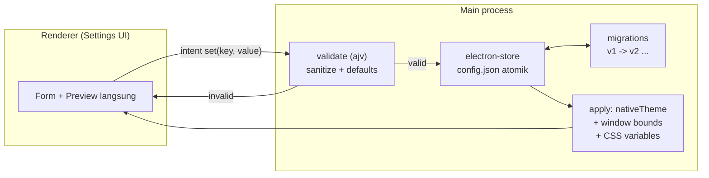
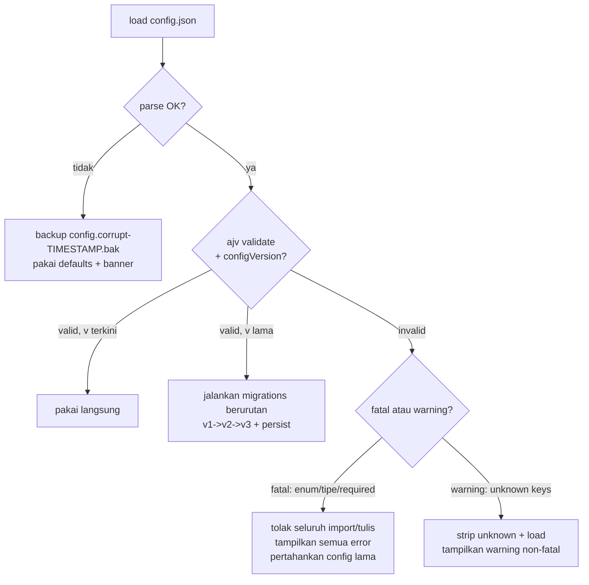
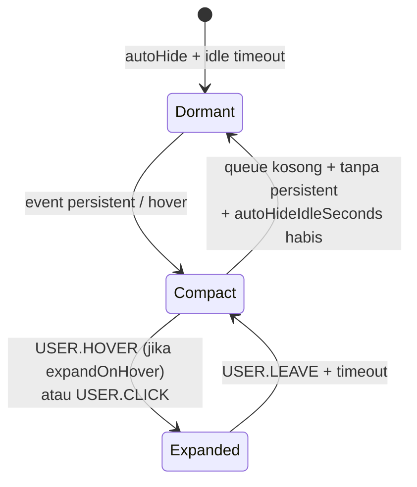
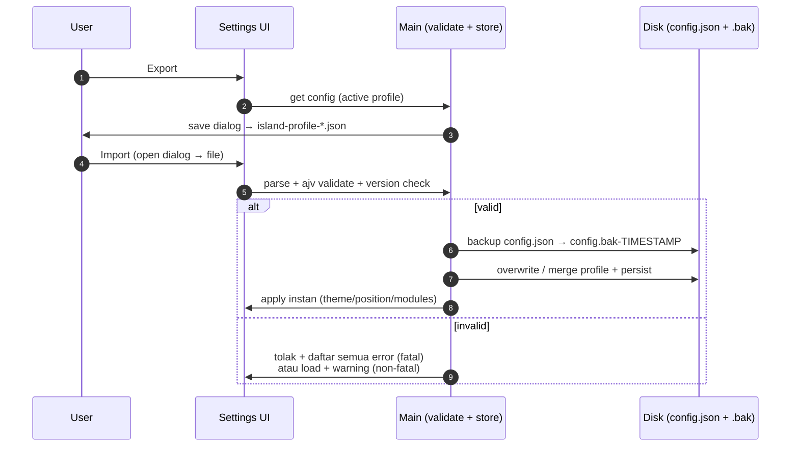
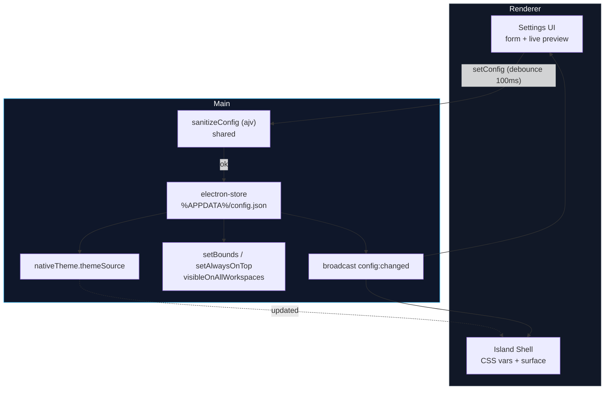

# Decision Document — Customization System (Schema + Persistence + Theme + Profiles, Tanpa Plugin-System di v1)

- **Tanggal:** 2026-09-17
- **Topik:** Customization system island-dynamic: Appearance (Theme/Accent/Transparency/Blur/Size/Radius/Animation), Position (Top Center/Left/Right/Custom), Modules (Pomodoro/Music/Notification/Download/Microphone/AI), Behavior (Auto-hide/Expand-on-hover/Keep-on-top/Workspace/Fullscreen)
- **Status:** Proposed (riset, belum diimplementasi/diverifikasi lokal)
- **Scope:** Configuration schema JSON berversi + settings persistence di Electron Windows + profiles/import-export + theme system (token → CSS variables) + Modules sebagai feature-flags
- **Out-of-scope:** Desain visual final, store/distribusi tema, plugin runtime pihak-ketiga (load kode eksternal), sync cloud multi-device
- **Melanjutkan:** `2026-09-17-dynamic-island-windows.md` (overlay frameless + auto-hide), `2026-09-17-dynamic-island-state-system.md` (State Manager + priority + timeout)

## Executive Summary

Pakai **`electron-store` + satu schema JSON berversi** sebagai satu-satunya sumber kebenaran settings. Contoh JSON usulan user belum aman untuk evolusi — tanpa `configVersion`, tanpa enum/pattern, import rusak akan crash atau state parsial.

Keputusan turunan:

1. **Store = `electron-store`** (`config.json` di `app.getPath('userData')`); aktifkan `schema` (ajv draft-2020-12) + `defaults` + `migrations` sejak v1; tulis atomik.
2. **Schema v1 = `configVersion: 1` + enum untuk `theme/position` + pattern hex untuk `accent` + boolean untuk tiap `modules` + objek untuk `behavior/appearance`**. Validasi ketat saat load dan import: kumpulkan semua error, tolak dengan pesan jelas, backup file lama sebelum overwrite.
3. **Theme = `nativeTheme.themeSource: system` default + token JSON → CSS variables** untuk accent/transparency/radius/animasi; ganti instan tanpa reload; blur real out-of-scope v1 (fallback opacity).
4. **Profiles = pilih satu: satu file per profil ATAU satu store + kunci `profiles/activeProfile` — jangan dua.** v1: satu store + `profiles` map + `activeProfileId` (paling sederhana, atomik, mudah export).
5. **Import/export = dialog file → parse → validasi ajv → tolak/error terkumpul + backup `.bak` sebelum overwrite.** Tiru pola Daintree/Terminal: warna CSS tak valid ditolak, warning non-fatal tetap load.
6. **Tunda true plugin-system.** Kebutuhan Modules/Behavior v1 cukup sebagai **boolean feature-flags + conditional render** di State Manager. Load kode pihak-ketiga adalah risiko eksekusi kode + API-stability yang tidak proporsional.

## Konteks

Usulan user yang dijawab dokumen ini:

```text
Appearance
├── Theme
├── Accent
├── Transparency
├── Blur
├── Size
├── Radius
└── Animation

Position
├── Top Center
├── Top Left
├── Top Right
└── Custom

Modules
├── Pomodoro
├── Music
├── Notification
├── Download
├── Microphone
└── AI

Behavior
├── Auto hide
├── Expand on hover
├── Keep on top
├── Workspace behavior
└── Fullscreen behavior
```

Contoh awal user (belum berversi):

```json
{
  "theme": "dark",
  "accent": "#ff4d5a",
  "position": "top-center",
  "modules": {
    "pomodoro": true,
    "media": true,
    "notifications": true
  }
}
```

Pertanyaan keputusan:

1. Schema seperti apa agar evolusi v1→v2 tidak merusak user lama?
2. Persist di mana di Windows, kapan tulis, bagaimana survive corrupt/crash?
3. Theme/accent/transparency/blur/size/radius/animation diterapkan bagaimana tanpa reload?
4. Position + Behavior (auto-hide, keep-on-top, workspace, fullscreen) di Electron Windows bagaimana?
5. Modules = flags atau plugin-system?
6. Profiles + import/export yang aman seperti apa?

## Findings (Evidence)

Konvensi: **[Fakta]** = terobservasi dari docs/sumber. **[Inferensi]** = kesimpulan kami. **[Opini sumber]** = klaim sumber sekunder.

### 1. Settings persistence — `electron-store` cukup untuk v1

**[Fakta]** `electron-store` menyimpan `config.json` di `app.getPath('userData')` (`%APPDATA%\<AppName>\config.json` di Windows), cocok untuk settings kecil karena seluruh file dibaca/ditulis tiap perubahan, bukan database.

**[Fakta]** Mendukung `schema` JSON Schema draft-2020-12 via `ajv`; nilai melanggar schema melempar `Config schema violation`; mendukung `defaults`, `migrations` per semver, dan atomic write (tulis temp + rename).

**[Inferensi]** Ini menjawab persistensi island-dynamic: config <1MB, tulis jarang (saat user ubah settings, bukan tiap tick Pomodoro 250ms). Jangan tulis store tiap tick render — boros I/O + risiko corrupt saat crash tepat saat tulis. State timer aktif (deadline) dan settings UI harus dipisah: `config.json` (settings) vs `timer.json`/`history.jsonl` (runtime), atau minimal key terpisah dengan throttling tulis.



### 2. Schema — contoh user harus dinaikkan ke berversi + tervalidasi

**[Inferensi]** Contoh JSON usulan tanpa `configVersion`, tanpa enum/pattern, akan gagal dalam 3 cara: (a) tambah field v2 merusak parser v1, (b) import file edit-manual (`"accent": "merah"`) crash atau state parsial, (c) tidak bisa migrasi otomatis user lama.

**[Fakta]** Pola `electron-store` yang benar: definisikan `schema` + `defaults` + `migrations: { '2.0.0': store => {...} }` sejak awal. Validasi berjalan saat `get/set`, bukan hanya saat import.

**[Opini sumber — bukan kontrak]** Contoh Daintree/Terminal menunjukkan validasi import yang ketat: tolak warna CSS tak valid, kumpulkan semua error sekaligus (bukan fail-fast satu), warning non-fatal tetap load — layak ditiru sebagai pola, bukan sebagai dependency.



### 3. Theme system — `nativeTheme` + token → CSS variables

**[Fakta]** `nativeTheme.themeSource = 'system' | 'light' | 'dark'` + `shouldUseDarkColors` adalah API primer untuk ikut tema OS (Electron docs v41). Default harus `system` agar ikut Windows Settings → Personalization.

**[Fakta]** Pola komunitas untuk tema custom: token JSON → CSS variables + ganti instan tanpa reload (set property di `:root`, bukan reload halaman atau ganti file CSS).

**[Inferensi]** Untuk island-dynamic, bedakan dua lapis:

| Lapis | Sumber | Contoh | Cara apply |
|---|---|---|---|
| OS theme | `nativeTheme.themeSource` | `system/light/dark` | `nativeTheme.themeSource = cfg.theme`; dengar `updated` untuk ikut perubahan OS otomatis |
| Accent/transparency/radius/size/animation | token di config → CSS vars | `--accent: #ff4d5a; --radius: 22px; --opacity: .92` | `document.documentElement.style.setProperty()` + IPC `config:changed` ke semua window; preview instan dengan debounce 100ms |

Blur real (acrylic/mica/backdrop-filter di overlay transparent Windows) tetap out-of-scope v1 sesuai doc overlay — fallback = opacity + solid/dark background. Alasan: RDP/VM/GPU-disable membuat blur tidak deterministik; belum diuji.

### 4. Position + Behavior — spesifik Electron Windows

**[Inferensi]** Position dan Behavior bukan CSS semata — mereka adalah `BrowserWindow.setBounds / setAlwaysOnTop / setVisibleOnAllWorkspaces / setFullScreenable` + logika State Manager (auto-hide):

- `position: top-center | top-left | top-right | custom` → hitung `x,y` dari `screen.getPrimaryDisplay().workAreaSize` + `sizePreset`. `custom` menyimpan `x,y` eksplisit; validasi clamp di dalam workArea (multi-monitor: fallback primary jika display hilang).
- `behavior.autoHide` + `autoHideIdleSeconds` → milik State Manager (`Dormant` saat idle, sesuai doc state-system), bukan `setTimeout` tersebar di komponen. `expandOnHover` = `USER.HOVER → Expanded`, `leave → Compact/Dormant`.
- `keepOnTop` → `win.setAlwaysOnTop(true, 'screen-saver')` + `win.setVisibleOnAllWorkspaces(true)` sesuai kebutuhan workspace. `fullscreenBehavior: hide | overlay | minimize` → dengar `fullscreen`/`leave-full-screen` + tampil di atas fullscreen hanya jika `overlay` (butuh `visibleOnFullScreen` di macOS; di Windows butuh level `screen-saver` + uji per game exclusive-fullscreen).
- `size: compact | comfortable | large | custom(w,h)` + `radius: 12–28px` + `animation: spring | fade | none` + `transparency: 0.4–1.0` → CSS vars + `setSize` dengan `animate` opsional. Animasi morph collapsed↔expanded milik shell (Framer-Motion/CSS spring), durasi dari token, `none` untukConstrained motion / test.



### 5. Modules — flags, bukan plugin-system

**[Inferensi]** True plugin-system (load kode pihak-ketiga saat runtime: `require(userPath)`, dynamic ESM, sandbox VM) adalah risiko eksekusi kode + API-stability (kontrak event berubah → plugin pecah) + review/penandatanganan yang tidak proporsional untuk v1. Kebutuhan Modules saat ini (on/off Pomodoro, Music, dsb) cukup sebagai **boolean feature-flags + conditional render + langganan event di State Manager**.

Aturan: flag `false` = actor tidak di-spawn + event kategorinya di-drop di bus + tidak masuk queue. Ini mencegah bug "modul mati tapi masih nahan island" (lih. Windhawk #4738 di doc state-system).

### 6. Profiles + import/export

**[Inferensi]** Dua desain bersaing: (a) satu file per profil (`profiles/<id>.json`), (b) satu store + kunci `profiles: Record<id, Config>` + `activeProfileId`. Pilih **satu, jangan dua** — v1 pilih (b): atomik (satu tulis), mudah backup/export (satu file), tidak ada masalah sinkron antar-file. (a) baru layak jika profil >100KB/berisi aset atau perlu sharing per-file.

Import/export aman = dialog file → parse → validasi `ajv` → tolak dengan pesan terkumpul + backup file lama sebelum overwrite:



## Decision / Desain yang Diusulkan

### Prinsip

1. Satu schema berversi, satu store, satu jalur tulis (`setConfig` tervalidasi).
2. Gagal aman: file korup/import rusak tidak pernah crash — backup + default + pesan jelas.
3. Apply instan tanpa reload (CSS vars + IPC + window API).
4. Modules = flags; plugin-system ditunda eksplisit sampai v2+ dengan RFC terpisah.

### Schema v1 (peningkatan dari contoh user)

```json
{
  "configVersion": 1,
  "appearance": {
    "theme": "system",
    "accent": "#ff4d5a",
    "transparency": 0.92,
    "blur": false,
    "size": "comfortable",
    "customSize": { "width": 420, "height": 64 },
    "radius": 22,
    "animation": "spring"
  },
  "position": {
    "preset": "top-center",
    "custom": { "x": 760, "y": 12 },
    "monitor": "primary"
  },
  "modules": {
    "pomodoro": true,
    "music": true,
    "notification": true,
    "download": false,
    "microphone": false,
    "ai": false
  },
  "behavior": {
    "autoHide": true,
    "autoHideIdleSeconds": 5,
    "expandOnHover": true,
    "keepOnTop": true,
    "workspaceBehavior": "all-workspaces",
    "fullscreenBehavior": "overlay"
  },
  "profiles": {
    "activeProfileId": "default",
    "items": {
      "default": { "name": "Default" }
    }
  }
}
```

Kontrak validasi (ajv, ringkas):

- `configVersion: integer, const 1` (v1) — migrasi menaikkan angka ini.
- `appearance.theme ∈ {system, light, dark}`; `accent: pattern ^#[0-9a-fA-F]{6}$`; `transparency: 0.4–1.0`; `blur: boolean`; `size ∈ {compact, comfortable, large, custom}`; `radius: 8–32`; `animation ∈ {spring, fade, none}`.
- `position.preset ∈ {top-center, top-left, top-right, custom}`; `custom.x/y: integer ≥0`; `monitor ∈ {primary, cursor, id-string}`.
- `modules.*: boolean` (6 kunci required).
- `behavior.autoHide/expandOnHover/keepOnTop: boolean`; `autoHideIdleSeconds: 3–60`; `workspaceBehavior ∈ {current-only, all-workspaces}`; `fullscreenBehavior ∈ {hide, overlay, minimize}`.
- `additionalProperties: false` di tiap objek + `unknownKeys: strip-dengan-warning` saat import (agar forward-compatible dengan v2).

Skeleton TypeScript (di `src/shared/config.ts`, dipakai main + renderer):

```ts
export const CONFIG_VERSION = 1;
export type Theme = 'system' | 'light' | 'dark';
export type PositionPreset = 'top-center' | 'top-left' | 'top-right' | 'custom';
export interface IslandConfig {
  configVersion: 1;
  appearance: {
    theme: Theme; accent: `#${string}`;
    transparency: number; blur: boolean;
    size: 'compact' | 'comfortable' | 'large' | 'custom';
    customSize: { width: number; height: number };
    radius: number; animation: 'spring' | 'fade' | 'none';
  };
  position: {
    preset: PositionPreset;
    custom: { x: number; y: number };
    monitor: string;
  };
  modules: Record<'pomodoro'|'music'|'notification'|'download'|'microphone'|'ai', boolean>;
  behavior: {
    autoHide: boolean; autoHideIdleSeconds: number;
    expandOnHover: boolean; keepOnTop: boolean;
    workspaceBehavior: 'current-only' | 'all-workspaces';
    fullscreenBehavior: 'hide' | 'overlay' | 'minimize';
  };
  profiles: { activeProfileId: string; items: Record<string, { name: string }> };
}
export function sanitizeConfig(raw: unknown): { ok: true; value: IslandConfig } | { ok: false; errors: string[] };
export function migrateConfig(raw: Record<string, unknown>): IslandConfig;
```

### Arsitektur apply (Electron)



Aturan tulis:

- Tulis hanya saat: user ubah settings (debounce 100–200ms untuk slider seperti transparency), ganti profil, import, migrasi boot.
- Jangan tulis tiap tick Pomodoro/media-progress.
- Setiap tulis = validasi dulu; gagal = tolak + tampilkan error, pertahankan nilai lama.
- Setiap overwrite import/migrasi = backup `config.bak-<ISO-timestamp>.json` dulu (max 5, rotate).

### Theme tokens → CSS

```ts
// main → renderer via config:changed, lalu:
root.style.setProperty('--accent', cfg.appearance.accent);
root.style.setProperty('--island-opacity', String(cfg.appearance.transparency));
root.style.setProperty('--island-radius', `${cfg.appearance.radius}px`);
root.style.setProperty('--island-anim', cfg.appearance.animation);
// theme terang/gelap: [data-theme="dark"] di <html>, ikut nativeTheme.shouldUseDarkColors saat theme=system
```

## Options Considered

| Opsi | Kelebihan | Kekurangan | Verdict |
|---|---|---|---|
| **A. `electron-store` + schema berversi + CSS vars (direkomendasikan v1)** | Atomik, ada schema/migrasi/defaults, kecil, pola mapan (kizami), apply instan | Seluruh file ditulis tiap ubah (tidak cocok untuk data besar/high-frequency) — diatasi dengan pisah runtime state | **Pilih v1** |
| B. `localStorage`/file JSON manual di renderer | Nol dependency | Tidak atomik, tidak ada schema/migrasi, renderer bisa tulis parsial, sulit backup, tidak ada validasi silang main/renderer | Tolak |
| C. SQLite untuk settings | Query kuat, transaksional | Overkill untuk <1MB key-value, perlu migrasi SQL + layer tambahan, theme/posisi tidak butuh query | Tolak untuk settings (boleh untuk history Pomodoro v2) |
| D. True plugin-system v1 (load JS pihak-ketiga) | Ekstensibel maksimal | Risiko eksekusi kode, API-stability, signing/review, debugging sulit — tidak proporsional untuk 6 modul internal | **Tunda ke v2+ dengan RFC** |
| E. Satu file per profil sejak v1 | Sharing per-file mudah | Sinkron antar-file, backup tidak atomik, kompleksitas daftar/scan folder | Cadangan jika profil berisi aset besar |

## Risiko + Mitigasi

| # | Risiko | Dampak | Mitigasi |
|---|---|---|---|
| 1 | File `config.json` korup (crash saat tulis / edit manual) | App crash saat boot atau state parsial | Parse-guarded + backup `.bak` + fallback defaults + banner "settings direset, backup tersedia" |
| 2 | Import file v2 ke app v1 / versi tak dikenal | Field tak dikenal merusak render | `configVersion` check: tolak major lebih baru dengan pesan; strip unknown keys dengan warning untuk minor |
| 3 | `accent` tak valid (`"merah"`, `#fff`, `red`) | CSS var rusak → island tak terbaca | Pattern `^#[0-9a-fA-F]{6}$` + tolak fatal; picker membatasi input; test `sanitizeConfig` |
| 4 | Position custom di luar layar (monitor dicabut) | Island hilang / tak terjangkau | Clamp ke `workArea` primary + fallback `top-center` + log warning |
| 5 | Transparency/blur ekstrem di RDP/VM | Teks tak terbaca / GPU fallback | Batas 0.4–1.0; `blur=false` default v1; sediakan "Reset appearance" satu klik |
| 6 | Modul dimatikan tapi masih nahan island | Island tidak auto-hide (bug #4738) | Flag false = jangan spawn actor + drop event di bus (kontrak dengan doc state-system) |
| 7 | Tulis terlalu sering (slider transparency) | I/O churn, risiko corrupt | Debounce 100–200ms + preview lokal dulu, persist setelah idle |
| 8 | Scope creep plugin-system di v1 | Waktu habis untuk sandbox/API | Bekukan: Modules = flags; plugin butuh RFC + threat model terpisah |

## Assumptions & Limitations

- Asumsi Electron + Windows 10 17763+/11, config <1MB, `electron-store` versi terkini yang masih memakai ajv draft-2020-12.
- Belum verifikasi lokal/pinning versi Electron/`electron-store`; belum uji corrupt-file, concurrent-write antar window, dan RDP/VM untuk transparency/blur.
- Blur real tetap out-of-scope v1 sesuai doc overlay; `blur` di schema adalah flag forward-compatible (default `false`).
- Mermaid di doc ini adalah spesifikasi, bukan hasil generate dari kode.

## Next Steps (tanpa ubah code di doc ini)

1. Buat spike `src/shared/config.ts`: tipe `IslandConfig`, JSON Schema ajv, `sanitizeConfig`, `migrateConfig`, `defaults` — murni, tanpa Electron, bisa unit-test Node saja.
2. Tulis unit test minimal: (a) contoh user lama tanpa `configVersion` → migrasi ke v1, (b) `accent` tak valid ditolak dengan semua error terkumpul, (c) unknown keys di-strip + warning, (d) file korup → defaults + backup, (e) import v-masa-depan ditolak jelas.
3. Spike main: `electron-store` + `schema` + `migrations` + backup `.bak` + broadcast `config:changed`; renderer: apply CSS vars + `nativeTheme` + `setBounds/alwaysOnTop` + preview debounce.
4. Kontrak dengan State Manager: `modules.*=false` → drop event kategori itu; `behavior.autoHide*` → timeout milik manager (lih. doc state-system).
5. RFC terpisah untuk plugin-system v2+ (sandbox, signing, API-stability, permission model) — jangan mulai di v1.

## Sources

- electron-store GitHub (storage `app.getPath('userData')`, `schema` ajv draft-2020-12, `defaults`, `migrations`, atomic write) — https://github.com/sindresorhus/electron-store
- Electron nativeTheme docs (`themeSource`, `shouldUseDarkColors`, event `updated`) — https://github.com/electron/electron/blob/v41.2.0/docs/api/native-theme.md
- Daintree Theme Authoring (pola validasi import: tolak warna tak valid, error terkumpul, warning non-fatal) — https://daintree.org/docs/themes/authoring
- Dok lokal: `2026-09-17-dynamic-island-windows.md`, `2026-09-17-dynamic-island-state-system.md`, `2026-09-17-pomodoro-timer-engine.md`

(End of file)
