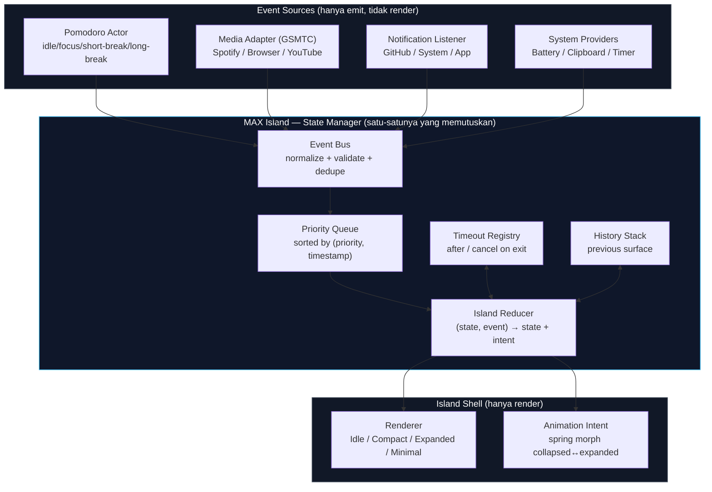
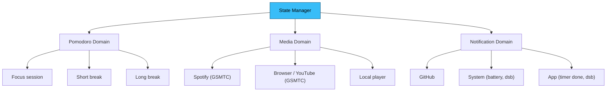
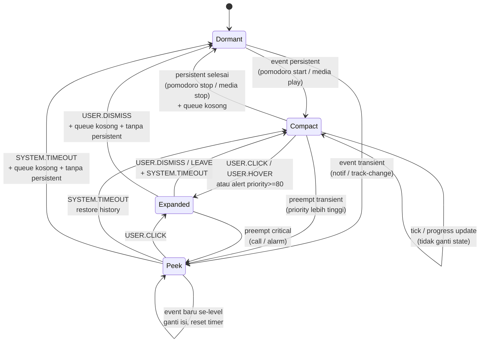
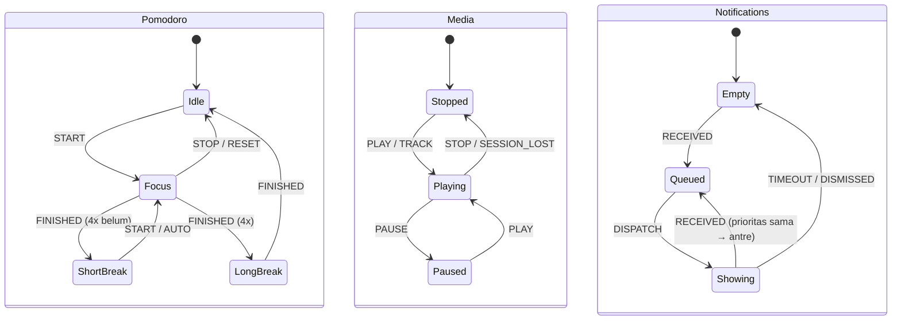
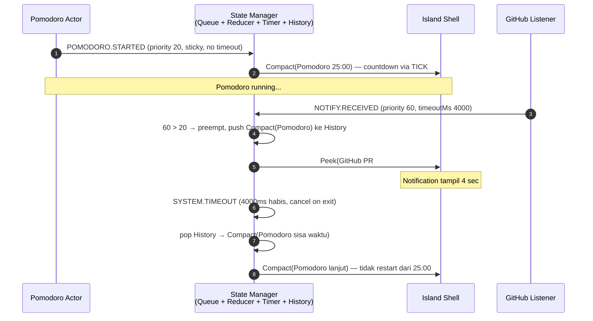
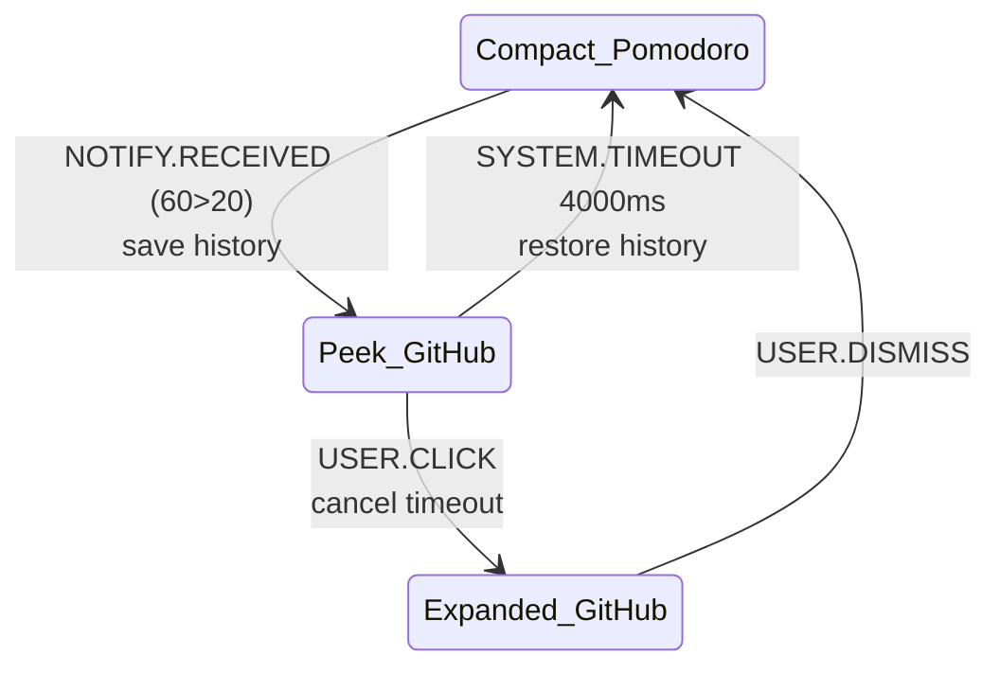
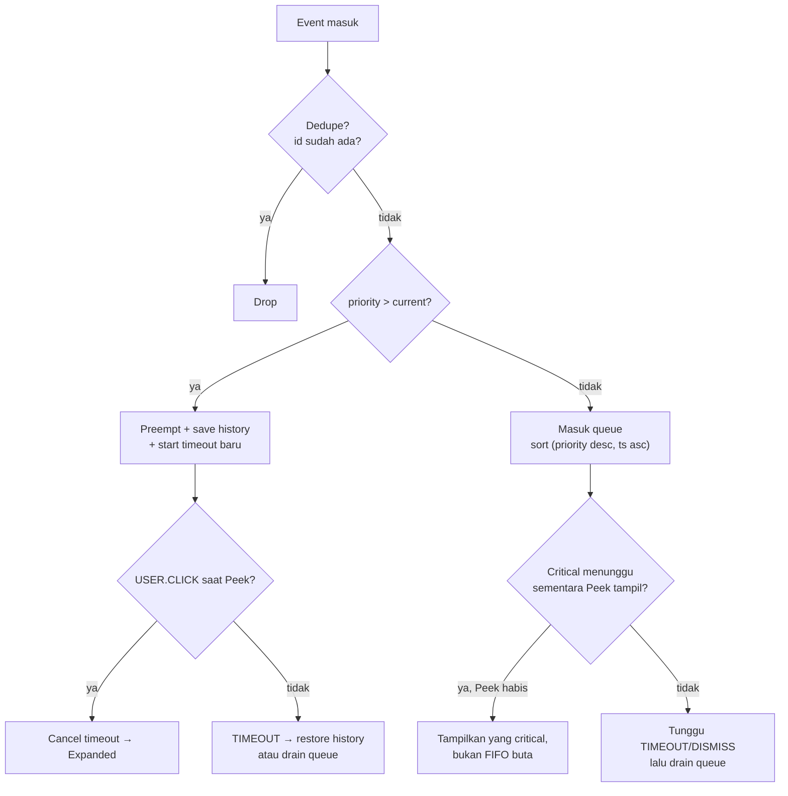

# Decision Document — Dynamic Island State System (Event-Driven, bukan Hardcode `if`)

- **Tanggal:** 2026-09-17
- **Topik:** Arsitektur state/event untuk MAX Island: State Manager + priority + notification queue + timeout/interruption
- **Status:** Proposed (desain awal, belum implementasi)
- **Scope:** Desain state machine island overlay Windows/Electron (Pomodoro + Media + Notification), kontrak event, priority, queue, transisi, timeout, interupsi, concurrent events
- **Out-of-scope:** Desain visual final, pilihan Electron vs Tauri (lihat `2026-09-17-dynamic-island-windows.md`), implementasi ActivityKit iOS
- **Melanjutkan:** `2026-09-17-dynamic-island-ios-macos-mekanisme.md` (state model Dormant/Minimal/Compact/Expanded) + `2026-09-17-dynamic-island-windows.md` (GSMTC + Pomodoro + auto-hide)

## Executive Summary

Jangan hardcode `if pomodoro → show pomodoro, if music → show music`. Itu tidak scalable saat ada concurrent events (Pomodoro jalan + notif GitHub masuk + track Spotify ganti dalam 1 detik).

Desain yang diusulkan: **satu `Island State Manager` di tengah**. Semua sumber (Pomodoro actor, Media adapter GSMTC, Notification listener) hanya emit **normalized event** → masuk **priority queue** → **reducer murni** menentukan **satu `IslandSurfaceState`** yang dirender. History state dipakai untuk kembali ke state sebelumnya setelah interupsi sementara (contoh: Pomodoro → notif 4 detik → Pomodoro lagi). Timeout (`after`) dipakai untuk auto-dismiss. Preemption hanya untuk priority lebih tinggi, sisanya queue.

Pola ini terbukti di tiga tempat: (1) iOS Dynamic Island (compact/minimal/expanded + sistem pilih mana yang tampil), (2) repo `Android-Island` (deterministic queue + priority preemption + reducer → idle/peek/expanded/pinned/dismissed), (3) XState (hierarchical + parallel + history + `after` + actor model).

## Konteks

Usulan user:

```text
              MAX Island
                  |
           State Manager
                  |
     ┌────────────┼────────────┐
     ↓            ↓            ↓
 Pomodoro       Media       Notification
     ↓            ↓            ↓
 Focus         Spotify       GitHub
```

Pertanyaan keputusan yang dijawab dokumen ini:

1. Bentuk State Manager seperti apa agar tambah sumber baru (Focus, Spotify, GitHub, dst) tanpa ubah `if/else` di UI?
2. Bagaimana menangani priority, queue, timeout, interupsi, dan concurrent events secara deterministik?
3. Bagaimana alur konkret `Pomodoro running → GitHub notification → tampil 4 sec → Pomodoro kembali` dimodelkan?

## Findings (Evidence)

### 1. iOS — sistem yang memilih presentasi, bukan app

**[Fakta]** iOS punya 3 presentasi: `compact` (1 Live Activity aktif, terdiri dari leading+trailing), `minimal` (2 Activity aktif, satu attached + satu detached), `expanded` (long-press / alert sesaat via `AlertConfiguration`). Sumber: HIG Live Activities + `ActivityKit displaying-live-data`.

**[Fakta]** Saat >1 app start Live Activity, **sistem yang memilih** mana yang visible. Dua preseden numeric priority: (1) `DynamicIslandExpandedRegion.init(_:priority:content:)` punya `priority: Double = 0` — sistem render view prioritas tertinggi full-width saat sizing expanded; (2) `relevanceScore` menentukan mana dari app yang sama yang tampil di island (tanpa score / tie = yang pertama started). Sumber: `DynamicIslandExpandedRegion` docs + `displaying-live-data`.

**[Fakta]** Batasan ActivityKit yang relevan untuk desain timeout/persist kita: gaya `ActivityStyle.transient` untuk tampil sementara yang berakhir saat collapse/tap-outside/leave-app; `staleDate` → `isStale=true`; dismissal `.default/.immediate/.after(date)`; batas ~8 jam aktif + ~4 jam lockscreen; payload ≤4KB; sistem mengabaikan `withAnimation` dan memakai system timing. Sumber: `displaying-live-data` ( diverifikasi via deep-research 2026-09-17).

**[Belum terverifikasi]** Klaim "Apple menyarankan satu Live Activity yang rotate antar events" dari draf awal — halaman HIG membutuhkan JS dan gagal diverifikasi langsung. Jangan jadikan requirement sampai terverifikasi.

Implikasi untuk kita: island overlay juga harus punya **satu renderer + satu state aktif**, bukan N view berebut. Sistem (State Manager) yang memilih, bukan masing-masing modul yang gambar sendiri.

### 2. Android-Island — referensi arsitektur paling mirip kebutuhan kita

**[Fakta]** Repo `ProNoob2450/Android-Island` memakai alur: System event sources → emit `IslandEventUpdate` ternormalisasi → `SystemEventRepository` merge flows + apply category settings + update **deterministic priority queue** → `IslandReducer` ubah gestures/queue/timeout jadi `IslandSurfaceState` + animation intents → `OverlayWindowController` render. Sumber: README repo.

**[Fakta]** State yang dipakai: `idle, peek, expanded, pinned, dismissed, incoming-call, in-call` + fitur **priority preemption dan secondary bubble support**. Sumber: sama.

**[Fakta]** Split modul: `core:events` (event model, queue, reducer, snapshot), `core:cutout`, `core:overlay`, `core:ui`. Sumber: sama.

Implikasi: tiru pemisahan ini untuk Electron: `core/events` (tanpa ketergantungan Electron/React) harus bisa di-unit-test murni (queue ordering, reducer behavior).

### 3. XState — pola statechart yang menyelesaikan timeout/interruption/concurrent

**[Fakta]** XState (`xstate`, `@xstate/store`) berbasis event-driven + state machines + statecharts + actor model. Sumber: README `statelyai/xstate`.

**[Fakta]** Pola yang relevan dan terdokumentasi:
- **Hierarchical (nested):** parent transition berlaku untuk semua child, event bubbling otomatis.
- **Parallel:** region independen jalan bersamaan (contoh: `bold/underline/italics` masing-masing on/off).
- **History (`type: 'history'`):** kembali ke substate terakhir (`method.hist` kembali ke `check` setelah `review`, bukan reset ke `cash`), shallow default, `history: 'deep'` opsional. Ini jawaban untuk "kembali ke Pomodoro setelah notif".
- **Delayed transition (`after`):** auto-transition berbasis timer yang otomatis di-cancel saat state-nya di-exit (semantik terverifikasi via Stately docs `delayed-transitions`; detail line `stateUtils.ts` tidak dibuka langsung sesi ini, jadi tidak dikutip nomor baris). Ini jawaban untuk "tampil 4 sec".
- **Actor model:** actor memproses message sequential dari internal event queue, tidak share state langsung, komunikasi via kirim event; `spawnChild(childMachine, {id})` untuk multi-actor (terverifikasi via Stately docs `actors`). Cocok untuk Pomodoro actor vs Media actor vs Notification actor.

Implikasi: tidak harus langsung depend ke `xstate` (prinsip minimal dependency). Tapi **model-nya wajib ditiru**: history + after + guard + actor. Jika logika tumbuh, migrasi ke `xstate` jadi mudah karena kontraknya sama.

### 4. Priority + queue — konvensi yang sudah mapan

**[Fakta]** `Adw.Toast:priority`: `NORMAL` → queue, `HIGH` → tampil segera dan mendorong toast sebelumnya ke queue. Sumber: docs libadwaita.

**[Fakta]** Pola toast modern yang terverifikasi: Base UI `Toast.Provider limit=3` default — saat exceed, oldest ditandai `data-limited` + `inert` (bukan dihapus); Sonner `visibleToasts=3` default, `expand` boolean, `duration=4000`, `gap=14`, `id` stabil untuk dedupe; Radix Toast `duration=5000` default, per-toast override, pause closing on hover/focus/window-blur, viewport pause semua toast saat pointer/focus masuk. Sumber: Base UI Toast docs, Sonner npm/shadcn docs, Radix Toast docs.

**[Fakta]** Bug Radix `#2233` (terverifikasi): `duration=Infinity` (loading toast ala promise) + pause (hover/focus/blur) → tidak auto-dismiss dan `onOpenChange` tidak terpanggil; root cause `closeTimerRemainingTimeRef` tidak update saat rerender + `viewport.focus()` setelah close membuat timer stuck. Pelajaran untuk island (queue=1): pakai **per-event deadline + reset remaining saat duration berubah**, bukan timer global viewport. Issue terkait `#2221` hanya terkonfirmasi sebagai related-link; shadcn `#617` tidak ditemukan/relevan (yang ada `#7230`/`#2234` soal richColors) → keduanya ditulis tidak terverifikasi.

**[Opini sumber]** Referensi community `notification-system-design` (max visible 3, queue >5 collapse jadi summary "+N more", durasi short 3000/standard 5000/long 8000, urgency 4 level, grouping, quiet hours, lifecycle created→…→dismissed, ARIA polite vs assertive) adalah checklist best-practice yang masuk akal, bukan spec vendor. Aturan ">5% critical = crying wolf" juga opini tanpa benchmark terkontrol.

**[Fakta]** Pelajaran dari Windhawk issue `#4738` (terverifikasi): modul Media dianggap continuous event dan me-reset/override `AutoHideIdleSeconds`; ekspektasi user: media hanya popup 3–5 detik saat track-change/play-pause seperti Clipboard/Battery. Ini failure mode yang harus dicegah oleh desain queue/timeout, bukan oleh `if` di UI. Catatan verifikasi: pola hover-expand/scroll-tab/split diambil dari halaman katalog mod Windhawk (search excerpt), bukan dari source `.wh.cpp` (URL tree 404 saat diverifikasi).

### 5. Kenapa `if/else` hardcode gagal

| Gejala | Penyebab `if/else` | Solusi state machine |
|---|---|---|
| Tambah sumber baru (misal GitHub) harus edit UI | UI tahu semua sumber | Sumber hanya emit event, UI hanya render `IslandSurfaceState` |
| Dua event bersamaan → flicker / rebutan | Tidak ada definisi siapa menang | Priority score + preemption rule deterministik |
| Notif hilang → tidak tahu harus kembali ke mana | Tidak ada memori state | History state (shallow/deep) |
| Timer bocor (notif tidak hilang, media nahan island) | Timeout tersebar di komponen | Satu `after`/timeout milik State Manager, cancel on exit |
| Sulit test | Logika nempel di render | Reducer murni: `(state, event) → state`, test tanpa Electron |

## Decision / Desain yang Diusulkan

### Prinsip

1. **Single source of truth:** hanya State Manager yang boleh memutuskan apa yang tampil.
2. **Event-carried state transfer:** event membawa data (`title/artist/payload`), bukan sekadar sinyal.
3. **Deterministic:** `(state, event, now) → state` murni, tidak ada `Math.random` / `Date.now()` di dalam reducer (waktu di-inject).
4. **Preemption terkontrol:** hanya priority lebih tinggi yang boleh interupsi; selain itu queue.
5. **Selalu bisa kembali:** setiap interupsi sementara menyimpan `previous` via history.
6. **Timeout milik manager:** setiap tampil sementara wajib punya `timeoutMs` + `onTimeout`.

### Arsitektur (peta dari diagram user)



Setiap kotak di bawah State Manager (Pomodoro/Media/Notification) adalah **actor independen** dengan state internal sendiri. Di bawahnya lagi (Focus/Spotify/GitHub) adalah **provider/konfigurasi**, bukan state baru. Tambah sumber baru = tambah actor + daftarkan kategori, **tanpa menyentuh renderer**.



### Kontrak event ternormalisasi

Semua sumber wajib emit bentuk ini (nama field boleh disesuaikan saat implementasi, tapi semantiknya tetap):

```ts
type IslandEventType =
  | "POMODORO.TICK" | "POMODORO.STARTED" | "POMODORO.FINISHED"
  | "MEDIA.TRACK_CHANGED" | "MEDIA.PLAY_PAUSE" | "MEDIA.STOPPED"
  | "NOTIFY.RECEIVED" | "NOTIFY.DISMISSED"
  | "USER.HOVER" | "USER.LEAVE" | "USER.CLICK" | "USER.DISMISS"
  | "SYSTEM.TIMEOUT" | "SYSTEM.QUEUE_DRAINED";

interface IslandEvent {
  id: string;                 // dedupe key
  type: IslandEventType;
  category: "pomodoro" | "media" | "notification" | "system" | "user";
  priority: number;           // lihat tabel di bawah, bukan boolean
  timeoutMs: number | null;   // null = pinned sampai dismiss eksplisit
  timestamp: number;          // di-inject oleh bus, bukan oleh source
  payload: unknown;           // title/artist/progress/dll
  sticky: boolean;            // true = tetap di queue setelah tampil (misal pomodoro)
}
```

### Priority system (awal, bisa di-tuning)

| Priority | Kategori | Contoh | Perilaku |
|---|---|---|---|
| 100 (critical) | Incoming call / alarm | Timer selesai + suara | Preempt apa pun, pinned sampai dismiss |
| 80 (urgent) | Pomodoro phase change | Focus → break | Preempt, tampil expanded 5 detik lalu kembali/menetap sesuai aturan |
| 60 (transient) | Notification | GitHub PR, mention | Preempt state ≤60 selama `timeoutMs` (default 4000), lalu restore history |
| 40 (media-event) | Track change / play-pause | Spotify next | Hanya preempt jika island idle / tampil media; jika Pomodoro aktif → secondary bubble / queue, bukan ganti utama |
| 20 (persistent) | Ongoing session | Pomodoro focus countdown, media playing | Menempati slot collapsed default, tidak auto-dismiss |
| 0 (idle) | Tidak ada event | — | Dormant / clock / auto-hide |

Aturan preemption:

```text
if incoming.priority > current.priority → preempt (simpan current ke history)
else if incoming.priority == current.priority → queue FIFO (yang lebih dulu tetap tampil)
else → queue (urut priority desc, timestamp asc)
```

Khusus media saat Pomodoro aktif: jangan rebut slot utama. Tampilkan sebagai **secondary bubble** (pola Android-Island) atau queue. Ini mencegah bug Windhawk `#4738`.

### State machine shell (yang dirender)



Penjelasan state:

- **Dormant:** auto-hide / hanya dot. Tidak ada persistent, queue kosong.
- **Compact:** slot utama terisi persistent (Pomodoro countdown / Now Playing). Ini yang menggantikan clock (pola `Avenger11764/Dynamic_island`).
- **Peek:** tampil sementara (`timeoutMs`, default 4000). Selalu kembali via history.
- **Expanded:** butuh interaksi (hover/klik/long-press ala iOS) atau alert critical. Berisi kontrol (play/pause/next, pomodoro pause/skip, action GitHub).
- **Pinned/Dismissed** (opsional v2): pinned untuk critical sampai dismiss eksplisit; dismissed untuk snooze kategori.

### Domain actors (parallel, independen dari shell)

Shell di atas adalah **satu** state aktif. Di bawahnya, setiap domain punya mesin sendiri yang jalan **parallel** (pola XState `type: 'parallel'`):



Reducer menggabungkan ketiganya menjadi satu keputusan tampil. Contoh: Pomodoro=`Focus` (persistent) + Media=`Playing` (persistent) + Notifications=`Showing(GitHub)` (transient 4s) → shell=`Peek(GitHub)` selama 4s, lalu kembali ke `Compact(Pomodoro)`, bukan ke Media. Kenapa Pomodoro? Karena history stack menyimpan `Compact(Pomodoro)` sebagai `previous`, dan Media hanya secondary.

### Alur utama yang diminta: Pomodoro → GitHub 4 detik → kembali



Versi state-transition (cara baca: panah = event):



Kasus tepi yang harus ditangani reducer (dan di-test):



### Timeout, interruption, concurrent events — aturan eksplisit

| Topik | Aturan | Implementasi |
|---|---|---|
| Timeout | Setiap `Peek`/`Expanded-alert` wajib `timeoutMs`. Default transient 4000, media-event 3000–5000, urgent 5000, critical `null` (pinned). Hover/focus/blur pause (simpan remaining), leave resume (recompute `endTime`). Pelajaran Radix `#2233`: timer per-event, reset remaining saat duration berubah. | `Timeout Registry`: `start(id, endTime = now + ms)` on entry, `cancel(id)` on exit/click→expanded. Timer berbasis `endTime` (tahan sleep/throttle Chromium + koreksi via `powerMonitor resume`), persist deadline + queue + history di `%APPDATA%`. |
| Interruption | Hanya `incoming.priority > current.priority` yang preempt. Sama/rendah → queue. Critical (`null` timeout) preempt apa pun. | Guard di reducer + history push hanya saat preempt. |
| Concurrent | Event diproses **satu per satu** (FIFO input), keputusan tampil dari queue ter-sort, bukan dari urutan kedatangan mentah. Dedupe by `id`. | Input mailbox + `sort(priority desc, timestamp asc)`. Cap queue (misal 20), overflow → collapse jadi summary (`+N lainnya`), pola toast. |
| Restore | Kembali selalu ke `history.top`, bukan ke default. Jika `history.top` sudah invalid (misal Pomodoro selesai saat notif tampil) → fallback ke queue head → fallback ke Dormant. | History stack + validasi sebelum restore. |
| Tick | `POMODORO.TICK` / `MEDIA.PROGRESS` tidak ganti state, hanya update payload. Throttle tick (1 detik) agar tidak re-render tiap ms. | Guard `isTick` → update context saja. |

### Skeleton reducer (TypeScript, murni, tanpa Electron — bisa di-test Node saja)

```ts
// core/events/island.ts — tidak boleh import electron/react.
type Surface =
  | { kind: "dormant" }
  | { kind: "compact"; owner: string; eventId: string }
  | { kind: "peek"; owner: string; eventId: string; deadline: number }
  | { kind: "expanded"; owner: string; eventId: string };

interface IslandState {
  surface: Surface;
  queue: IslandEvent[];    // sorted
  history: Surface[];      // stack, max ~5
  seen: Set<string>;       // dedupe
}

function reduce(s: IslandState, e: IslandEvent, now: number): IslandState {
  if (s.seen.has(e.id)) return s; // dedupe
  // tick: update payload saja, jangan ganti surface (disingkat)
  if (e.type.endsWith(".TICK")) return updatePayload(s, e);
  // user click saat peek → expanded + cancel timeout
  if (e.type === "USER.CLICK" && s.surface.kind === "peek")
    return { ...s, surface: { kind: "expanded", owner: s.surface.owner, eventId: s.surface.eventId } };
  // timeout/dismiss → restore history atau drain queue atau dormant
  if (e.type === "SYSTEM.TIMEOUT" || e.type === "USER.DISMISS" || e.type === "NOTIFY.DISMISSED")
    return restoreOrDrain(s, now);
  // preempt vs queue
  const cur = priorityOf(s.surface);
  if (e.priority > cur)
    return {
      ...s,
      seen: add(s.seen, e.id),
      history: push(s.history, s.surface),
      queue: remove(s.queue, e.id),
      surface: toSurface(e, now),
    };
  return { ...s, seen: add(s.seen, e.id), queue: insertSorted(s.queue, e) };
}
```

Aturan ini langsung bisa jadi unit test: queue ordering, preemption, history restore, timeout cancel, dedupe, overflow collapse.

## Options Considered

| Opsi | Kelebihan | Kekurangan | Verdict |
|---|---|---|---|
| **A. Custom reducer + queue + history (direkomendasikan v1)** | Zero dependency, murni + testable, cukup untuk 3 domain, migrasi ke XState mudah | Harus tulis + test sendiri (tapi kecil, ~200 baris) | **Pilih v1** |
| B. Langsung pakai `xstate` v5 | History/after/parallel/actor/inspect visual siap pakai, cocok jika domain >5 | Tambah dependency + learning curve, overkill untuk 3 domain awal | Cadangan saat state meledak / butuh visual debugger |
| C. Hardcode `if pomodoro/show music` | Cepat di awal | Tidak menangani preemption/history/timeout/concurrent, tambah 1 sumber = edit UI, bug `#4738` berulang | **Tolak** |
| D. Satu Live Activity rotate (dulu ditulis sebagai "saran Apple") | Sederhana, tidak ada rebutan | Kehilangan konteks persistent (countdown Pomodoro ke-reset tiap rotate), tidak cocok untuk countdown + kontrol media; status "saran Apple" **belum terverifikasi** (HIG gagal dibuka langsung) | Tolak sebagai pola utama sampai terverifikasi; boleh untuk ringkasan Compact saja |

## Risiko + Mitigasi

1. **Media menahan island (bug `#4738`)** → Mitigasi: media-event `timeoutMs` 3–5 detik, tidak ada persistent tanpa `sticky:false`; Pomodoro sticky menang atas media-event di slot utama; media hanya secondary bubble.
2. **Timer drift / sleep / throttle** → Mitigasi: deadline berbasis `endTime = now + ms`, persist `%APPDATA%`, koreksi saat resume via Electron `powerMonitor` (`suspend`/`resume`/`lock-screen`) + `visibilitychange`. Justifikasi terverifikasi: background timer Chromium di-throttle (1 wake/menit setelah ~5 menit background). Risiko yang sama dicatat di doc Windows.
3. **Flicker saat burst event** → Mitigasi: mailbox proses satu-per-satu + debounce 100–200ms sebelum render + tick tidak ganti surface.
4. **History basi** (Pomodoro selesai saat notif tampil) → Mitigasi: validasi `history.top` sebelum restore, fallback queue → dormant.
5. **Over-engineering (langsung XState + parallel penuh)** → Mitigasi: v1 cukup `dormant/compact/peek/expanded` + 1 stack history + 1 queue; `pinned`/`minimal-detached`/multi-bubble di v2.

## Assumptions & Limitations

- Asumsi stack overlay mengikuti doc Windows: Electron frameless transparent alwaysOnTop + GSMTC via `windows-media-sessions`, Pomodoro state-machine lokal.
- Asumsi notifikasi GitHub masuk via listener/polling (GitHub API/websocket) — detail adapter di luar scope doc ini.
- Desain ini belum diimplementasi/di-test; angka priority dan timeout adalah titik awal yang harus di-tuning via spike + user test.
- Mermaid di doc ini adalah spesifikasi, bukan hasil generate dari kode.
- Catatan verifikasi deep-research 2026-09-17: halaman HIG Live Activities gagal dibuka langsung (JS-required) sehingga klaim "satu Activity rotate" ditulis belum terverifikasi; line spesifik `stateUtils.ts mutateEntryExit` tidak dibuka sehingga hanya semantik `after + cancel-on-exit` yang diklaim (via Stately docs); Radix `#2221`/shadcn `#617` tidak terverifikasi isi; source `.wh.cpp` Windhawk 404 sehingga pola hover/scroll/split hanya dari halaman katalog; angka priority/timeout/cap/debounce adalah inferensi awal, bukan benchmark.

## Next Steps (tanpa ubah code di doc ini)

1. Buat spike `core/events` murni (tanpa Electron): tipe `IslandEvent`, `reduce`, queue sort, history, timeout registry berbasis `endTime`.
2. Tulis unit test minimal: (a) Pomodoro → GitHub 4s → kembali Pomodoro sisa waktu, (b) burst Spotify track-change tidak merebut Pomodoro, (c) click saat peek → expanded + cancel timeout, (d) history basi → fallback dormant, (e) dedupe + overflow collapse.
3. Adopsi pola modul Android-Island: `core/events` (murni) → `shell/overlay` (Electron window) → `ui` (React render `IslandSurfaceState` saja).
4. Evaluasi `xstate` hanya jika domain >5 atau butuh Stately visual inspect; jangan tambah di v1.
5. Tuning: timeout default per kategori + threshold preemption media-vs-pomodoro via acceptance test (auto-hide 3–5 detik, primary monitor).

## Sources

- Displaying live data with Live Activities (compact/minimal/expanded + sistem pilih visible + `relevanceScore` + `transient` + `staleDate` + dismissal + batas 8 jam/4 jam + 4KB) — https://developer.apple.com/documentation/activitykit/displaying-live-data-with-live-activities.md
- DynamicIsland struct — https://developer.apple.com/documentation/widgetkit/dynamicisland.md
- DynamicIslandExpandedRegion `init(_:priority:content:)` (`priority: Double = 0`) — https://developer.apple.com/documentation/widgetkit/dynamicislandexpandedregion/init(_:priority:content:).md
- HIG Live Activities (dicoba dibuka, JS-required → klaim rotate belum terverifikasi) — https://developer.apple.com/design/human-interface-guidelines/live-activities
- Meet ActivityKit WWDC23 (lifecycle request/update/end) — https://wwdcnotes.com/documentation/wwdc23-10184-meet-activitykit
- Design dynamic Live Activities WWDC23 (alert via expand, bukan push) — https://wwdcnotes.com/documentation/wwdc23-10194-design-dynamic-live-activities
- Android-Island (IslandEventUpdate + priority queue + preemption + secondary bubble + IslandReducer + surface states) — https://github.com/ProNoob2450/Android-Island
- XState core README (event-driven + hierarchical + parallel + history + actor) — https://github.com/statelyai/xstate/blob/main/packages/core/README.md
- Stately docs (terverifikasi via Context7 `/statelyai/docs`): delayed-transitions (`after` + auto-cancel on exit), history-states (shallow/deep + persist snapshot), actors (sequential mailbox + `spawnChild`)
- Adw.Toast priority (NORMAL queue vs HIGH preempt + push-old-to-queue) — https://gnome.pages.gitlab.gnome.org/libadwaita/doc/1.0.0-alpha.2/property.Toast.priority.html
- Radix Toast docs (duration 5000 + pause hover/focus/blur + viewport) — https://www.radix-ui.com/primitives/docs/components/toast
- Radix Toast source `toast.tsx` — https://github.com/radix-ui/primitives/blob/main/packages/react/toast/src/toast.tsx
- Radix issue #2233 (pause/resume + `closeTimerRemainingTimeRef` + `viewport.focus` bug) — https://github.com/radix-ui/primitives/issues/2233
- Base UI Toast (`limit=3` + `data-limited`/`inert` + `toastManager`) — https://base-ui.com/react/components/toast
- Sonner npm (`visibleToasts`/`expand`/`duration=4000`/`gap=14`) — https://www.npmjs.com/package/sonner/v/0.6.0
- shadcn Sonner/Toast (Toast deprecated → Sonner) — https://ui.shadcn.com/docs/components/radix/sonner dan https://ui.shadcn.com/docs/components/radix/toast
- Notification System Design ref (community skill, perlakukan sebagai checklist) — https://github.com/phazurlabs/sumi/blob/main/skills/performance-states-patterns/references/notification-system-design.md
- Windhawk mod catalog (hover-expand/scroll-tab/split, dari halaman katalog) — https://windhawk.net/mods/dynamic-island-for-windows
- Windhawk Media auto-hide issue #4738 (pelajaran media vs AutoHideIdleSeconds) — https://github.com/ramensoftware/windhawk-mods/issues/4738
- Winisland (hover-expand + leave-collapse + click-cycle + drag-snap + `%APPDATA%`) — https://github.com/onurgnll/Winisland
- Avenger Dynamic_island (spring-physics + collapsed timer gantikan clock + wheel-scroll + 4-sec intro) — https://github.com/Avenger11764/Dynamic_island
- Chromium background timer throttle (1 wake/menit setelah ~5 menit) — https://issues.chromium.org/issues/40128284
- Electron powerMonitor (`suspend`/`resume`/`lock-screen`) — https://www.electronjs.org/docs/latest/api/power-monitor
- Dok lokal: `2026-09-17-dynamic-island-ios-macos-mekanisme.md`, `2026-09-17-dynamic-island-windows.md`

(End of file)
