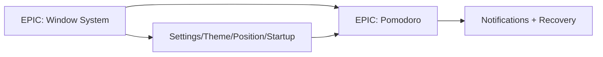

# Decision Document — MVP Definition MAX Island v0.1 (Brutal Cut)

- **Tanggal:** 2026-09-17
- **Topik:** MVP v0.1 scope + technical task breakdown (Window System, Pomodoro)
- **Status:** Proposed (belum diestimasi/diuji lokal)
- **Scope:** Apa yang masuk v0.1, apa yang eksplisit ditunda, dan pecahan EPIC→TASK siap eksekusi
- **Out-of-scope:** Semua item daftar "Belum" di bawah — dilarang masuk v0.1 tanpa ADR baru

## Executive Summary

v0.1 = **floating overlay top-center yang expand/collapse + Pomodoro lengkap (pause/resume/reset, notifikasi, recovery after sleep) + settings minimal (theme, position, startup)**. Selain itu: potong. AI, plugin ecosystem, Spotify/browser integration, cloud sync, complex analytics **dilarang** masuk v0.1. Prinsip: jangan sampai MVP berubah menjadi operating system baru.

## 1. MVP v0.1 — In Scope

- [x] Floating overlay (Electron frameless transparent alwaysOnTop, fixed-size)
- [x] Top-center positioning (primary monitor dulu)
- [x] Expand/collapse (dua ukuran via `setSize`, animasi `transform/opacity` ≤300 ms)
- [x] Pomodoro: timer engine deadline-based (`targetEnd - now`, bukan tick counter)
- [x] Pause/resume/reset
- [x] Notifications (OS toast primer + suara lokal sekunder)
- [x] Settings (durasi focus/short/long, sessionsPerCycle, auto-start flags, sound toggle)
- [x] Theme (light/dark + aksen minimal, tanpa acrylic/blur di v1)
- [x] Position (offset top-center + ingat posisi; multi-monitor = deteksi saja, lock ke primary)
- [x] Startup (autostart OS opt-in + restore state `idle/paused/running` saat boot)

Setiap item di atas wajib punya acceptance di §4. Tanpa acceptance = belum done.

## 2. Non-Goals v0.1 (Eksplisit Belum)

- [ ] AI (asisten, ringkasan, saran fokus)
- [ ] Plugin ecosystem (API pihak ketiga, marketplace, sandboxing)
- [ ] Spotify integration (GSMTC/media control penuh)
- [ ] Browser integration (tab tracking, focus shield, ekstensi)
- [ ] Cloud sync (akun, sync settings/history, backend)
- [ ] Complex analytics (dashboard, streak gamifikasi, export canggih)

Guardrail: request "tambah X dikit" yang menyentuh non-goals **wajib ditolak atau dipindah ke v0.2+** via ADR. Ukuran installer dan idle performance (§5 di doc performance) tidak boleh regresi demi fitur.

## 3. Arsitektur Singkat (rujukan)

- Engine Pomodoro di **main process** (source of truth), renderer hanya render + intent — lihat `2026-09-17-pomodoro-timer-engine.md`.
- Budget performance MAX (idle ≈ negligible) — lihat `2026-09-17-performance-max-island.md`.
- Pola overlay Electron + risiko DPI/multi-monitor — lihat `2026-09-17-dynamic-island-windows.md`.



Urutan eksekusi: Window System dulu (tanpa ini tidak ada tempat render), lalu Pomodoro + persistence + recovery, lalu settings/startup sebagai penutup. Notifications dikerjakan bersama complete-phase Pomodoro, bukan sebagai EPIC terpisah.

## 4. Technical Task Breakdown

### EPIC: Window System

```text
TASK:
├── Create transparent window (frame:false, transparent:true, resizable:false)
├── Implement always-on-top (termasuk perilaku fullscreen-exclusive)
├── Implement hit testing (area transparan click-through, drag vs klik eksplisit)
├── Implement positioning (top-center primary, offset, persist)
├── Implement multi-monitor detection (deteksi saja; v0.1 lock primary + fallback aman)
└── Implement fullscreen behavior (sembunyi/non-intrusif saat fullscreen-exclusive)
```

| TASK | DoD (Definition of Done) |
|---|---|
| Create transparent window | Window muncul tanpa frame/border, dua ukuran fixed, tidak bisa di-resize bebas |
| Implement always-on-top | Selalu di atas window normal; tidak mencuri focus saat collapse |
| Implement hit testing | Klik area transparan tembus; drag hanya dari handle; klik tombol selalu kena |
| Implement positioning | Top-center primary konsisten di restart + skala DPI 100/150/200% |
| Implement multi-monitor detection | Pindah/cabut monitor tidak bikin island hilang di luar layar |
| Implement fullscreen behavior | Saat app fullscreen-exclusive (game/video), island tidak mengganggu |

### EPIC: Pomodoro

```text
TASK:
├── Timer engine (deadline-based, tick 250–500 ms render-only)
├── State persistence (transisi + hidden + tiap 5 dtk, tulis atomik)
├── Focus session (start/pause/resume/reset/skip + history append-only)
├── Short break (transisi cycleCount % N != 0)
├── Long break (transisi cycleCount % N == 0, reset siklus)
├── Notifications (toast OS + chime lokal, dipicu deadline check)
└── Recovery after sleep (reconcile saat resume/unlock/visible/boot)
```

| TASK | DoD |
|---|---|
| Timer engine | Freeze 5–10 dtk / minimize 10 mnt → sisa tetap benar; tidak ada drift akumulasi |
| State persistence | Kill saat running/paused → relaunch merekonstruksi dengan benar |
| Focus session | History tercatat tepat sekali (idempotent `phaseRunId`) |
| Short/Long break | Siklus N focus → long break berjalan sesuai config; config korup fallback default |
| Notifications | Toast + suara muncul saat minimized; tidak dobel saat resume |
| Recovery after sleep | Sleep 2 mnt → bangun: lanjut benar atau complete tertunda + flag `completedWhileSuspended` |

### EPIC: Settings / Theme / Position / Startup (penutup v0.1)

```text
TASK:
├── Settings UI (durasi, siklus, auto-start, suara) + sanitizeConfig
├── Theme (light/dark + aksen; tanpa material blur v1)
├── Position settings (offset + reset-to-default)
└── Startup (autostart toggle + restore state + migrasi skema berversion)
```

DoD: semua settings persist atomik + survive restart; file korup → backup `.bak` + default, app tetap jalan.

## 5. Anti-Scope-Creep Checklist (cek tiap PR)

- [ ] Apakah PR menyentuh salah satu dari 6 non-goals? Jika ya → tolak/pindah milestone.
- [ ] Apakah menambah interval <500 ms permanen / animasi loop / polling baru? Jika ya → wajib justifikasi performance.
- [ ] Apakah menambah dependency baru? Jika ya → jawab "apakah ini perlu?" (prinsip Karpathy: minimal dependencies).
- [ ] Apakah mengubah deadline-based engine menjadi tick counter? Dilarang.

## Blocker

None — siap dipecah ke issue tracker; butuh pin versi Electron sebelum spike Window System dimulai.
