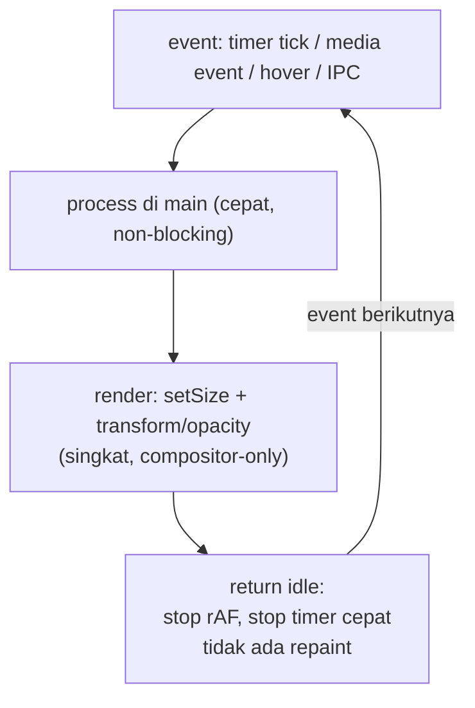

# Decision Document — Performance MAX Island (Budget: CPU 8% / RAM 500 MB / GPU 15%)

- **Tanggal:** 2026-09-17
- **Topik:** Performance app always-running: idle CPU, memory footprint, GPU rendering, animation performance, wake-ups, background process, startup time, battery impact, hardware acceleration
- **Status:** Proposed (riset, belum diukur lokal)
- **Scope:** Satu BrowserWindow kecil top-center (Electron frameless transparent alwaysOnTop) untuk Dynamic Island di Windows 10/11
- **Out-of-scope:** Angka SLA final, optimasi multi-window, native rewrite (Tauri/C++/WinUI)

## Executive Summary

Budget MAX (CPU 8% / RAM 500 MB / GPU 15%) **achievable di Electron dengan syarat idle benar-benar idle**, dan target desain `event → render → return idle` dijadikan aturan arsitektur, bukan imbauan.

Keputusan:

1. Pertahankan `transparent:true` tapi jendela **kecil fixed-size** (collapsed/expanded via `setSize`), pill solid/semi-solid + `border-radius` CSS, **tanpa acrylic/blur belakang** di v1. Biaya komposisi transparan di Windows (DWM) itu nyata meski konten statis.
2. Biarkan **hardware acceleration ON**. Jangan matikan untuk "hemat GPU" — tidak supported dan merusak hit-testing transparan.
3. Animasi hanya **`transform/opacity` singkat** lalu kembali idle. Hentikan `rAF`/timer saat tidak ada event. Jangan animasikan layout/shadow/blur per-frame.
4. Main process **non-blocking** + defer/bundle modul + `Menu.setApplicationMenu(null)`. Media polling 500–1000 ms + event saja; Pomodoro timestamp-based (lihat `2026-09-17-pomodoro-timer-engine.md`).
5. Acceptance diukur lokal via `process.getCPUUsage()` / `getProcessMemoryInfo()` + Task Manager/GPU: collapsed statis ≈ 0, spike GPU hanya saat expand/animasi, tidak ada loop repaint. Jika idle tidak negligible, potong pertama adalah timer/polling tersembunyi dan DWM/GPU — bukan ganti stack.

## Konteks

App akan selalu running sebagai widget kecil. User menetapkan batas atas (MAX) dan target desain:

```text
Idle:      CPU ≈ negligible, GPU ≈ negligible
Animation: GPU naik sesaat (sementara)
Event:     process event → render → return idle
```

Pertanyaan yang dijawab: apakah budget ini realistis di Electron transparent, dan aturan teknis minimal apa agar builder aman jalan tanpa over-engineering.

## Findings (Evidence)

Konvensi: **[Fakta]** = docs/sumber primer. **[Inferensi]** = kesimpulan kami. **[Opini/sinyal]** = sumber sekunder, tidak ditransfer langsung sebagai janji angka.

### 1. Idle CPU — musuh utamanya adalah timer/polling, bukan framework

**[Fakta]** Panduan performance resmi Electron: profile dulu, jangan include modul sembarangan, jangan load/jalankan code terlalu awal, jangan blokir main maupun renderer, bundle ke satu file, `Menu.setApplicationMenu(null)` bila frameless tanpa menu, pakai `requestIdleCallback()` untuk kerja kecil dan Web Workers untuk kerja berat. Loading modul disebut eksplisit mahal terutama di Windows.

**[Fakta]** Electron mengekspos `contents.setBackgroundThrottling(allowed)` untuk mengontrol throttle animasi/timer saat page di-background-kan.

**[Inferensi]** Idle negligible hanya tercapai jika saat collapsed-statis: tidak ada `setInterval` cepat, tidak ada `rAF` jalan terus, tidak ada polling CPU/RAM/network agresif. Keputusan GSMTC sebelumnya (polling 500–1000 ms + event `CurrentSessionChanged`) dan Pomodoro timestamp-based sudah searah: kurangi frekuensi, andalkan event + deadline check.

### 2. GPU rendering — transparan itu tidak gratis di Windows

**[Fakta]** Pola resmi window kustom: `frame:false + transparent:true + resizable:false` + CSS `background:transparent`. Limitasi di halaman yang sama: tidak ada click-through area transparan secara default, transparent tidak reliably resizable, `blur()` CSS hanya di dalam web contents.

**[Fakta]** PR Electron #39895 (debug DirectComposition): isi window transparan memakai `DXGI_ALPHA_MODE_PREMULTIPLIED` sehingga memicu redraw DWM tiap frame video, vs `IGNORE` bila opaque. Pada setup pelapor (4x video 480p, display 2160p) DWM turun 16–18% → <1% setelah opaque fix; pada 1080p 6–8% → <1%.

**[Opini/sinyal]** Laporan Tauri #15471 (macOS/WKWebView, page statis): `transparent:true` menahan GPU residency (~36% vs ~10%) dan power (~620 mW vs ~75 mW). Laporan seputar translucency/vibrancy di Tahoe mengaitkan hal serupa. Tidak dapat ditransfer langsung ke Windows-Electron — hanya sinyal jangan asumsikan transparan gratis saat idle.

**[Inferensi]** Untuk island kecil: risiko DWM/GPU jauh lebih kecil dari kasus video fullscreen di atas, tapi tetap wajib: jendela kecil, tidak ada video/animasi loop di idle, tidak ada backdrop-blur/acrylic di v1. Pill solid/semi-solid CSS paling murah.

### 3. Animation performance — hanya compositor properties

**[Fakta]** Dok kompositor Chromium: compositing GPU jauh lebih efisien untuk operasi banyak piksel; compositor bisa update tanpa repaint Blink untuk scroll dan animasi CSS tertentu. Blog Chrome: yang hardware-accelerated adalah `transform`, `opacity`, `filter`, plus `will-change` / `OffscreenCanvas` / WebGL. Properti layout (`width/height/top/left/margin/padding/box-shadow/background`) memaksa layout+paint tiap frame di main thread dan menghabiskan budget 16.6 ms.

**[Inferensi]** Aturan animasi island: expand/collapse, fade, slide = `transform/opacity` pada layer pill kecil. `will-change` hanya sementara saat animasi, bukan permanen (hindari tekanan memori kompositor). Dilarang menganimasikan `width/height/blur/shadow` per-frame.

### 4. Wake-ups & background process

**[Fakta/Inferensi]** Setiap `setInterval`/polling mencegah idle renderer dan menambah wake-up CPU/battery. Karena itu: hentikan/paused `rAF`/timer saat collapsed/statis; single `setInterval` 250–500 ms hanya saat timer Pomodoro running (dan itu pun hanya render, lihat doc Pomodoro); media cukup 500–1000 ms + event; CPU/RAM/network monitor bukan default (opt-in, interval ≥2000 ms atau hanya saat expanded).

### 5. Memory footprint & startup time

**[Fakta]** Electron membawa Chromium+Node sehingga baseline lebih besar dari native; API `process.getProcessMemoryInfo / getHeapStatistics / getBlinkMemoryInfo / getCPUUsage` tersedia untuk ukur. Startup dioptimasi dengan defer `require()`, bundling, stagger kerja just-in-time. Perbaikan snapshot/code-cache upstream (PR #51697/#51703) menunjukkan arah startup, bukan janji angka.

**[Inferensi]** RAM 500 MB sebagai MAX longgar untuk satu window kecil bila tidak bocor (leak via listener/IPC tidak dibersihkan adalah risiko nyata). Startup dijaga dengan: satu window, preload minimal, lazy-load settings/media modules, tidak ada auto-play media saat boot.

### 6. Battery impact

**[Inferensi]** Tidak ada angka battery primer untuk island ini. Battery mengikuti idle CPU + GPU residency + wake-ups. Jika idle benar-benar tanpa repaint/timer cepat, dampak minimal. Klaim lebih dari itu butuh pengukuran Task Manager / `powermetrics`, bukan teori.

### 7. Hardware acceleration — jangan dimatikan

**[Fakta]** Contoh offscreen rendering memakai `app.disableHardwareAcceleration()`. Issue Electron #48064 menunjukkan memakai `disableHardwareAcceleration` / `disable-gpu-compositing` untuk click-through transparan tidak pernah officially supported dan perilakunya berubah di Chromium 139/140 (perlu `disable-direct-composition`, tetap tidak direkomendasikan).

**[Inferensi]** Matikan HW acceleration = risiko hit-testing transparan rusak + rendering justru jatuh ke CPU. Biarkan ON.

## Target Desain Sistem (Aturan Builder)



Aturan konkret v1:

1. Satu window, dua ukuran fixed (`setSize` collapsed/expanded), `resizable:false`.
2. Animasi ≤300 ms, `transform/opacity` saja.
3. Tidak ada interval <500 ms yang jalan permanen. Timer Pomodoro 250–500 ms hanya saat running; media 500–1000 ms + event; sysinfo opt-in.
4. `Menu.setApplicationMenu(null)`, defer `require()`, bundle renderer, preload tipis.
5. HW acceleration ON; tanpa `backgroundMaterial`/acrylic di v1.
6. Acceptance: collapsed statis 60 detik → CPU≈0%, GPU≈0, tidak ada repaint kontinyu (cek via Task Manager + `process.getCPUUsage()`); expand/animasi → spike sesaat lalu turun.

## Assumptions and Limitations

Asumsi Windows 10 17763+ / 11, satu window kecil, Electron modern belum di-pin. Belum ada pengukuran lokal CPU/RAM/GPU/startup/battery untuk island ini; angka DWM dan macOS di atas milik setup pelapor, bukan garansi budget terpenuhi. Perilaku fullscreen-exclusive, RDP/VM/GPU lemah, dan multi-monitor/DPI belum diuji untuk performance.

## Sources

- Electron performance tutorial — https://github.com/electron/electron/blob/main/docs/tutorial/performance.md
- Electron custom window styles — https://www.electronjs.org/docs/latest/tutorial/custom-window-styles
- Electron webContents backgroundThrottling — https://www.electronjs.org/docs/latest/api/web-contents
- Electron offscreen rendering — https://www.electronjs.org/docs/latest/tutorial/offscreen-rendering
- Electron opaque DWM fix #39895 — https://github.com/electron/electron/issues/39895
- Electron transparent click-through #48064 — https://github.com/electron/electron/issues/48064
- Tauri transparent GPU #15471 — https://github.com/tauri-apps/tauri/issues/15471
- Chromium GPU compositing — https://www.chromium.org/developers/design-documents/gpu-accelerated-compositing-in-chrome/
- Chrome hardware-accelerated animations — https://developer.chrome.com/blog/hardware-accelerated-animations

## Blocker

None — builder boleh lanjut ke spike ukur idle; butuh pin versi Electron dan satu run pengukuran lokal sebelum budget dijadikan SLA.
