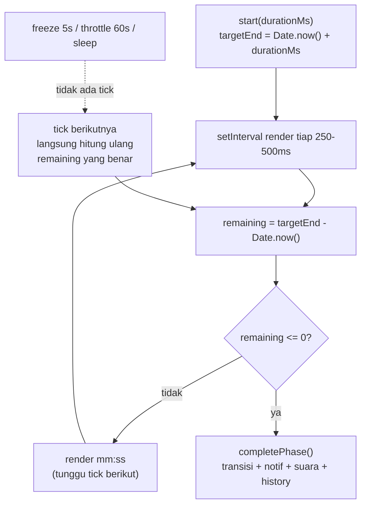
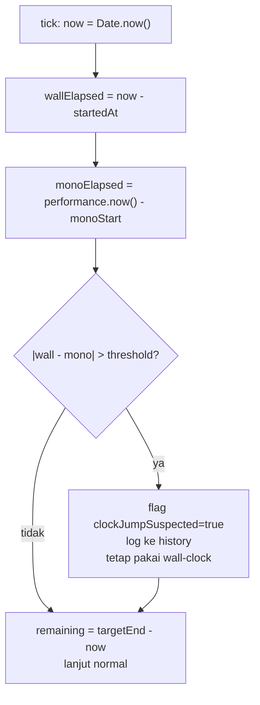
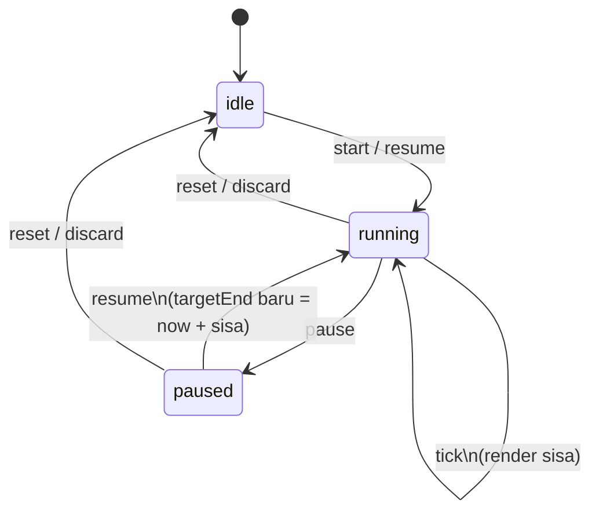
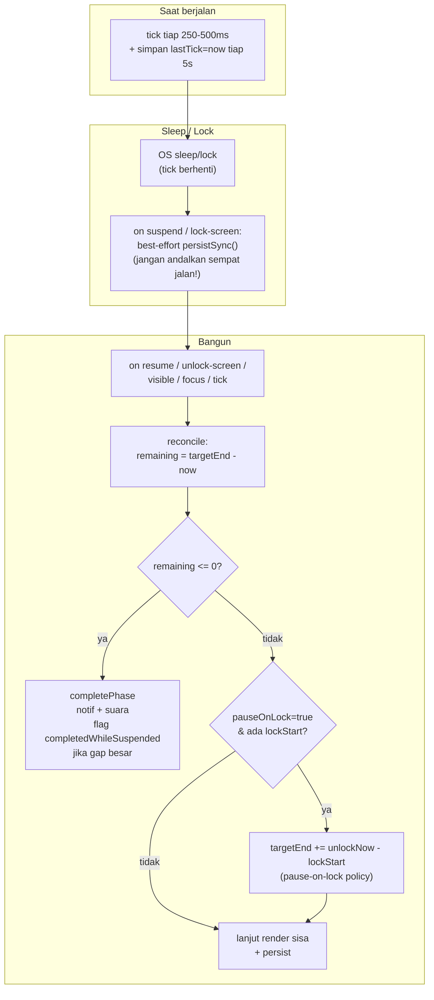
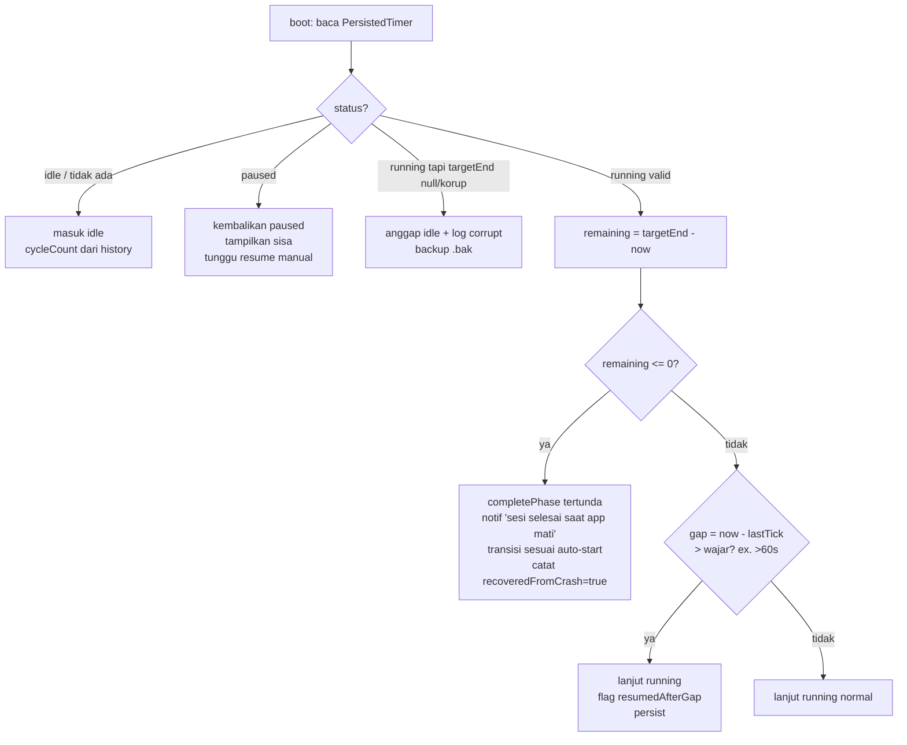
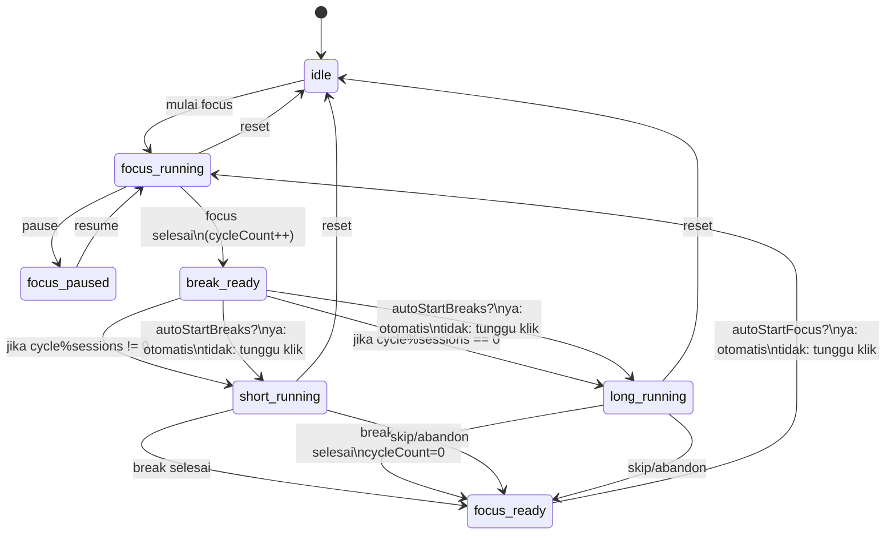
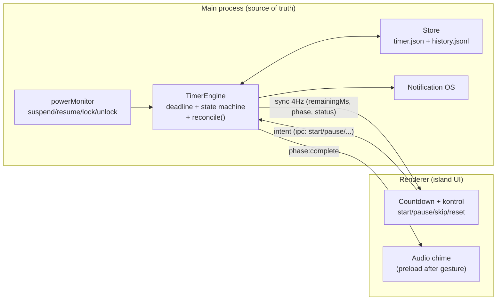

# Decision Document — Pomodoro Timer Engine (Deadline-Based, Bukan Tick Counter)

- **Tanggal:** 2026-09-17
- **Topik:** Core feature Pomodoro: presisi, pause/resume, sleep/lock/suspend, system clock vs timezone, persistensi, crash recovery, history, short/long break, configurable intervals, auto-start, notification sound
- **Status:** Proposed (riset, belum diimplementasi/diverifikasi lokal)
- **Scope:** Desain timer engine untuk Dynamic Island di Windows (Electron). Fokus ke kebenaran waktu, bukan desain visual final.
- **Out-of-scope:** Strict-mode blocking situs, analytics cloud, sync multi-device.

## Executive Summary

Bangun Pomodoro sebagai **deadline-based wall-clock timer** dengan sumber kebenaran tunggal:

```text
targetEndEpochMs = Date.now() + durationMs
remainingMs = targetEndEpochMs - Date.now()
```

`setInterval`/`setTimeout` **hanya untuk render UI** (tick 250–500 ms), bukan untuk mengurangi counter. Ini membuat freeze 5 detik, throttle background Chromium, sleep, dan lock **self-healing**: tick berikutnya langsung menghitung sisa waktu yang benar.

Keputusan turunan:

1. **Engine tinggal di main process Electron** (sumber kebenaran tunggal), renderer hanya render + kirim intent. Ini pola yang dipakai `kizami` dan `petomato`.
2. **Persist state aktif** (`phase`, `targetEndEpochMs`, `remainingMsOnPause`, `cycleCount`, `configSnapshot`) di setiap transisi + `visibilitychange:hidden` + tick jarang (tiap 5 detik) + event `powerMonitor suspend/lock-screen` (best-effort).
3. **Sleep/lock/suspend = elapsed alami** secara default (timer tetap berjalan). Jangan coba "pause otomatis saat sleep" mengandalkan handler `suspend` — di laptop Windows 11 24H2 handler bisa tidak sempat jalan sebelum proses dibekukan. Rekonsiliasi selalu dilakukan saat `resume` / `unlock-screen` / `visible` / boot.
4. **Timezone irrelevant.** Simpan durasi sebagai ms + timestamp UTC (`Date.now()` / ISO). Timezone hanya untuk display/history.
5. **`performance.now()` tidak dipakai sebagai persist.** Ia monotonic dan presisi sub-ms, tapi reset saat restart dan tidak tick konsisten saat OS sleep di semua OS. `Date.now()` wajib untuk deadline yang survive restart/crash.
6. **History append-only terpisah** dari state timer aktif. Jangan turunkan history dari state aktif.
7. **Short/long break + configurable + auto-start = state machine** di atas timer, bukan logika presisi.
8. **Notifikasi + suara dipicu oleh deadline check**, bukan oleh selesainya playback suara atau tick yang tepat waktu.

## Konteks

Pertanyaan user yang dijawab dokumen ini:

1. Apakah `targetEndTime - currentTime` cukup untuk presisi Pomodoro?
2. Bagaimana pause/resume yang benar tanpa merusak deadline?
3. Apa yang terjadi saat system sleep, PC lock, suspend/resume?
4. Apakah timezone/DST/NTP merusak timer?
5. Bagaimana persist + crash recovery?
6. Bagaimana short/long break, configurable intervals, auto-start, history, dan notification sound dipasang di atas engine yang sama?

## Findings (Evidence)

Konvensi: **[Fakta]** = terobservasi dari docs/sumber. **[Inferensi]** = kesimpulan kami dari fakta. **[Opini sumber]** = klaim sumber sekunder.

### 1. Kenapa `setInterval(1000)` decrement tidak boleh jadi sumber kebenaran

**[Fakta]** `setInterval`/`setTimeout` hanya menjamin delay minimum, bukan deadline tepat. MDN menyatakan callback bisa jalan lebih lambat dari delay yang diminta, tergantung event loop.

**[Fakta]** Chromium men-throttle timer background secara agresif untuk hemat CPU/baterai: tab hidden di-throttle ke ~1 detik, dan lewat Chrome 88 ada *intensive throttling* — tab hidden >5 menit + chain count ≥5 + silent ≥30 detik + tanpa WebRTC dicek hanya ~1x per menit (Chrome for Developers, "Heavy throttling of chained JS timers").

**[Fakta]** Firefox clamp timer inactive-tab ke minimum 1000 ms (Firefox Android sampai 15 menit). iOS Safari bisa suspend timer sepenuhnya saat background.

**[Fakta]** Ada HTML nesting clamp: chain `setTimeout` dengan nesting >5 dan timeout <4 ms dipaksa ke 4 ms.

**[Inferensi]** Counter `remaining -= 1000` per tick mengakumulasi error: lag 3 ms × 1500 tick (25 menit) ≈ 4,5 detik di tab aktif, dan bisa tertinggal **menit** setelah background/sleep tanpa pernah pulih. Ini failure mode #1 Pomodoro web.

**[Fakta]** Komunitas Electron melaporkan masalah yang sama: timer Chromium ter-throttle di background kecuali `backgroundThrottling: false` + flag `disable-background-timer-throttling` (StackOverflow "Node.js extremely inaccurate setTimeout", issue Electron #9567).

**[Inferensi]** Solusi yang benar bukan "interval lebih cepat", tapi **pindah sumber kebenaran ke timestamp**:

```ts
// sekali saat start
const targetEndEpochMs = Date.now() + durationMs;

// tiap tick UI (boleh telat, boleh ke-skip)
const remainingMs = targetEndEpochMs - Date.now();
```

Tick yang telat/ke-skip tidak meracuni tick berikutnya. Inilah yang menjawab requirement user: freeze 5 detik → tick berikutnya langsung benar.

Rekomendasi tick:

- Interval render **250–500 ms**, bukan 1000 ms. Alasan: display detik berganti tepat waktu meski tick jitter ±100 ms, tanpa beban berarti.
- Jangan pakai `requestAnimationFrame` sebagai timer Pomodoro di Electron: rAF berhenti saat window hidden/minimized/occluded meski `backgroundThrottling: false` (issue Electron #9567). rAF untuk animasi, `setInterval`/`setTimeout` + deadline untuk timer.
- Di Electron island: set `backgroundThrottling: false` + `mainWin.webContents.setBackgroundThrottling(false)` + switch `disable-background-timer-throttling`, **tapi tetap anggap tick bisa telat** — deadline yang menjamin kebenaran, bukan flag tersebut.



Perbandingan:

| Pendekatan | Source of truth | Drift 25 mnt (aktif) | Setelah hidden/sleep | Kesimpulan |
|---|---|---|---|---|
| Counter (`sisa -= 1` per tick) | Tick rate sendiri | Beberapa detik | Tertinggal selama hidden | Jangan dipakai |
| Deadline (`targetEnd - Date.now()`) | System wall-clock | <1 frame display | Benar di frame pertama kembali | **Pakai ini** |

### 2. Timer precision: seberapa presisi yang dibutuhkan Pomodoro?

**[Fakta]** `Date.now()` resolusi ms, mengikuti system clock (bisa dikoreksi NTP/manual/DST). `performance.now()` resolusi sub-ms (dicoarsen sampai 5–100 µs untuk privacy), monotonic, tidak terpengaruh koreksi jam (MDN `performance.now()`, W3C HR-Time L2/L3).

**[Fakta]** Spesifikasi HR-Time: monotonic clock hanya dijamin dalam satu eksekusi user-agent; bisa di-reset antar restart/konteks terisolasi. Tidak boleh diserialisasi sebagai waktu absolut.

**[Fakta]** MDN memperingatkan `performance.now()` boleh tidak tick saat OS sleep (perilaku beda antar OS; hanya Windows yang konsisten tick saat sleep).

**[Inferensi]** Pomodoro tidak butuh presisi sub-ms. Butuhnya **akurasi detik + tidak akumulasi drift + survive restart**. Maka:

- **Deadline = `Date.now()`-based** (persistable, survive restart, mencakup sleep sebagai elapsed).
- **`performance.now()` / `process.hrtime.bigint()` hanya untuk ukur jitter/drift di devtools**, bukan sumber kebenaran produksi.
- **Node `process.hrtime.bigint()`** monotonic nanosecond dari process start — sama keterbatasannya: hilang saat restart, tidak untuk persist.

Praktiknya: tick 250 ms + `Math.ceil(remainingMs / 1000)` untuk display detik memberi transisi detik yang stabil tanpa flicker.

### 3. Timezone irrelevant vs system clock: dua hal berbeda

**[Fakta]** `Date.now()` = ms sejak Unix epoch UTC, tidak mengandung timezone. Timezone hanya muncul saat format ke string lokal (`new Date().toString()`, `toLocaleString`).

**[Inferensi]** Timezone/DST **tidak memengaruhi durasi** jika yang disimpan adalah `durationMs` + `targetEndEpochMs` (angka UTC). Yang memengaruhi durasi adalah **perubahan system clock** (user ganti jam manual, koreksi NTP besar, dual-boot CMOS skew):

- Jam dimajukan 10 menit saat focus berjalan → `remaining` menyusut 10 menit (sesi selesai lebih cepat).
- Jam dimundurkan 10 menit → sesi molor 10 menit.

Mitigasi yang proporsional (tanpa overengineering NTP client sendiri):

1. Simpan `startedAtEpochMs`, `targetEndEpochMs`, `durationMs`, `monotonicStartMs = performance.now()` (non-persist, hanya sesi hidup).
2. Di tiap tick, hitung dua estimasi elapsed: `wallElapsed = now - startedAt` dan `monoElapsed = performance.now() - monotonicStart`. Jika `|wallElapsed - monoElapsed| > threshold` (mis. >30 detik atau >10% durasi), log sebagai `clockJumpSuspected` dan **tetap hormati wall-clock** (sederhana, deterministik), tapi catat di history agar sesi yang aneh bisa dijelaskan.
3. Simpan history dalam **UTC ISO** (`new Date().toISOString()`), tampilkan lokal hanya di UI. Ini membuat statistik harian konsisten walau user ganti timezone.
4. Jangan pakai komponen kalender lokal (`getHours()`, DST boundary) untuk hitung deadline. Deadline selalu aritmetika epoch-ms.



### 4. Pause / resume yang benar

**[Inferensi]** Pause = bekukan deadline, bukan "hentikan interval saja". Pola yang benar:

```ts
// PAUSE
remainingOnPauseMs = Math.max(0, targetEndEpochMs - Date.now());
status = 'paused';
targetEndEpochMs = null; // tidak ada deadline aktif
persist();

// RESUME
targetEndEpochMs = Date.now() + remainingOnPauseMs;
status = 'running';
persist();
```

Aturan:

- Pause berkali-kali aman: `remainingOnPauseMs` selalu dihitung ulang dari deadline aktif, bukan dikurangi manual.
- Ganti settings saat paused: `remainingOnPauseMs` tetap; durasi baru berlaku untuk sesi berikutnya (atau reset sesi berjalan — pilih satu, jangan diam-diam campur).
- Ganti settings saat running: jangan ubah `targetEnd` diam-diam. Opsinya: (a) berlaku sesi berikutnya (default, paling tidak mengejutkan), atau (b) tombol "Restart sesi dengan settings baru".
- Skip = `completePhase(skipped=true)` lalu transisi sesuai state machine, catat di history sebagai `skipped`, bukan `completed`.



### 5. System sleep, PC lock, suspend/resume (bagian paling berisiko di Electron)

**[Fakta]** Electron `powerMonitor` (main process, setelah `app.ready`) meng-emit: `suspend`, `resume`, `lock-screen` (macOS/Windows), `unlock-screen` (macOS/Windows), `shutdown` (Linux/macOS). Docs resmi menegaskan modul hanya untuk main process.

**[Fakta]** Urutan tipikal di Windows: lock → `lock-screen`; sleep → `lock-screen` + `suspend`; bangun → `resume` + `unlock-screen`. Tapi urutan/timing tidak dijamin identik antar versi Windows.

**[Fakta]** Issue Electron #47739 (Windows 11 24H2, laptop): handler `suspend` bisa tidak sempat dieksekusi karena proses langsung dibekukan; logika "hentikan timer di suspend" baru jalan setelah resume — terlambat. Di desktop 24H2 yang sama, handler sempat jalan. Ini indikasi power-saving laptop lebih agresif.

**[Inferensi]** Jangan desain yang **bergantung** pada sempatnya handler `suspend`/`lock-screen` jalan. Desain yang aman:

1. **Kebijakan default: sleep/lock = elapsed** (waktu tetap berjalan). Ini perilaku Pomodoro klasik (kizami: "wall-clock based engine: survives window hiding and system sleep without drift") dan paling sederhana + deterministik.
2. `suspend`/`lock-screen` handler = **best-effort persist** (`persistSync()` cepat, <10 ms), bukan komputasi berat/IPC lambat ke renderer. Anggap handler boleh tidak jalan.
3. **Kebenaran dipulihkan saat `resume` / `unlock-screen` / `visibilitychange:visible` / `focus` / tick berikutnya**: selalu `reconcile()` = `remaining = targetEnd - Date.now()`; jika `<= 0`, selesaikan fase (bahkan jika "selesai saat tidur" — bunyikan/notif saat bangun, catat `completedWhileSuspended=true`).
4. Jika produk nanti minta "pause saat lock" sebagai opsi: implementasikan sebagai **kebijakan di `resume/unlock`**, bukan di `suspend/lock`: saat unlock, jika `pauseOnLock=true` dan fase = focus dan `lockStart` tercatat, maka `remainingOnPause -= 0` (tidak, yang benar: saat lock catat `lockStartWall`; saat unlock hitung `lockedMs = unlockNow - lockStartWall`; lalu `targetEnd += lockedMs`, alias geser deadline sejauh terkunci). Ini tetap benar walau handler lock tidak sempat jalan — fallback: pakai `powerMonitor.getSystemIdleTime()` / selisih `now - lastTick` sebagai estimasi gap.



Catatan Windows 24H2: karena handler `suspend` tidak reliabel di laptop, **jangan** taruh `notifyRendererToStopTimer` sinkron yang berat di sana. Cukup flush state ke disk. Renderer akan sinkron ulang via IPC saat resume (`main → renderer: timer:sync`).

### 6. Timer persistence (survive restart renderer/main)

**[Fakta]** Pola repo referensi: Winisland simpan settings di `%APPDATA%`; kizami simpan settings + engine di main via `electron-store`; petomato timer engine sebagai single source of truth di main process agar survive tutup popup.

**[Inferensi]** Yang dipersist (file JSON atomik, mis. `electron-store` atau JSON + write-temp-rename):

```ts
type Phase = 'focus' | 'shortBreak' | 'longBreak';
type TimerStatus = 'idle' | 'running' | 'paused';

interface PersistedTimer {
  version: 1;
  status: TimerStatus;
  phase: Phase;
  targetEndEpochMs: number | null; // hanya saat running
  remainingOnPauseMs: number | null; // hanya saat paused
  startedAtEpochMs: number | null;
  cycleCount: number; // focus selesai dalam siklus berjalan
  configSnapshot: PomodoroConfig; // durasi yang dipakai sesi ini
  lastTickEpochMs: number; // untuk deteksi gap
  clockJumpSuspected?: boolean;
}

interface PomodoroConfig {
  focusMs: number;      // default 25*60_000
  shortBreakMs: number; // default 5*60_000
  longBreakMs: number;  // default 15*60_000
  sessionsPerCycle: number; // default 4
  autoStartBreaks: boolean; // default false/true tergantung produk
  autoStartFocus: boolean;
  pauseOnLock?: boolean; // default false (elapsed)
  soundEnabled: boolean;
  soundFile?: string;
  volume?: number;
}
```

Kapan tulis:

- Setiap transisi (`start/pause/resume/complete/skip/reset`) — sinkron, murah.
- `visibilitychange → hidden`, `window blur`, `powerMonitor suspend/lock-screen` — best-effort sync flush.
- Tick ter-throttle tiap 5 detik (update `lastTickEpochMs` saja) agar crash di tengah sesi masih bisa direkonstruksi gap-nya.
- Jangan tulis tiap 250 ms tick render — boros I/O, memperpendek umur SSD, dan berisiko corrupt saat crash tepat saat tulis (pakai tulis atomik bila memang harus sering).

Validasi saat load: sanitize angka (positive, batas wajar mis. 1–180 menit), `sessionsPerCycle` 1–12, fallback ke default bila korup. Jangan pernah crash karena file settings korup — rename `.bak` + pakai default.

### 7. Crash recovery (boot reconciliation)

**[Inferensi]** Boot = baca `PersistedTimer` + `now = Date.now()`, lalu:



Aturan:

- Crash saat `paused` → kembali `paused` dengan sisa sama. Jangan auto-resume.
- Crash saat `running` dan deadline sudah lewat → jangan "melanjutkan countdown negatif". Selesaikan fase, catat `completedWhileDead=true`, lalu ikuti aturan auto-start (jika auto-start mati, berhenti di idle-menunggu-konfirmasi dengan banner "Focus selesai saat app tertutup — mulai break?").
- Simpan `appVersion` di persist agar migrasi skema bisa dilakukan eksplisit.

### 8. Focus session history

**[Inferensi]** Pisahkan **state aktif** (satu baris, overwrite) dari **history** (append-only, tidak pernah dioverwrite timer). Skema minimal:

```ts
interface SessionRecord {
  id: string; // uuid
  kind: Phase;
  startedAt: string; // ISO UTC
  endedAt: string;   // ISO UTC
  plannedMs: number;
  actualMs: number;
  outcome: 'completed' | 'skipped' | 'abandoned' | 'completedWhileSuspended' | 'recoveredFromCrash';
  cycleIndex: number; // focus ke-berapa dalam siklus
  clockJumpSuspected?: boolean;
  taskLabel?: string;
}
```

- Tulis satu record **tepat sekali** saat fase berakhir (idempotent via `phaseRunId` agar double-fire tick + resume tidak dobel catat).
- Statistik (total focus hari ini, streak, siklus) selalu dihitung dari history, bukan dari `cycleCount` aktif. `cycleCount` aktif hanya untuk menentukan short vs long berikutnya.
- Retensi: simpan lokal penuh (SQLite/JSONL). Jika JSON, rotate per bulan agar file tidak membengkak; jika butuh query, SQLite lebih tepat untuk v2.

### 9. Short break, long break, configurable intervals, auto-start

Ini murni **state machine** di atas engine deadline. Aturan klasik (dapat dikonfigurasi):

- `focus` selesai → `cycleCount++`.
- Jika `cycleCount % sessionsPerCycle === 0` → `longBreak`, else → `shortBreak`. Setelah `longBreak` selesai → `cycleCount = 0` (siklus baru).
- `autoStartBreaks=true` → break langsung `running` tanpa tunggu klik. `false` → berhenti di `idle-awaiting-break` (tampilkan CTA "Mulai break").
- `autoStartFocus=true` → focus berikutnya langsung jalan setelah break. `false` → tunggu klik.
- Opsi `autoStart` sebaiknya **delay + countdown** (mis. "Focus mulai dalam 10 detik — Batal?") agar user tidak kaget + memberi kesempatan batal. Ini pola Pomatez/Frogodoro.



Validasi konfigurasi (`sanitizeConfig` dibagi di `src/shared` agar dipakai main + renderer, pola kizami):

- Clamp durasi 1–180 menit, `sessionsPerCycle` 1–12, volume 0–1.
- Perubahan config saat `running` berlaku sesi berikutnya (default). Sediakan "Apply + restart sesi" eksplisit bila user mau.

### 10. Notification sound + notifikasi OS

**[Fakta]** Chromium punya autoplay policy: audio tanpa user gesture bisa diblok. Notifikasi OS butuh permission (`Notification.requestPermission()` di renderer / `new Notification()` di main).

**[Inferensi]** Desain yang tahan throttle:

1. **Pemicu = deadline check**, bukan "saat suara selesai diputar" atau "saat tick ke-N". Alur: `remaining <= 0` → `completePhase()` → kirim `Notification` OS + mainkan suara + update tray/island. Jika tab ter-throttle, penyelesaian tetap ketahuan di tick pertama setelah bangun + event `visibilitychange:visible`.
2. **Suara = aset lokal pendek** (WAV/MP3 <2 detik, mis. chime), preload setelah user gesture pertama ("Aktifkan suara" / klik Start pertama). Jangan fetch remote saat transisi — bisa gagal offline.
3. Di Electron, mainkan suara dari renderer yang visible **atau** main process via native player; jangan andalkan satu saja. Pola aman: main kirim `phase:complete` via IPC; renderer yang menerima memainkan `<audio>` (sudah di-unlock gesture) **dan** main menampilkan `new Notification({title, body})`. Jika renderer mati, notifikasi OS tetap muncul.
4. Sediakan `soundEnabled`, pilihan file, volume, dan tombol Test. Hormati `pauseOnLock` untuk suara: jika sesi selesai saat terkunci, tampilkan notifikasi persisten (sticky/toast Windows) + suara diputar saat unlock, bukan saat terkunci (tidak terdengar + bisa dianggap bug).
5. Windows toast: pakai `new Notification()` Electron (memakai ToastNotifications Windows). Jangan pakai `alert()` / modal — tidak terdengar saat minimized dan memblokir event loop.

## Rekomendasi Arsitektur (Electron)



- Semua keputusan waktu di `TimerEngine` (main). Renderer tidak pernah menghitung deadline sendiri.
- IPC: `timer:intent` (renderer→main), `timer:sync` + `timer:phaseComplete` (main→renderer, 4 Hz + segera saat transisi).
- `backgroundThrottling: false` + `disable-background-timer-throttling` sebagai optimasi, bukan kebenaran.

Contoh kerangka engine (TypeScript, disederhanakan):

```ts
// main/timerEngine.ts
export class TimerEngine {
  private timer: NodeJS.Timeout | null = null;
  state: PersistedTimer;
  constructor(private store: Store, private cfg: PomodoroConfig) {
    this.state = this.store.loadTimer() ?? idleState(cfg);
  }
  start(phase: Phase, durationMs: number) {
    this.state = { ...this.state, status: 'running', phase,
      targetEndEpochMs: Date.now() + durationMs,
      startedAtEpochMs: Date.now(), remainingOnPauseMs: null };
    this.persist(); this.loop();
  }
  pause() {
    if (this.state.status !== 'running' || !this.state.targetEndEpochMs) return;
    this.state.remainingOnPauseMs = Math.max(0, this.state.targetEndEpochMs - Date.now());
    this.state.status = 'paused'; this.state.targetEndEpochMs = null;
    this.persist();
  }
  resume() {
    if (this.state.status !== 'paused' || this.state.remainingOnPauseMs == null) return;
    this.state.targetEndEpochMs = Date.now() + this.state.remainingOnPauseMs;
    this.state.status = 'running'; this.state.remainingOnPauseMs = null;
    this.persist(); this.loop();
  }
  private loop() {
    if (this.timer) clearInterval(this.timer);
    this.timer = setInterval(() => this.reconcile('tick'), 250);
  }
  reconcile(reason: string) {
    if (this.state.status !== 'running' || !this.state.targetEndEpochMs) return;
    const remaining = this.state.targetEndEpochMs - Date.now();
    if (remaining <= 0) this.completePhase(reason);
    else this.broadcast(remaining);
  }
  private completePhase(reason: string) {
    // tulis history sekali (idempotent via phaseRunId), transisi state machine,
    // notif OS + emit phase:complete, persist
  }
  private persist() { this.store.saveTimerAtomic(this.state); }
}
```

## Risiko & Keputusan Produk Terbuka

| # | Risiko / pertanyaan | Dampak | Rekomendasi |
|---|---|---|---|
| 1 | Handler `suspend` tidak sempat jalan di laptop Win11 24H2 | Timer dianggap "jalan terus" padahal sleep — benar secara elapsed, tapi suara/notif telat sampai resume | Terima sebagai default elapsed; catat `completedWhileSuspended` |
| 2 | User ganti system clock manual/NTP jump besar | Sesi molor/maju | Hormati wall-clock + flag `clockJumpSuspected`, jangan coba koreksi otomatis |
| 3 | `sessionsPerCycle`, durasi ekstrem (0 / 1000 mnt) | State machine rusak / file korup | `sanitizeConfig` + fallback default, backup `.bak` |
| 4 | Auto-start mengejutkan user | Focus mulai sendiri saat user pergi | Default auto-start = off untuk v1, atau countdown-delay 10 detik + tombol Batal |
| 5 | Suara tidak bunyi (autoplay policy / renderer mati) | User kelewat transisi | Notifikasi OS sebagai primer, suara sekunder; preload setelah gesture |
| 6 | Double-complete (tick + resume fire bersamaan) | History dobel | Idempotent `phaseRunId`, tulis history sekali |

## Checklist Verifikasi (sebelum klaim selesai)

- [ ] Freeze renderer 5–10 detik (block event loop) → sisa waktu tetap benar di tick berikutnya.
- [ ] Minimize + biarkan 10 menit (throttle) → countdown benar saat restore, fase selesai tepat.
- [ ] Sleep 2 menit di tengah focus → bangun: sisa = deadline − now; jika lewat, fase selesai + flag `completedWhileSuspended`.
- [ ] Lock/unlock tanpa sleep → elapsed (default) atau geser deadline jika `pauseOnLock=true`.
- [ ] Kill proses saat running → relaunch merekonstruksi dengan benar (lanjut / selesaikan tertunda).
- [ ] Kill saat paused → kembali paused dengan sisa sama.
- [ ] Maju/mundurkan jam 10 menit → tidak crash, flag `clockJumpSuspected` muncul.
- [ ] Ganti timezone/DST → durasi tidak berubah, history UTC konsisten.
- [ ] Config korup (edit manual JSON) → fallback default + backup, app tetap jalan.
- [ ] Suara + toast muncul saat minimized; tidak dobel saat resume.

## Sumber

- MDN — `Window.setInterval()` (delay minimum, bisa tertunda).
- MDN — `Performance.now()`, High precision timing, `Performance.timeOrigin` (monotonic vs wall-clock, sleep caveat).
- MDN — Page Visibility API, `visibilitychange` (titik persist/rekonsiliasi).
- Chrome for Developers — "Heavy throttling of chained JS timers in Chrome 88" (intensive throttling 1/mnt).
- W3C HR-Time L2/L3 (monotonic clock, tidak untuk persist absolut).
- Electron docs — `powerMonitor` (`suspend`/`resume`/`lock-screen`/`unlock-screen`, main-only).
- Electron issue #9567 (`backgroundThrottling`, rAF vs `setInterval` background).
- Electron issue #47739 (Win11 24H2 laptop: handler `suspend` tidak reliabel).
- theblogtimer.com "Why Browser Timers Drift" + tickline.app "Background-Tab Timers Drift" (pola `endTime − Date.now()`, fire alarm on visible).
- Repo referensi: `zabuton-app/kizami` (wall-clock engine di main, shared state machine, electron-store), `Reneuwumuhire/petomato` (engine main-process, auto-start toggles), `Shawnchee/claude-pomodoro` (persist settings + notif + chime), `zidoro/pomatez` (auto-start work, notif types), `lelamanolio/frogodoro` (configurable durations + sound toggles).
