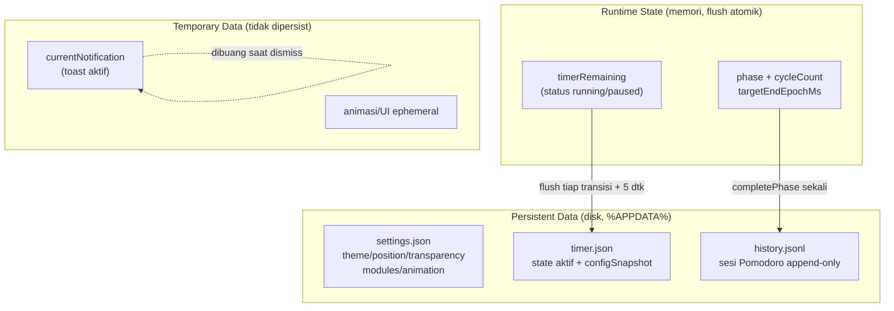

# Decision Document — Privacy & Data Requirements (MAX Island v0.1)

- **Tanggal:** 2026-09-17
- **Topik:** Privacy requirements (PRIV-001 s.d. PRIV-005) + klasifikasi data (Persistent vs Runtime vs Temporary)
- **Status:** Proposed (belum diaudit/diimplementasi)
- **Scope:** v0.1 — overlay + Pomodoro + settings minimal; integrasi baca notifikasi/mic/app-state diperlakukan sebagai risiko, default mati/belum ada
- **Out-of-scope:** Cloud sync, analytics backend, plugin pihak ketiga (semua non-goal v0.1)

## Executive Summary

Privasi adalah constraint arsitektur, bukan tempelan: jangan kumpulkan data pribadi yang tidak perlu (PRIV-001), telemetri default mati (PRIV-002), user bisa menginspeksi data (PRIV-003) dan mematikan integrasi (PRIV-004), konten notifikasi diproses lokal sebisa mungkin (PRIV-005). Data dipilah tegas menjadi Persistent (settings + history Pomodoro di `%APPDATA%`), Runtime (state timer aktif di memori + flush atomik), dan Temporary (notifikasi saat ini, tidak pernah dipersist). Tidak ada konten sensitif yang ditulis ke disk di luar yang dideklarasikan di §3.

## 1. Privacy Requirements

### PRIV-001 — Do not collect unnecessary personal data

- Kumpulkan minimum yang dibutuhkan v0.1: settings + riwayat Pomodoro lokal (durasi, timestamp mulai/selesai UTC, outcome). Bukan isi layar, isi dokumen, isi pesan, atau audio.
- Larangan: membaca badan notifikasi app lain, status mic, atau daftar aplikasi untuk tujuan selain yang user aktifkan eksplisit. Karena v0.1 tidak punya Spotify/browser integration, **tidak ada pembacaan media/notifikasi eksternal sama sekali**.
- Setiap field persist baru wajib menjawab: "tanpa field ini, fitur apa yang rusak?" Jika jawabannya "tidak ada" → field ditolak.

### PRIV-002 — Telemetry is disabled by default unless required

- v0.1: **tanpa telemetri keluar sama sekali** (no network call analytics/crash-reporter cloud). Ini default, bukan toggle.
- Jika suatu saat dibutuhkan (mis. crash report): opt-in eksplisit, terpisah dari "check for updates", dengan penjelasan data apa yang dikirim + tombol kirim manual. Tidak ada silent upload.
- Verifikasi: grep audit `fetch(/http.request/WebSocket` di main process harus kosong di build v0.1 kecuali update-check yang juga opt-in.

### PRIV-003 — User can inspect collected data

- Seluruh Persistent Data adalah file lokal terbaca: `settings.json` + `timer.json` + `history.jsonl` di `%APPDATA%/MAX Island/`.
- Sediakan di Settings: tombol **"Open data folder"** + **"Export my data (JSON)"** + tampilan ringkas (durasi, sesi selesai, timestamps).
- Format stabil + berversion agar user/tool eksternal bisa membaca tanpa reverse-engineering.

### PRIV-004 — User can disable integrations

- Setiap integrasi (sekarang: notifikasi OS, suara, autostart; nanti: media/notif-listener) punya **kill-switch independen** di Settings, default mati kecuali yang inti v0.1.
- Mematikan integrasi = kode jalurnya tidak di-load/tidak di-subscribe (bukan sekadar mute UI). Contoh: `soundEnabled=false` → tidak ada AudioContext; notifikasi mati → tidak ada `new Notification()`.
- Prinsip flag-off = drop event: event dari integrasi yang mati langsung dibuang, tidak diproses/di-log.

### PRIV-005 — Notification content processed locally where possible

- Konten notifikasi Pomodoro (judul/body jadwal lokal) **dibuat dan diproses 100% lokal**. Tidak dikirim ke server, tidak di-fetch dari remote saat transisi.
- Aset suara = file lokal pendek, preload setelah user gesture; dilarang fetch remote saat transisi (gagal offline + bocor metadata waktu fokus user).
- Jika v0.2+ membaca notifikasi app lain: hanya metadata yang diizinkan user (nama app + waktu), tidak pernah badan pesan; dan tetap PRIV-003/004 berlaku (bisa dilihat + bisa dimatikan).

## 2. Data Requirements — Taksonomi



Aturan:

- **Persistent** = harus survive restart; tulis atomik (temp-rename), berversion, disanitasi saat load (korup → `.bak` + default, app tetap jalan).
- **Runtime** = hidup di memori engine (main process); satu-satunya yang boleh ditulis sering. Flush jarang ke `timer.json`.
- **Temporary** = tidak pernah menyentuh disk, tidak masuk log. Hilang saat dismiss/restart — itu disengaja.

## 3. Katalog Data v0.1

### User Settings → `settings.json` (Persistent)

```text
User Settings
├── Theme (light/dark, accent)
├── Position (top-center offset, reset default)
├── Transparency (opacity pill, tanpa blur v1)
├── Enabled modules (notif on/off, sound on/off, autostart)
└── Animation preferences (enable/disable, reduced-motion hormati OS)
```

### Pomodoro (tiga kelas)

```text
Pomodoro
├── Session duration      → Persistent (focusDuration = 25, shortBreak, longBreak, sessionsPerCycle)
├── Completed sessions    → Persistent (history.jsonl: timestamps UTC ISO + outcome)
├── Current state         → Runtime (phase, status, cycleCount) + flush → timer.json
└── Session timestamps    → Persistent saat complete (startedAt/endedAt UTC), Runtime saat berjalan
```

Contoh pemisahan yang diminta:

| Kelas | Contoh | Disimpan di | Retensi |
|---|---|---|---|
| Runtime | `timerRemaining` | Memori + `timer.json` (flush) | Sampai sesi selesai/reset |
| Persistent | `focusDuration = 25` | `settings.json` | Permanen sampai user ubah |
| Temporary | `currentNotification` | Memori renderer saja | Dibuang saat dismiss |

### Yang dilarang disimpan di v0.1

Badan notifikasi app lain, isi clipboard, daftar proses rinci, audio/mic, lokasi, BSSID Wi-Fi, kalender. Jika ada kode menulis salah satunya → gagal review (lihat doc Pomodoro §Forbidden + doc Performance).

## 4. Acceptance (cek sebelum done)

- [ ] Folder data lokal hanya berisi file yang dideklarasikan §3; tidak ada file/cache tersembunyi berisi konten sensitif.
- [ ] Settings → "Open data folder" + "Export JSON" bekerja; export sama dengan isi disk.
- [ ] Semua integrasi punya toggle off yang benar-benar menghentikan langganan event.
- [ ] Build v0.1: tidak ada network call telemetri (grep audit hijau).
- [ ] File korup → backup `.bak` + default, tidak crash, tidak kehilangan history (append-only tidak dioverwrite).
- [ ] `currentNotification` dan state animasi tidak pernah muncul di file persist/history.

## Blocker

None — siap diimplementasi bersama EPIC Settings/Pomodoro; audit privasi ulang wajib saat integrasi media/notifikasi pertama masuk (v0.2+).
