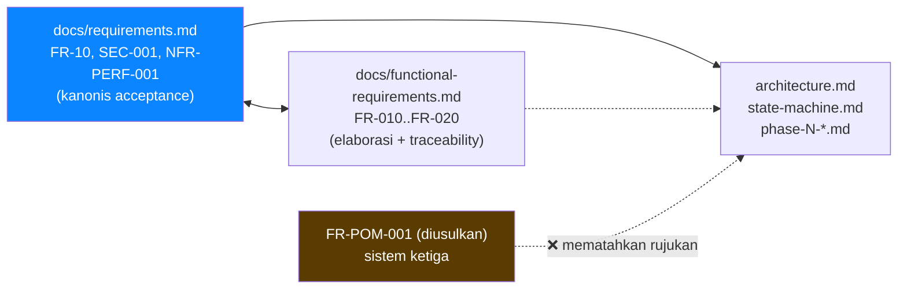
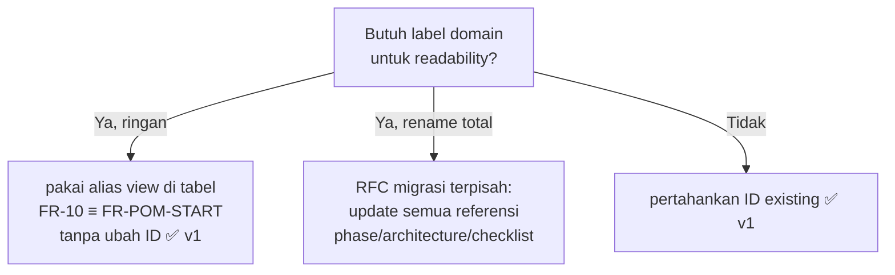

# Decision Document — Requirements ID Scheme (Exactly What Must The System Do)

- **Tanggal:** 2026-09-17
- **Topik:** Apakah perlu skema ID baru gaya FR-POM-001 / NFR-PERF-001 / SEC-001 untuk FR, NFR, Security, Privacy, Compatibility, Data, UI, Error handling, Testing — atau memakai ID stabil yang sudah ada sebagai kanonis
- **Status:** Decided (riset read-only atas docs per 2026-09-17, belum verifikasi implementasi `src/`)
- **Scope:** Pemetaan kategori yang diminta user ke ID kanonis di `docs/requirements.md` + elaborasi di `docs/functional-requirements.md`, tanpa rename file dan tanpa mengubah source code
- **Out-of-scope:** Validasi klaim OS API ke dokumentasi Microsoft/Electron, implementasi `src/`, benchmark angka `X`

## Executive Summary

**Jangan buat skema ketiga FR-POM-001.** Builder lanjut dengan `docs/requirements.md` sebagai kanonis acceptance + `docs/functional-requirements.md` sebagai elaborasi. Domain sudah terencode di blok nomor (01=shell, 10=pomodoro, 20=signals, 30=config, 40=state), dan kategori yang diminta user sudah tercakup tersebar — bukan sebagai prefix mandiri. Jika butuh label domain untuk readability, pakai alias view di tabel pemetaan saja (mis. FR-10 ≡ "FR-POM-START"), tanpa mengubah ID stabil, tanpa rename, tanpa menambah PRIV/DATA/ERR/TEST sebagai ID baru di v1.

Tiga sistem ID paralel (FR-10 vs FR-010 vs FR-POM-001) akan mematahkan rujukan di `architecture.md`, `state-machine.md`, `phase-N-*.md`, dan acceptance checklist. Cost rename lebih besar dari benefit prefix domain.

## Konteks

Permintaan user:

```text
Exactly what must the system do?
FR, NFR, Security, Privacy, Compatibility, Data, UI, Error handling, Testing
Setiap requirement punya ID: FR-POM-001, FR-POM-002, NFR-PERF-001, SEC-001
```

Pertanyaan keputusan: apakah introduksi prefix domain (`FR-POM-*`, `NFR-PERF-*`, `SEC-*` baru, `PRIV-*`, `DATA-*`, `ERR-*`, `TEST-*`) diperlukan, atau ID existing sudah menjawabnya?

Aturan menang sengketa (`AGENTS.md` §7): `docs/phase-N-*.md` > `docs/requirements.md` (ID acceptance) + `architecture.md` + `state-machine.md` + `adr/` > `window-overlay.md` > `research/*.md` > klaim chat. Angka budget P6 = titik awal, tuning hanya via ukur.

## Findings (Evidence)

Konvensi: **[Fakta]** = terobservasi dari repo. **[Inferensi]** = kesimpulan kami. **[Opini]** = preferensi yang dinyatakan di repo.

### 1. ID kanonis sudah ada dan dinyatakan pemenang bila konflik

**[Fakta]** `docs/requirements.md` sudah kanonis v1 dengan ID stabil dan dinyatakan sebagai pemenang acceptance bila konflik (ditegaskan di `docs/README.md` Changelog + `AGENTS.md` §7): FR-01–07 (shell), FR-10–16 (pomodoro), FR-20–27 (signals), FR-30–34 (config), FR-40–43 (state), UI-001–003, SYS-001–004, EXT-001–004, STATE-001–003 (alias FR-40–42), NFR-PERF-001–003, NFR-MEM-001, NFR-REL-001–002, NFR-COMP-001–003, NFR-UX-001–002, NFR-MAINT-001, NFR-OBS-001, SEC-001–005, AI-SEC-001–004.

**[Fakta]** `docs/functional-requirements.md` adalah elaborasi terpisah dengan ID berbeda (FR-001–007, FR-010–020, FR-030–034, FR-040–044, FR-050–057) + tabel Traceability eksplisit ke ID stabil `requirements.md`. Contoh: FR-010–FR-020 memperluas FR-10–FR-16.

**[Inferensi]** Repo saat ini sudah memiliki **dua** sistem ID yang hidup berdampingan dengan tabel pemetaan eksplisit. Menambah sistem ketiga (FR-POM-001) tanpa migrasi total menciptakan tiga sumber kebenaran paralel.

### 2. Kategori yang diminta sudah tercakup tersebar

**[Fakta]** Pemetaan kategori → ID existing (hasil baca langsung 2026-09-17):

| Kategori diminta | ID kanonis yang menjawab | Catatan |
|---|---|---|
| FR | FR-01–43 + UI-001–003, SYS-001–004, EXT-001–004, STATE-001–003 | FR fungsional + interface + state/event |
| NFR | NFR-PERF-001–003, NFR-MEM-001, NFR-REL-001–002, NFR-COMP-001–003, NFR-UX-001–002, NFR-MAINT-001, NFR-OBS-001 | Angka `X` = placeholder, diisi pasca-benchmark |
| Security | SEC-001–005 + AI-SEC-001–004 | Least privilege, no-admin, safeStorage, opt-in, no-plugin v1 |
| Privacy | Tertanam di SEC-003 (safeStorage, no plaintext secret), SEC-004 (opt-in per-fitur, allowlist openExternal, no plugin v1), FR-26/SYS-001 (UserNotificationListener hanya dengan consent), FR-27 (SSID/BSSID butuh location consent, calendar butuh OAuth — deferred) | Tidak ada PRIV-001 mandiri |
| Compatibility | NFR-COMP-001–003 (Win11 + Win10 17763+, multi-monitor, DPI 100–250%) | — |
| Data | FR-14 (history append-only UTC ISO + outcome + phaseRunId), FR-19/FR-34 (atomic write timer.json/config.json + .bak), NFR-REL-002 | — |
| UI | UI-001–003 + NFR-UX-001–002 | Collapsed/expanded + animasi ≤300 ms compositor-only |
| Error handling | FR-31 (korup/import rusak → .bak + defaults + kumpulkan error), FR-19/FR-20 (korup → idle + .bak + banner, flag clockJumpSuspected/completedWhileSuspended/recoveredFromCrash) | Fail-safe, tidak pernah crash |
| Testing | NFR-MAINT-001 (pure shared/events + shared/config unit-test Node) + acceptance checklist di `requirements.md` §Acceptance + DoD per `docs/phase-N-*.md` | — |

**[Fakta]** Tidak ada ID mandiri PRIV-001, DATA-001, ERR-001, TEST-001 di repo. Privacy/Data/Error/Testing adalah view atas SEC/FR/NFR yang ada.

**[Opini]** Header `docs/requirements.md` menyatakan "Setiap requirement punya ID stabil agar bisa dirujuk Architecture doc dan acceptance test" dan `AGENTS.md` §7 menyatakan "Angka budget P6 = titik awal, tuning hanya via ukur" — preferensi mempertahankan stabilitas ID dan angka placeholder `X`.

### 3. Risiko skema ketiga

**[Inferensi]** Mengintroduksi FR-POM-001 akan: (a) mematahkan rujukan di `architecture.md`, `state-machine.md`, `phase-N-*.md`, acceptance checklist; (b) memaksa find-replace lintas-doc dengan risiko salah; (c) membingungkan builder tentang mana yang menang. Benefit prefix domain sudah dicapai oleh blok nomor (10=pomodoro, 20=signals, 30=config, 40=state) + tabel alias.





## Decision

1. **Kanonis tetap `docs/requirements.md`.** FR-01–43, UI/SYS/EXT/STATE, NFR-*, SEC-001–005, AI-SEC-001–004 adalah ID acceptance. Tidak ada ID baru di v1.
2. **Elaborasi tetap `docs/functional-requirements.md`.** FR-001–FR-057 dipakai untuk detail Trigger/Input/Behavior/Output per acceptance terpisah, selalu via tabel Traceability ke ID kanonis.
3. **Tidak ada PRIV/DATA/ERR/TEST sebagai ID baru.** Keempatnya adalah view: tunjuk ke SEC/FR/NFR existing sesuai tabel §2.
4. **Alias domain hanya sebagai view.** Bila readability membutuhkan, tulis `FR-10 (FR-POM-START)` di teks, tidak pernah sebagai ID primer, tidak pernah di checklist acceptance.
5. **Bila owner tetap menghendaki prefix FR-POM-***: perlu keputusan eksplisit + diff doc terpisah yang memigrasi semua referensi phase/architecture/checklist sekaligus — dilarang setengah jalan.

## Risiko & Mitigasi

| Risiko | Mitigasi |
|---|---|
| Builder bingung dua sistem ID (FR-10 vs FR-010) | Selalu tulis pasangan + Maps-to; checklist acceptance hanya pakai ID kanonis |
| Godaan menambah PRIV/DATA/ERR/TEST ID | Tolak di v1; tambahkan kolom view di traceability bila perlu, bukan ID baru |
| Angka NFR `X` dianggap janji SLA | Tegaskan placeholder; isi hanya setelah spike ukur idle 60 dtk, startup, animasi |

## Sources

- `docs/requirements.md` — local repo (kanonis v1, dibaca 2026-09-17)
- `docs/functional-requirements.md` — local repo (elaborasi + traceability)
- `docs/product-requirements.md` — local repo
- `docs/README.md` — local repo (aturan menang + changelog)
- `AGENTS.md` — local repo (§7 sumber kebenaran sengketa)

(End of file)
