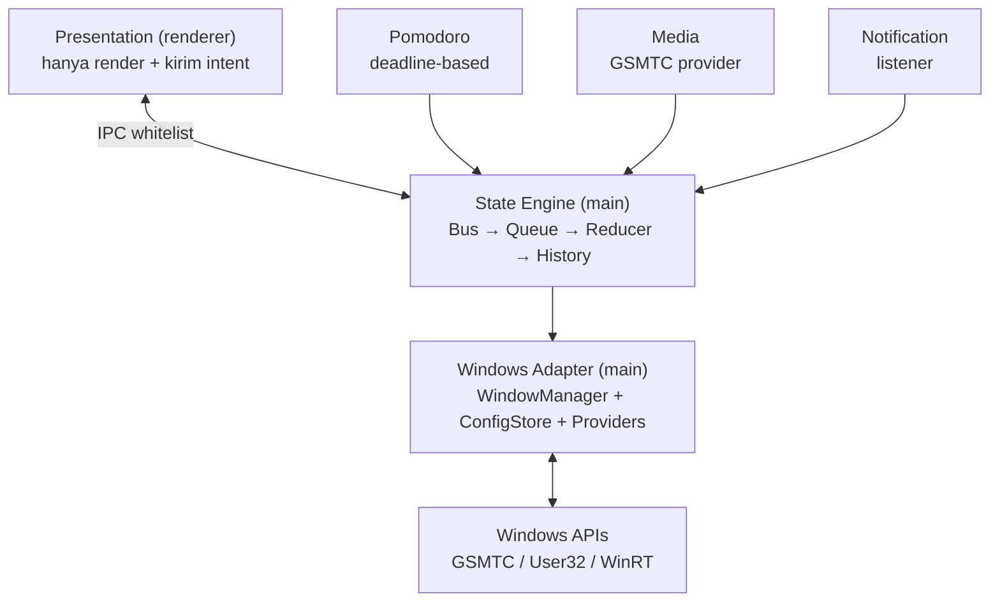

# Decision Document — System Architecture v1 (MAX Island)

- **Tanggal:** 2026-09-17
- **Topik:** Apakah susunan Presentation → State Engine → Pomodoro/Media/Notification → Windows Adapter → Windows APIs dapat dibangun aman di Electron, dengan batas component, dependency, data/event flow, process, threading, storage, IPC, dan failure boundaries
- **Status:** Accepted (blueprint = `docs/architecture.md`; dokumen ini mencatat keputusan + resolusi konflik)
- **Scope:** v1 overlay top-center collapse/expand fixed, satu decision point di main, 3 provider generik, tanpa plugin dinamis/worker/SQLite
- **Out-of-scope:** Rewrite Tauri/native, backdrop-blur real, mic-pasti/BSSID/calendar/Discord-voice, multi-device sync, SLA perf final

## Executive Summary

Bangun persis susunan `docs/architecture.md`: Presentation hanya render + kirim intent; **satu State Engine di main** (Bus → Queue cap ~20 → Reducer murni → History ~5 + TimeoutRegistry) satu-satunya penulis keputusan tampil; domain (Pomodoro/Media/Notification) hanya emit `IslandEvent` ternormalisasi; Windows Adapter tipis ke Windows APIs. Satu konflik nyata ditemukan dan diputus: **ADR-004 (plain JSON) vs phase-5/architecture.md (electron-store+ajv)** — dimenangkan phase-5 sesuai AGENTS.md §7; ADR-004 dicatat superseded pada poin implementasi store (prinsip atomic/debounce/no-secret-nya tetap berlaku).

## 1. Susunan yang diputuskan

Pemetaan ke diagram usulan user: `Presentation` = renderer; `State Engine` = satu decision point di main; `Pomodoro/Media/Notification` = domain actors paralel; `Windows Adapter` = satu lapisan tipis (GSMTC generik + foreground allowlist + power/network/FS/notif — bukan adapter per-app); `Windows APIs` = lapisan OS.

## 2. Findings (evidence)

### 2.1 Kontrak repo yang mengikat (dibaca langsung, bukan klaim)

- **[Fakta]** AGENTS.md §1–2: urutan phase EXACT P1→P7, gate DoD per phase, dilarang mulai Pn+1 sebelum DoD Pn hijau; struktur `src/main/{window,pomodoro,system,ai,infra}`, `src/shared/{events,config}`, `src/renderer/{shell,settings}`; dependency rule: `shared/events` zero-dep electron/react, `renderer` tidak import `main`, `main/window` satu-satunya pemilik `BrowserWindow`, domain hanya emit event ke bus. (dibaca: `AGENTS.md`)
- **[Fakta]** AGENTS.md §7 precedence sengketa: `phase-N-*.md` > `requirements.md` + `architecture.md` + `state-machine.md` + `adr/` > `window-overlay.md` > `research/` > `images/` > klaim chat. (dibaca: `AGENTS.md`)
- **[Fakta]** `docs/architecture.md` (dibaca penuh, 235 baris): State Manager di main (Bus normalize+validate+dedupe+flag-drop → Queue priority-desc/timestamp-asc cap ~20 → Reducer murni `(state,event,now)→state` → History max ~5 + TimeoutRegistry endTime); IPC whitelist (`timer:intent/island:intent/config:set` R→M; `timer:sync 4Hz/island:sync/phaseComplete/config:changed` M→R); storage `config.json` (electron-store) + `timer.json` + `history.jsonl` + `.bak` rotate; threading single-thread per proses, interval 250ms hanya saat running, no worker v1; failure table (korup→backup+defaults+banner, clock-jump→reconcile+flag, queue-overflow→collapse, renderer-crash→main tetap).
- **[Fakta]** `docs/README.md` (dibaca): phase map P1–P7 + changelog yang menegaskan pelengkap (`requirements.md`, `architecture.md`, `state-machine.md`, `adr/`) tetap berlaku; konflik dimenangkan phase doc untuk urutan kerja, requirement ID untuk acceptance.
- **[Fakta]** Phase-5 (dibaca): store = `electron-store` + ajv draft-2020-12 + migrations + backup `.bak` max 5; tulis hanya saat ubah/debounce 100–200ms; `modules.*=false` = actor tidak di-spawn + event di-drop di bus.
- **[Fakta]** Primer Electron (terverifikasi via Context7 oleh peneliti): `ipcMain.handle` + `ipcRenderer.invoke`, `contextBridge.exposeInMainWorld` di preload; jangan expose `ipcRenderer` mentah — wrap callback hanya dengan value yang perlu.
- **[Fakta]** `docs/window-overlay.md` + ADR-002: `frame:false, transparent:true, resizable:false, skipTaskbar:true, alwaysOnTop level pop-up-menu`, posisi `workArea` DIP, rounding CSS; bisa tertutup fullscreen-exclusive; tinggal di satu virtual desktop.

### 2.2 Konflik nyata + putusan

- **[Fakta]** ADR-004 (`docs/adr/004-storage.md`) memutuskan plain JSON dan **menolak** electron-store; phase-5 + `architecture.md` memutuskan electron-store + ajv + migrations.
- **[Putusan]** Sesuai AGENTS.md §7, **phase-5 menang** untuk implementasi store. ADR-004 dicatat `Superseded-by: phase-5` pada poin pilihan library; prinsipnya (atomic tmp+rename, tulis debounce, tanpa secret di settings, fallback defaults+banner) **tetap berlaku** dan kompatibel dengan electron-store. Tidak perlu keputusan tambahan — precedence sudah mengatur.
- **[Opini ditolak]** Tutorial "transparent+CSS blur = Acrylic" dan klaim "Task Scheduler lebih aman dari Registry Run" — sudah ditolak di `window-overlay.md` karena bertentangan sumber primer; tidak menjadi dasar arsitektur.

### 2.3 Inferensi (bukan fakta, ditandai jujur)

- **[Inferensi]** Pemisahan `config.json`/`timer.json`/`history.jsonl` + single-owner State Manager di main adalah satu-satunya susunan yang memenuhi DoD P1–P6 tanpa deadlock/race yang terlihat dari doc; belum ada kode sehingga belum terbukti runtime.
- **[Inferensi]** Tidak ada worker/thread pool dibutuhkan di v1 karena beban poll/sync di bawah budget P6 — budget adalah titik awal, tuning via ukur (P6), bukan SLA.

## 3. Recommendation (kontrak bangun)

1. **Presentation** — render `IslandSurfaceState` + kirim intent; dilarang hitung deadline/priority (AGENTS.md §5 auto-reject `if pomodoro…else if music` di renderer).
2. **State Engine (main)** — Bus (normalize+validate+dedupe+flag-drop) → Queue (cap 20, collapse) → Reducer murni zero-dep → History 5 + TimeoutRegistry endTime; satu-satunya penulis `island:sync`.
3. **Domains** — TimerEngine deadline-based di main (sync 4Hz, persist tiap transisi + throttle 5s); GSMTC provider poll 500–1000ms + event, popup 3–5s; notif-listener dengan consent; semua hanya emit event, tick/progress payload-only.
4. **Windows Adapter** — WindowManager via `IslandWindowApi`; ConfigStore satu jalur tulis tervalidasi (electron-store); Providers tipis.
5. **IPC** — preload `contextBridge` whitelist saja (daftar channel di `architecture.md` §IPC contract).
6. **Failure** — korup→backup+defaults+banner; clock-jump/sleep→reconcile+flag; overflow→collapse; renderer-crash→main tetap + relaunch re-sync (petakan ke ERR-001–007 di `requirements/10-error-handling.md`).
7. **Urutan kerja** — P1→P7 strictly per `docs/README.md`; 1 diff = 1 DoD item dengan `Phase: N` di pesan.

## 4. Assumptions & Limitations

- Asumsi: Windows 10/11 laptop menengah; versi Electron/Node/`windows-media-sessions`/`electron-store` belum di-pin (tugas P1/P4).
- Belum ada spike (GSMTC Spotify+YouTube, foreground VSCode/Chrome, notif-listener izin) dan belum ada ukur idle CPU/RAM/cold-start — semua wajib sebelum klaim; angka P6 = titik awal.
- Belum verifikasi RDP/VM/GPU-lemah/fullscreen-exclusive/virtual-desktop.

## 5. Sources

- Lokal (dibaca penuh): `AGENTS.md`, `docs/README.md`, `docs/architecture.md`, `docs/phase-5-customization.md`
- Lokal (rujukan): `docs/state-machine.md`, `docs/window-overlay.md`, `docs/phase-2-state-event.md`, `docs/phase-3-pomodoro.md`, `docs/phase-4-system-integration.md`, `docs/phase-6-performance-security.md`, `docs/adr/002..005`, `docs/requirements/`
- Primer: Electron IPC tutorial — https://github.com/electron/electron/blob/main/docs/tutorial/ipc.md ; Electron Security — https://github.com/electron/electron/blob/main/docs/tutorial/security.md ; BrowserWindow — https://www.electronjs.org/docs/latest/api/browser-window ; screen — https://www.electronjs.org/docs/latest/api/screen ; app — https://www.electronjs.org/docs/latest/api/app ; Tray — https://www.electronjs.org/docs/latest/api/tray ; Custom Window Styles — https://www.electronjs.org/docs/latest/tutorial/custom-window-styles ; Custom Window Interactions — https://www.electronjs.org/docs/latest/tutorial/custom-window-interactions

## 6. Blocker

None untuk mulai P1. Tindak lanjut tercatat (bukan blocker): pin versi + spike GSMTC/foreground/notif-listener; update status ADR-004 menjadi superseded; selaraskan kolom Implementation di `requirements/13-traceability.md` ke struktur `src/` AGENTS.md §2 saat scaffold.
