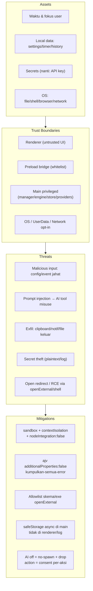

# Decision Document — Threat Model + Interface Contracts + Data Model (MAX Island v0.1)

- **Tanggal:** 2026-09-17
- **Topik:** Threat model (Assets → Boundaries → Threats → Attack Surface → Mitigations), kontrak interface antar-modul, dan model data (Runtime/Persistent/Cache/Logs/Telemetry/Secrets)
- **Status:** Proposed (mengikat sebelum implementasi; belum diaudit kode)
- **Scope:** Electron Windows local-first v0.1 (overlay + Pomodoro + settings minimal, AI default off, tanpa plugin runtime/cloud sync)
- **Out-of-scope:** Cloud sync, analytics backend, plugin marketplace, autonomous agent, voice always-on

## Executive Summary

Ancaman terbesar v0.1 bukan AI canggih, melainkan tiga jalur klasik: IPC/preload + `openExternal`/URI launcher bila allowlist longgar, payload event/config jahat ke reducer/store, dan secret yang disimpan plaintext. Keputusannya: bekukan 4 trust boundaries (Renderer untrusted | Preload bridge | Main privileged | OS/UserData + Network opt-in), semua lintas-boundary hanya via kontrak beku (bus `IslandEvent`, `timer:intent/sync`, `config:set/changed`, `IslandWindowApi`), dan data dipilah tegas (Runtime vs Persistent atomik vs Cache ephemeral vs Logs ring-buffer vs Telemetry nol vs Secrets hanya via `safeStorage` di main). AI di v0.1 = consumer pasif (priority 60, transient, no-tool, default off); tool apapun (Filesystem/Browser/Shell/Network/Applications) wajib consent per-aksi di P7 — sehingga pertanyaan "what if untrusted instruction misuses a tool" dijawab: tidak ada tool yang bisa disalahgunakan karena tidak ada tool yang di-spawn.

## 1. Threat Model



### MAX AI — attack surface tools (P7, default off di v0.1)

```text
MAX AI
  ├── Filesystem   → v0.1: NO (non-goal baca file sembarang)
  ├── Browser      → v0.1: NO (browser integration deferred)
  ├── Shell        → v0.1: NO (eksekusi perintah non-goal)
  ├── Network      → v0.1: NO (tanpa telemetri; update-check opt-in saja)
  └── Applications → v0.1: NO (tanpa kontrol app lain)
```

Jawaban atas "what happens if an untrusted instruction causes the AI to misuse one of these tools?": di v0.1 tidak ada tool yang tersedia untuk disalahgunakan (no-spawn + event AI di-drop, priority 60 transient). Di P7, setiap tool wajib: consent eksplisit per-aksi, sanitize (max-length/strip-HTML), audit exfil, dan tidak pernah menerima clipboard/notif/file tanpa consent.

### 9 area yang didokumentasikan

| Area | Keputusan |
|---|---|
| Privilege boundaries | 4 boundary di atas; provider tidak render langsung; hanya `main/window` pemilik `BrowserWindow` |
| Permission model | Preload whitelist (`timer:intent`, `island:intent`, `config:set/get`, subscribe `timer:sync/island:sync/config:changed`); `sandbox:true` bila memungkinkan |
| Plugin trust | v0.1: tanpa `require(userPath)`/dynamic ESM/VM plugin; flag-off = drop event |
| Secret handling | Hanya `safeStorage` async di main (DPAPI user-scoped di Windows: lindungi antar-user, bukan antar-app se-user); tidak di config plaintext/renderer/log; cek backend |
| Local data | `config.json` + `timer.json` (atomik) + `history.jsonl` (append-only) di `userData`, + `.bak` rotate max 5; tulis saat transisi/intent, larang tiap tick |
| IPC | Kontrak beku §2; payload divalidasi ajv + sanitize; event AI off di-drop |
| Malicious input | Import config/event asing → tolak + kumpulkan semua error, jangan fail-fast satu; korup → `.bak` + default |
| Prompt injection | AI consumer-only P2+P5; tanpa kunci = launcher lokal tanpa network; no-tool di v1 |
| Data exfiltration | Tanpa fetch remote saat transisi; suara/notif aset lokal; grep audit P6 sebagai gate (`fetch/http/WebSocket` di main harus kosong kecuali opt-in) |

## 2. Interface Contracts (beku — jangan lebarkan tanpa ADR)

```text
PomodoroService
├── start()    → timer:intent {action:'start'}
├── pause()    → timer:intent {action:'pause'}
├── resume()   → timer:intent {action:'resume'}
├── reset()    → timer:intent {action:'reset'}
└── getState() → timer:sync (remainingMs, phase, status) + timer:phaseComplete

Event:
├── POMODORO_STARTED
├── POMODORO_PAUSED
├── POMODORO_COMPLETED
└── (SKIPPED / RESET / RECOVERED — via IslandEvent yang sama)
```

Aturan bus: `IslandEvent {id, type, category, priority, timeoutMs, timestamp, payload, sticky}`; flag-off = drop; dedupe; cap-20 transient (lihat P2). Config satu jalur: `config:set → sanitize → store → config:changed`. Window satu pemilik: `IslandWindowApi`. Provider hanya emit event ternormalisasi.

## 3. Data Model

```text
PomodoroSession
├── id
├── startedAt   (ISO UTC)
├── endedAt     (ISO UTC)
├── duration    (plannedMs + actualMs)
├── type        (focus/shortBreak/longBreak)
└── status      (completed/skipped/abandoned/completedWhileSuspended/recoveredFromCrash)
```

| Kelas | Isi | Aturan |
|---|---|---|
| Runtime State | phase, status, remainingMs, cycleCount, targetEndEpochMs | Memori main; flush jarang |
| Persistent State | `config.json`, `timer.json` + snapshot, `history.jsonl` | Atomik + bak + version + sanitize |
| Cache | artwork/progress/ephemeral UI | Memori saja, boleh hilang |
| Logs | ring-buffer 50 transisi | Tanpa body sensitif |
| Telemetry | nol di v1 | Opt-in bila kelak ada |
| Secrets | API key dkk (v0.2+) | `safeStorage` main-only |

## Sources

- Repo: `docs/architecture.md`, `docs/phase-2/3/5/6/7`, `AGENTS.md §2/§5`, `research/2026-09-17-privacy-data-requirements.md`
- Electron security tutorial (BrowserWindow default aman, `openExternal` hanya URL tepercaya)
- Electron `safeStorage` API + PR #51314 (DPAPI user-scoped, async API, Linux `basic_text` caveat)

## Blocker

None — cukup untuk builder proceed tanpa dependency/abstraksi baru.
