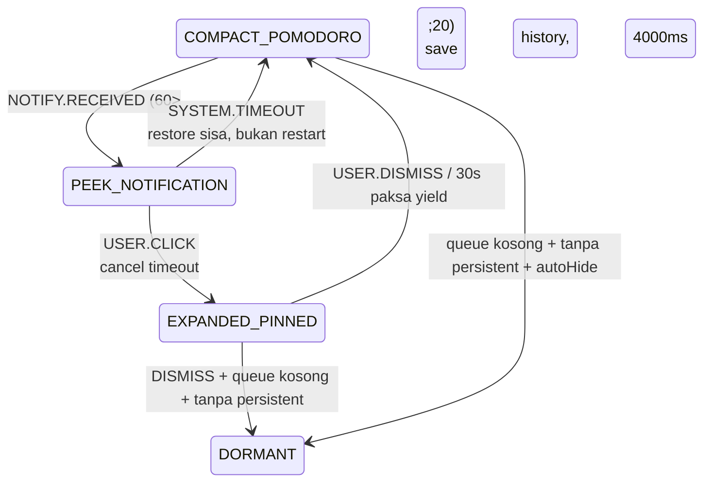
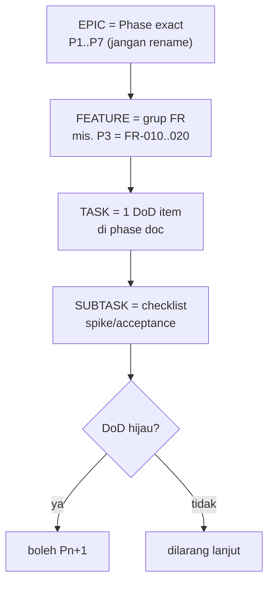

# Decision Document — UX / Interaction Spec + Implementation Plan (Formalisasi, Bukan Dokumen Baru)

- **Tanggal:** 2026-09-17
- **Topik:** (10) Apakah butuh UX/Interaction Spec formal baru (State/Trigger/Transition/Animation/Interaction/Timeout/Fallback) dan (11) Implementation Plan baru (EPIC→FEATURE→TASK→SUBTASK ala POM-001..006), atau cukup formalisasi dari kontrak yang sudah ada
- **Status:** Decided (riset read-only atas docs per 2026-09-17, tanpa fetch eksternal baru — risiko rendah)
- **Scope:** Interaksi island + urutan build; formalisasi 7-kolom + pemetaan EPIC→Phase
- **Out-of-scope:** Visual design final, motion-detail baru, WBS penuh, perubahan kontrak antar-phase, perubahan source code

## Executive Summary

**Builder boleh jalan tanpa dokumen riset baru.** Tidak perlu spec UX 7-kolom dari nol dan tidak perlu nomor POM-001..006 paralel — keduanya sudah ada sebagai kontrak yang tersebar dan tinggal diformalisasi saat implementasi:

- Untuk (10), gunakan template `State(surface:content) | Trigger(event+priority) | Transition(reducer+history) | Animation(intent+durasi) | Interaction(click/hover/dismiss/pin) | Timeout(endTime+cancel) | Fallback(validasi→queue→dormant)` dan isi hanya 3 baris kanonis dulu: `COMPACT:POMODORO --NOTIFY(60,4000)--> PEEK:NOTIFICATION --TIMEOUT--> COMPACT:POMODORO(sisa)`; `PEEK --CLICK--> EXPANDED+pin (cancel, max 30s)`; `EXPANDED --5s idle non-pin--> COMPACT [--idle--> DORMANT]`.
- Untuk (11), jangan buat nomor POM-xxx paralel — petakan `EPIC=Phase exact P1..P7 → FEATURE=grup FR → TASK=1 DoD item → SUBTASK=checklist spike/acceptance di phase doc`. Contoh P3: TASK=reconcile sleep/lock, crash-recovery, clock-jump flag — bukan POM-001 abstrak.

Contoh user `POMODORO_RUNNING → NOTIFICATION → POMODORO_RUNNING` menggabung visibility+content jadi satu label sehingga menyimpang dari kontrak ortogonal `state-machine.md`; contoh `POM-001..006` menduplikasi DoD P3 + FR-010..020 sehingga berisiko bypass gate P1→P7.

## Findings (Evidence)

Konvensi: **[Fakta]** = terobservasi dari repo. **[Inferensi]** = kesimpulan kami.

### 1. Kontrak UX sudah ada — visibility ortogonal vs content

**[Fakta]** `docs/state-machine.md` sudah kontrak: visibility `DORMANT→COMPACT→EXPANDED`, content `CLOCK/POMODORO/MEDIA/NOTIFICATION/SYSTEM` + resolver prioritas + contoh kanonis `COMPACT:POMODORO → COMPACT:NOTIFICATION (preempt 4s) → COMPACT:POMODORO (yield)`; aturan `EXPANDED→COMPACT 5s idle kecuali pin`, klik saat peek = `EXPANDED+pin` batalkan timeout 4s max 30s paksa yield, `incumbent-wins-ties`, transient `latest-wins+coalesce` max 1, tick bukan event resolver, semua transisi log `{from,to,reason,at}` ring 50.

**[Fakta]** `docs/phase-2-state-event.md §2.1–2.3` sudah angka stabil: prioritas 100 pinned / 80 urgent / 60 transient default 4000ms / 40 media-event 3000–5000ms / 20 persistent sticky / 0 idle; preempt hanya jika `incoming>current`; queue cap ~20 overflow collapse `+N`; history max ~5 validasi-sebelum-restore fallback queue-head→dormant; Timeout Registry `endTime=now+ms`, hover/focus pause simpan remaining; tick throttle ~1s payload-only; debounce render 100–200ms.

**[Fakta]** `docs/architecture.md + docs/functional-requirements.md FR-001..FR-057` sudah tiap transisi punya Trigger/Input/Behavior/Output + IPC `island:sync (surface+animation intent)`, animasi `transform/opacity ≤300ms compositor-only`, `timer:sync 4Hz`.

**[Fakta]** `docs/window-overlay.md + docs/phase-1-window-system.md` sudah batasan: fixed collapsed/expanded via `setSize`, hit-region toggle bukan timer, tanpa `focus()` agresif, default `hide` saat fullscreen-exclusive, tinggal di satu virtual desktop.

**[Inferensi]** Contoh (10) user berisiko duplikasi/menyimpang karena menggabung dua sumbu ortogonal menjadi satu label datar (`POMODORO_RUNNING`, `NOTIFICATION`). Kosakata kanonis harus tetap `visibility:content` (mis. `COMPACT:POMODORO`, `PEEK:NOTIFICATION`).

### 2. Urutan build sudah ada — Phase exact + gate DoD

**[Fakta]** `AGENTS.md §1 + docs/README.md` phase order EXACT P1→P7 dilarang ubah, gate DoD hijau sebelum Pn+1, 1 diff = 1 DoD item.

**[Fakta]** `research/README.md` eksplisit: tidak ada `research.md` konsolidasi baru, baseline = 9 decision docs + window-overlay + requirements + architecture.

**[Inferensi]** Contoh (11) `POM-001 Timer abstraction … POM-006 UI integration` menduplikasi P3 DoD + FR-010..020 dengan nomor paralel sehingga berisiko bypass gate. Pemetaan yang aman: EPIC=Phase, FEATURE=grup FR, TASK=DoD item, SUBTASK=checklist.

## Decision

### (10) Template 7-kolom — isi 3 baris kanonis dulu

| State (surface:content) | Trigger (event+priority) | Transition (reducer+history) | Animation (intent+durasi) | Interaction | Timeout (endTime+cancel) | Fallback |
|---|---|---|---|---|---|---|
| `COMPACT:POMODORO` → `PEEK:NOTIFICATION` → `COMPACT:POMODORO` | `NOTIFY.RECEIVED (60)` preempt atas persistent (20); lalu `SYSTEM.TIMEOUT` | push incumbent ke history (max 5); pop + validasi sebelum restore | `island:sync` surface+intent; morph `transform/opacity ≤300ms` | non-pin: otomatis yield; click saat peek → lihat baris 2 | `endTime=now+4000`; cancel on exit/click | history basi → queue-head → `DORMANT`; countdown lanjut sisa, bukan restart |
| `PEEK:*` → `EXPANDED:*+pin` | `USER.CLICK` saat peek | cancel timeout; pin menang atas semua timeout | intent expanded | pin hingga `DISMISS`; max 30s paksa yield agar tidak nyangkut; pin aktif → event baru coalesce ke antrean | batalkan 4s; start pin-timer 30s | timeout paksa → yield ke incumbent |
| `EXPANDED` → `COMPACT` → `DORMANT` | `USER.DISMISS/LEAVE` atau 5s idle non-pin; lalu idle+queue kosong+no persistent+autoHide | reducer ke compact; lalu dormant | intent collapse; debounce render 100–200ms saat burst | hover/focus pause (simpan remaining), leave resume (recompute endTime) | idle-timer 5s; autoHide timer terpisah | `DORMANT` = clock fallback; tidak pernah kosong |

Larangan (dari `state-machine.md` §6): tanpa antrean stacking-card, tanpa suara transient (kecuali Pomodoro selesai), tanpa preempt oleh CLOCK.

### (11) Pemetaan EPIC→Phase — tanpa nomor paralel

Contoh P3 (bukan POM-001 abstrak): TASK=reconcile sleep/lock + crash-recovery + clock-jump flag; SUBTASK=freeze 5–10s, sleep 2 mnt, kill running/paused, clock-jump, config korup — langsung dari DoD P3 + FR-010..020. Ini memungkinkan P2 contract tests (5 kasus) dan P3 checklist dieksekusi tanpa kontrak baru.

## Risiko & Batasan

- Kosakata: pertahankan `visibility×content (COMPACT:POMODORO)`; tolak label datar baru kecuali diputuskan owner secara eksplisit.
- Angka 4s/5s/30s/≤300ms/100–200ms/cap 20/history 5 adalah titik awal, bukan SLA — tuning via ukur.
- Tidak fetch HIG/Material motion atau Electron changelog baru (tidak dibutuhkan untuk risiko ini); tidak validasi user-testing/accessibility; tidak verifikasi spike GSMTC/DPI/fullscreen — itu tugas builder per DoD P1/P3/P4.

## Sources

- `docs/state-machine.md`, `docs/phase-2-state-event.md`, `docs/phase-3-pomodoro.md` — local repo
- `docs/architecture.md`, `docs/functional-requirements.md`, `docs/window-overlay.md`, `docs/phase-1-window-system.md` — local repo
- `docs/README.md`, `AGENTS.md`, `research/README.md` — local repo (aturan gate + baseline)

(End of file)
